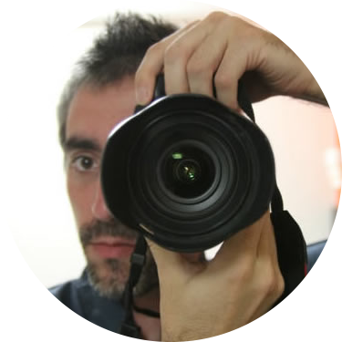

Explorer. Web engineer. Biker. Drummer. Tennis player. Rower. DIY enthusiast. Cinema buff. Passionate about art, creativity and inspired by Japan.

I'm currently working full-time and also have some open source side projects going on, so I don't have any time left for freelancing.

If you want to know more about me, you can read my [geek life](/geek-life), [curriculum](/cv) or my motorcycle adventure called the [Samurai route](/samurai-route/). Alternatively, I'm always up for a ping-pong or fußball game.

And don't forget to add me in [LinkedIn](http://linkedin.com/in/joanmira) and [Twitter](https://twitter.com/gazpachu/)! ;-)
