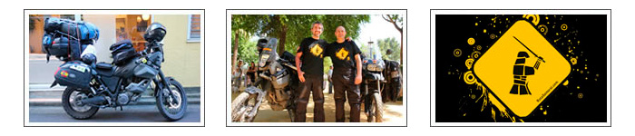
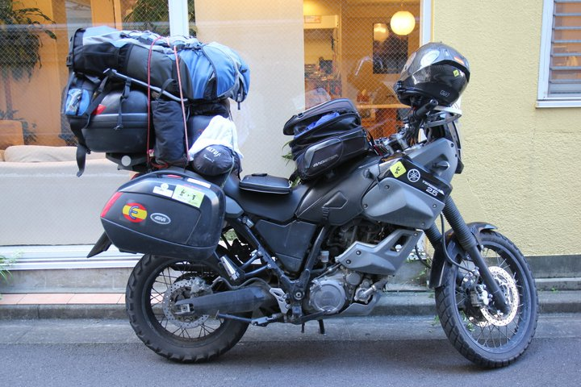
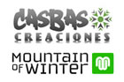
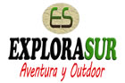
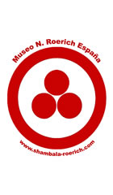
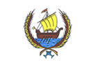
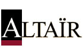
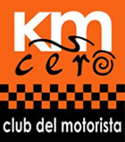

<a class="btn" href="http://rutasamurai.herokuapp.com" target="_blank">Launch archived website</a>

In January 2010 I had a crazy idea: to **travel by motorbike from Spain to Japan** in 3 months (around 20.000Km) and then spend 2 months travelling around Japan. I've been riding motorcycles since I was 17 but never really travelled long distances with one of them, not even 500 Km!. I also wanted to explore my limits, get away from the computer for some time, feel more in contact with nature and of course, visit Japan!

I passed the exam for the "big motorcycles" license and bought a [Yamaha XT660Z Teneré](https://en.wikipedia.org/wiki/Yamaha_XT660Z_T%C3%A9n%C3%A9r%C3%A9). It wasn't my favourite model, but at the end, it turned out to be a great choice for that kind of trip. I [spent a few months preparing the trip](/category/samurai-route), found some kind sponsors and a partner. Finally, on June, I left my hometown and started this great adventure :-) [ <a href="https://www.facebook.com/rutasamurai/photos_stream?tab=photos_albums" target="_blank">view pictures</a> ]

There are also a [few blog entries related with the trip](/tag/ruta-samurai) (in Spanish)

<iframe frameborder="0" height="550" marginheight="0" marginwidth="0" scrolling="no" src="http://maps.google.es/maps/ms?hl=es&ie=UTF8&t=h&msa=0&msid=109521630100610492151.00047cbcf9d4d2e0c9663&ll=45.58329,65.742188&spn=84.257979,149.414063&z=2&output=embed" style="border: 1px solid #CCCCCC;" width="100%"></iframe>

<iframe allowfullscreen="allowfullscreen" frameborder="0" width="800" height="450" src="//www.youtube.com/embed/mDsD1S7m3_A?rel=0"></iframe>

### Sponsored by

<a href="http://www.bagster.com/es/">Bagster</a> designs and manufactures increasingly practical and innovative items for motorcycle travels. Trades in virtually 100% of the outlets and facilities for motorcycles. For the Samurai Route, Bagster sponsored us with mittens, deposit bags and backpacks.

<a href="http://www.creacionescasbas.com/">Winter Mountain / Casbas Creations</a> is the 6th Generation of mountain clothing fashion designers and manufacturers. They produce garments for the best and most representative firms nationally and internationally, such as Mango, Nike, Kikers, Trango among others.

<a href="http://explorasur.com/">Explora Sur</a> is a shop with items for: climbing, caving, canyoning, hiking, cycling and running, textile, camping, etc. They are totally reliable and have very good prices. The best that can be found on the Internet!

<a href="http://www.pionono.es/">Pionono</a> creates delicious treats that cannot be explained. You have to try them!. They are proud to offer a home-made craft product of Santa Fe, Granada. Check the <a href="https://www.youtube.com/watch?v=So5_lX2Cgn4">promo video for the Samurai Route</a>.

<a href="http://www.midland.es/">Midland</a> is the famous company behind the Bluetooth Walkie intercom that we used and gave us everything we needed! GPS connection, Walki, telephone, MP3, PMR446 and PTT.

<a href="http://shambala-roerich.com/">Roerich Museum House</a> is managed by Leonardo and Petri. They maintained it with great effort since the non-profit ADA Roerich Association was founded in 1997. Its objective is to bring inspiration, beauty, contemplation and education about the Roerich to the current society. They are leaders in Spain in the Roerich culture and philosophy and their success depends on the good will of those who have awakened the vision, understanding and compassion. This is the challenge today. If you appreciate their efforts will understand the need for extensive financial support from those who are committed to peace, service and culture of synthesis. Your contribution will be well used and gratefully received. Thank you.

<a href="http://www.ayto-coriadelrio.es/">The council house of Coria del Rio</a> helped us prepare the trip. They also gave us a gift and a letter for the council of the Japanese city of Sendai.

<a href="#">EstampAlicante</a> specializes in t-shirt printing and provided the official Samurai Route t-shirts, available is the following sizes: XS, S, M, L and XL.

<a href="http://www.altairblog.com/">Altaïr</a> helped us promote the Samurai Route story and gave us copies of the magazine.

<a href="http://">Km Zero</a> provided us with maximum coverage motorcycle insurance in Russia and Mongolia. They also offered us a large space in their magazine to publish promote the adventure and gave us some shirts, anti-puncture foam, patches for clothing, backpacks, scarves, earplugs,...

