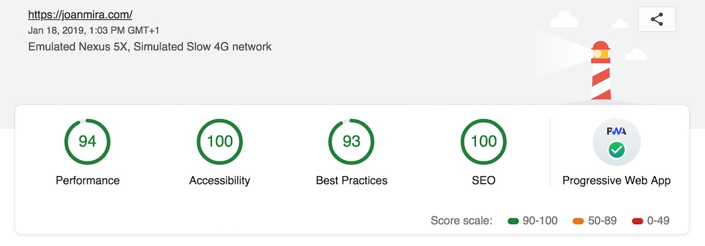

Last updated on January 2019

### Audience overview

* The average number of unique users per month is 4.000
* The average number of page views per month is 6.000
* The average session duration is 55 seconds
* 70% of the users speak Spanish and 25% English
* 80% of the traffic comes from organic search, 15% access directly and 5% from referrals

###Most popular pages

1. [/las-50-mejores-peliculas-de-los-anos-80/](/las-50-mejores-peliculas-de-los-anos-80/) (38%)
2. [/1001-pelis-para-ver-antes-de-morir/](/1001-pelis-para-ver-antes-de-morir/) (23%)
3. [/tutorial-build-a-weather-app-with-react/](/tutorial-build-a-weather-app-with-react/) (8%)
4. [/open-source-lms-with-react-and-node-js/](/open-source-lms-with-react-and-node-js/) (7%)
5. [/vuejs-first-impression-and-how-to-work-with-svgs/](/vuejs-first-impression-and-how-to-work-with-svgs/) (5%)
6. [/](/) (4%)
7. [/how-to-set-up-a-react-es6-app-for-production-on-ubuntu/](/how-to-set-up-a-react-es6-app-for-production-on-ubuntu/) (2%)
8. [/peliculas-sobre-mongolia-que-tienes-que-ver/](/peliculas-sobre-mongolia-que-tienes-que-ver/) (1%)
8. [/50-animes-para-ver-this-summer/](/50-animes-para-ver-this-summer/) (1%)
10. [/a-few-more-vuejs-2-tweaks-for-the-beginners/](/a-few-more-vuejs-2-tweaks-for-the-beginners/) (1%)

###Page speed

Report provided by [GTMetrix](https://gtmetrix.com/). There are still a few improvements that can be done around images and Nginx tuning.
