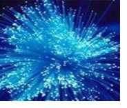
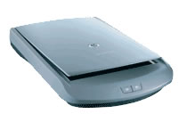
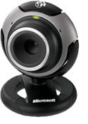
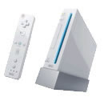

###INTRODUCCIÓN

La informática que cambió nuestras vidas es un trabajo personal del [grado multimedia en la UOC](http://uoc.edu) que pretende mostrar la forma en que se ha incorporado la tecnología informática en el día a día de los usuarios, principalmente dentro de esta última década.

La tecnología está en auge. La sociedad de consumo nos ha llevado a una dinámica en la que consumimos cada vez más por capricho que por necesidad y uno de los sectores más beneficiados es el de las nuevas tecnologías. En este trabajo hemos querido explicar de forma general algunos de los últimos aparatos electrónicos o novedades tecnológicas que se han hecho muy populares en la sociedad actual.

Este proyecto se centra en la explicación y desarrollo de los que hemos seleccionado como los 14 inventos decisivos para el usuario en esta última década. Inicialmente el proyecto se explica en el bloque 0 Introducción resumiendo los objetivos del mismo y además para poner al lector en situación. La elección de los 14 inventos no fue simple y la elaboración de una plantilla común para todos los inventos con la finalidad de que siguiesen una estructura similar tampoco fue fácil puesto que hay invenciones muy diversas y no es sencillo catalogar cada uno de los avances informáticos siguiendo las mismas pautas.

En el primer bloque del proyecto se tratan las principales innovaciones en el campo del hardware informático. Las nuevas formas de comunicación (Wifi, Bluetooth) y de almacenamiento (flash), por ejemplo, han sido algunas de las novedades más impactantes y de mayor crecimiento del sector.

Pero no sólo el hardware ha sufrido una expansión. Algunos de los temas que tratamos en el segundo bloque, de software informático, han cambiado la economía de muchos sectores (como el Peer to Peer y el MP3, que han revolucionado el sector de la música), pero también hay otros que han alterado hábitos sociales, como los blogs y las comunidades sociales, que han permitido a cualquier persona anónima no sólo expresar libremente su opinión, sino también difundirla por todo el mundo.

En el tercer y último bloque de contenido hemos incluido unas cuantas aplicaciones más de la informática que no se pueden clasificar únicamente como hardware o software, ya que son una unión de ambas y también están influyendo de forma notoria tanto en la economía como en la sociedad.

Como culminación del proyecto presentamos las conclusiones, que son claras y evidentes después de haber leído el proyecto y además se ha desarrollado una página web explicativa así como una presentación PowerPoint en las que se muestra de manera más didáctica e interactiva la esencia del proyecto.

Para explicar de forma general cada uno de estos nuevos avances, hemos diseñado una plantilla (ver página siguiente) que incluye tanto el pasado, presente y futuro de cada uno de los “inventos”, como los aspectos más relevantes de su funcionamiento e intenta dar una idea aproximada de la influencia que ha tenido en la sociedad. Principalmente los puntos evaluados en el proyecto son los siguientes:

* Resumen inicial de características
* Definición
* Funcionamiento y base científica
* Aplicaciones y sectores afectados
* Versiones y tipos
* Requerimientos, consumos, problemas
* Situación actual
* Previsión para el futuro

###1. HARDWARE INFORMÁTICO

####Memorias Flash. Almacenamiento rápido y transportable.

* **Nombre**: Memoria Flash. Pendrive. Tarjeta de memoria.
* **Año invención, invento y lugar**: Fue Intel en 1988 cuando inventó este tipo de memoria como evolución de las EEPROM existentes por aquel entonces.
* **Año en que impactó en la sociedad**: En 1994, SanDisk comenzó a comercializar tarjetas de memoria (CompactFlash) basadas en estos circuitos y desde entonces no han parado de evolucionar.
* **Sectores a los que pertenece**: desde el personal hasta la aeronáutica espacial. El espectro de usuarios es muy amplio y afecta a todos los sectores.
* **Principales marcas**: Sandisk, TDK, Verbatim, Kingston, PNY, Fordox, Samsung, Memorex.
* **Rango precio aproximado**: desde 15€ para 512Mb, 50€ para 2GB hasta 4000€  para 64GB.

**DEFINICIÓN**: Las memorias flash son de tipo no volátil, esto es, la información que almacena no se pierde en cuanto se desconecta de la corriente, una característica muy valorada para la multitud de usos en los que se emplea este tipo de memoria.

Los principales usos de este tipo de memorias son pequeños dispositivos basados en el uso de baterías como teléfonos móviles, PDA, pequeños electrodomésticos, cámaras de fotos digitales, reproductores portátiles de audio, etc.

**HISTORIA**: La historia de la memoria flash siempre ha estado muy vinculada con el avance del resto de las tecnologías a las que presta sus servicios como routers, módems, BIOS de los PCs, wireless, etc. Fue Intel en 1988 cuando inventó este tipo de memoria como evolución de las EEPROM existentes por aquel entonces.

Entre los años 1994 y 1998, se desarrollaron los principales tipos de memoria que conocemos hoy, como la SmartMedia o la CompactFlash. La tecnología pronto planteó aplicaciones en otros campos. En 1998, la compañía Rio comercializó el primer ‘Walkman’ sin piezas móviles aprovechando el modo de funcionamiento de SmartMedia. Era el sueño de todo deportista que hubiera sufrido los saltos de un diskman en el bolsillo.

**APLICACIONES**: El llavero USB que, además del almacenamiento, suelen incluir otros servicios como radio FM, grabación de voz y, sobre todo como reproductores portátiles de MP3 y otros formatos de audio.
 Las tarjetas de memoria flash que son el sustituto del carrete en la fotografía digital, ya que en las mismas se almacenan las fotos.

**TIPOS**: Existen tarjetas de memoria de diferentes tamaños y marcas. Algunos formatos extendidos son: compact flash, secure rom, Memory Stick, Picture Card, etc. Los llaveros USB tienen infinitas formas, tamaños y funciones.

**REQUISITOS**: Algunos reproductores MP3 o de video con memoria flash son autónomos y no es necesario disponer de ningún otro dispositivo. Las tarjetas de memoria y los llaveros USB (pendrives), necesitan de un ordenador, cámara digital o reproductor de música para poder funcionar.

**SITUACIÓN**: En la actualidad, las memorias flash son un elemento fundamental para el ocio y el trabajo. El cambio de la fotografía analógica a la digital no habría sido posible sin este tipo de memorias. Los estudiantes, profesionales y otros colectivos, utilizan las memorias flash para transportar datos de una forma fácil y rápida.

**FUTURO**: El futuro del mundo de la memoria flash es bastante alentador, ya que se tiende a la ubicuidad de las computadoras y electrodomésticos inteligentes e integrados y, por ello, la demanda de memorias pequeñas, baratas y flexibles seguirá en alza hasta que aparezcan nuevos sistemas que lo superen tanto en características como en coste y, al menos en apariencia, no es factible ni siquiera a medio plazo ya que la miniaturización y densidad de las memorias flash está todavía lejos de alcanzar niveles preocupantes desde el punto de vista físico.

####Fibra óptica. Mecanismos de transmisión de datos

* **Nombre**: Fibra óptica
* **Año invención, invento y lugar**: 1977 se instala en Inglaterra primer sistema de prueba.
* **Sectores a los que pertenece**: Internet, telecomunicaciones, televisión.
* **Principales marcas**: No existen marcas, aunque los principales inversores son compañías telefónicas como Motorola y compañías de televisión por cable como la venezolana Supercable.

**DEFINICIÓN**:  La fibra óptica es el avance necesario para mejorar la transmisión de datos a una alta velocidad requerida para el uso mundial de Internet, las líneas telefónicas no tienen una capacidad de transmisión tan alta ya en su creación no fueron ideadas para transportar datos.

**HISTORIA**: En 1959 se descubrió como derivación de los estudios de física (óptica) una nueva utilización de la luz, denominada rayo láser, que fueron aplicadas a las telecomunicaciones con la finalidad de que los mensajes se transmitiesen a velocidades inusitadas y con una amplia cobertura. Pero la utilización del láser era muy limitada debido a la inexistencia de conductores adecuados para hacer viajar las ondas electromagnéticas. Fue entonces cuando los científicos dirigieron sus esfuerzos en la producción de un canal, hoy conocido como fibra óptica. En 1966 surgió la propuesta de utilizar guía óptica para la comunicación y en 1977 se instalo en Inglaterra el primer sistema de prueba.

**BASE CIENTÍFICA**: Cables de espesor comprendido entre 10-300 micrones que llevan los mensajes en forma de haces de luz de un extremo a otro sin interrupción mediante una fibra realizada con cristales minúsculos. La transmisión es por reflexión y no se producen apenas pérdidas ya que el núcleo de la fibra esta recubierto por una capa de vidrio que provoca un índice de refracción muy bajo. El sistema de emisión y recepción requiere los siguientes componentes : Señal de entrada, amplificador, fuente de luz, corrector óptico, línea de fibra óptica, receptor, amplificador y señal de salida.

**APLICACIONES**: Aumentar la velocidad en las telecomunicaciones. Se aplica tanto en pequeños ambientes autónomos como en grandes redes geográficas (desde sistemas de procesamiento de datos en aviones hasta sistemas de largas líneas urbanas mantenidos por compañías telefónicas). Las aplicaciones más comunes son para Internet, redes, telefonía, televisión por cable.

**TIPOS**: Los circuitos de fibra óptica están compuestos por filamentos de vidrio (cristales naturales) o plástico (cristales artificiales).

**REQUISITOS**: Sólo pueden suscribirse las personas en cuyas ciudades esté instalada la red de fibra óptica. El coste de conexión e instalación es alto. Las fibras son frágiles, hay disponibilidad limitada de conectores y la dificultad de reparación de un cable roto es alta.

**SITUACIÓN**: Totalmente en auge, la instalación y aplicaciones de esta nueva tecnología es muy eficaz y además se sigue investigando al respecto para mejorar sus prestaciones.

**FUTURO**: En un futuro la mayoría de personas tendrán acceso a la fibra óptica y su coste de instalación será menor. Esto producirá un aumento en las conexiones a Internet y un nuevo concepto en telefonía y televisión.

####Wi-fi

* **Nombre**: WI-FI o Wifi. Significa Wireless-Fidelity.
* **Año invención, invento y lugar**: El estándar IEEE 802.11 fue publicado en 1997. Pertenece al Instituto de Ingenieros Eléctricos y Electrónicos (IEEE), asociación técnico-profesional mundial sin ánimo de lucro fundada en 1884 por diversas personalidades (incluso ilustres, como (Thomas Alva Edison, Alexander Graham Bell y Franklin Leonard Pope). WIFI como tal es el con junto de estándares basados en las especificaciones IEEE 802.11 y, al mismo tiempo, una marca de la Wi-Fi Alliance.
* **Año en que impactó en la sociedad**: En 1999 apareció la versión 802.11b, que junto con la 802.11g han sido las más utilizadas.
* **Sectores a los que pertenece**: como el IEEE es una asociación sin ánimo de lucro, cualquier sector puede beneficiarse de este estándar.

**DEFINICIÓN**: El protocolo IEEE 802.11 es un conjunto de estándares pensado para conectar diversos ordenadores entre sí de forma inalámbrica (mediante infrarrojos u ondas de radio, depende del estándar), aunque su uso más frecuente en la actualidad es el de la conexión a Internet.

**HISTORIA**: La primera versión del protocolo IEEE 802.11 fue creada en 1997, con una velocidad de transmisión de 2Mbps (Megabits por segundo). Posteriormente, en 1999, se crearon dos estándares más avanzados: el 802.11a (54Mbps) que operaba en la banda de 5GHz (GigaHerzios) y el 802.11b (11Mbps), que operaba en la banda de 2,4 Ghz (más usada, ya que es la misma que utilizan móviles y otros aparatos electrónicos). En junio de 2003 se creó otro estándar más, el 802.11g, que opera en la banda de 2,4GHz con una velocidad teórica máxima de 54Mbps y un radio de alcance de hasta 50km. Además al ser compatible con el estándar 802.11b se convirtió en el más popular.

**APLICACIONES**: Su uso más común hoy en día es el de comunicar un ordenador u otro dispositivo (PDA, móvil, etc.) con un punto de acceso a Internet. Esto permite que, estando dentro del radio de cobertura del nodo de acceso, puedas acceder a Internet sin necesidad de cables (utilizando simultáneamente otros protocolos de seguridad como el WEP o el WPA para proteger la comunicación y los datos).

**TIPOS**: Más que tipos hay que hablar diferentes versiones de un mismo estándar de protocolo de comunicaciones (ver la parte de Historia para más detalle).

**REQUISITOS**: En el uso más cotidiano, que es el acceso a Internet, lo único que necesitamos es tener un punto de acceso cercano al que poder conectar nuestro dispositivo. Si el dispositivo que queremos conectar es un ordenador, necesitaremos una tarjeta de red inalámbrica, si es otro tipo de dispositivo habitualmente ya tiene capacidad de comunicación WiFi integrada.

**SITUACIÓN**: Actualmente es uno de los estándares de comunicación más utilizados, ya que permite crear grandes redes de conexión a Internet incluso en ciudades enteras a bajo coste y sin necesidad de cables. De esta forma podemos estar conectados en todo momento y desde cualquier lugar a la red.

**FUTURO**: Ya está en marcha una nueva versión del protocolo (la versión 802.11n) que se espera alcance velocidades de hasta 600Mbps y con un radio de alcance mucho mayor. En el futuro se prevé que las ciudades tendrán garantizado acceso a Internet mediante Wifi desde cualquier punto de la ciudad (como ejemplo, la ciudad de Nuenen, cuna de Van Gogh, en Holanda, ya lo tiene implementado).

####Escáner

* **Nombre**: Escáner (o Scanner)
* **Año invención, invento y lugar**: Rudolf Hell es considerado el inventor del fax y del escáner. Fundó una empresa en Berlín que en los años 60 creó el precursor del actual escáner.
* **Año en que impactó en la sociedad**: Nunca ha supuesto un enorme boom, aunque su mayor auge fue en los años 90.
* **Sectores a los que pertenece**: Particular, comercial y profesional.
* **Principales marcas**: Epson, Canon y HP.
* **Rango precio aproximado**: Desde 60€ los más baratos a 240€ los más caros.

**DEFINICIÓN**: El escáner es un hardware cuyo cometido principal es convertir información analógica en digital, para poder ser interpretada por un ordenador y almacenarla o manipularla a posteriori.

**HISTORIA**: La compañía de Hell creó en 1929 una máquina capaz de transmitir texto. La máquina descomponía las letras en puntos y las retransmitía electrónicamente. Este aparato fue el precursor del fax y, posteriormente, sirvió como base tecnología para fabricar el primer escáner en 1963.

**APLICACIONES**: Además de los usos habituales de un escáner (digitalizar imágenes, textos y demás), existe una variante del escáner que se utiliza con mucha frecuencia, sobretodo en comercios: el lector de código de barras.

**TIPOS**: Básicamente hay tres tipos de escáneres: de rodillo, de mano y de sobremesa. El de rodillo es similar a un fax, ya que recoge automáticamente el documento a escanear y lo digitaliza. Su principal inconveniente es que sólo puede digitalizar documentos de texto. El tipo de mano es el menos fiable, ya que depende del pulso del usuario, pero es el más barato. Por último el de sobremesa, que es el más caro pero también el más profesional y extendido.

**REQUISITOS**: La tecnología que compone el escáner tiene el principal inconveniente en que es muy mecánica y eso puede derivar en fallos debidos al desgaste, golpes, etc. Respecto a consumo y requisitos, no necesita nada más que electricidad para funcionar y un driver (estándar TWAIN) para comunicarse con el ordenador.

**SITUACIÓN**: Actualmente no es uno de los productos más demandados. El hecho de  que la mayoría de información que se produce ya sea digital ha hecho que el escáner caiga en desuso.

**FUTURO**: Entre los dispositivos basados en la tecnología del escáner con mayor futuro encontramos los lectores de huellas dactilares i los escáneres de retina, entre otros.

####Webcam

* **Nombre**: Webcam o cámara web.
* **Año invención, invento y lugar**: Fue inventada por Quentin Stafford-Fraser en 1991 en el Departamento de Computación de la Universidad de Cambridge.
* **Año en que impactó en la sociedad**: Actualmente es cuando más se está comercializando.
* **Sectores a los que pertenece**: Particular, ocio.
* **Principales marcas**: Logitech, Creative, Microsoft, Genius…
* **Rango precio aproximado**: Entre 12€ y 120€ dependiendo del modelo.

**DEFINICIÓN**: Básicamente, la webcam es una cámara digital conectada a un PC y su cometido principal es el de capturar imágenes para distribuirlas por Internet.

**HISTORIA**: Se atribuye su invento a Quentin Stafford-Fraser, del Departamento de Computación de la Universidad de Cambridge. Quentin era adicto al café y, harto de bajar escaleras para ir a por café y que no quedara, decidió conectar una videocámara a un ordenador mediante una tarjeta de vídeo y así poder ver la cafetera desde su sitio.

**APLICACIONES**: El uso más popular es el de comunicarse visualmente con otras personas (por ejemplo, con programas de mensajería instantánea, como MSN Messenger), aunque también permite grabar pequeños vídeos y fotos para subirlos a la Red o jugar a videojuegos (ver Tipos).

**TIPOS**: Además de las webcams particulares, actualmente se pueden encontrar por Internet miles de webcams en lugares públicos y ciudades del mundo que te permiten “visitar” otros lugares sin estar allí ([http://www.worldlive.cz/en/webcams#location](http://www.worldlive.cz/en/webcams#location)). Otros tipos de webcams serían, por ejemplo, la “Eye Toy”, un accesorio para la consola PlayStation2 que captura tu imagen y movimientos y te convierte en el protagonista de los juegos.

**REQUISITOS**: El único requisito es disponer de un ordenador medianamente potente, un puerto USB (suele ser la conexión más habitual) y los drivers de la webcam.

**SITUACIÓN**: Actualmente las webcams se están potenciando sobretodo para un uso lúdico y de comunicación, pero gozan de una gran aceptación.

**FUTURO**: Cada vez más aparatos tecnológicos incluyen cámara y conexión a Internet y además se va mejorando la velocidad de transmisión de datos, lo cual potenciará el uso de videoconferencias como forma de comunicación, ya sea desde el móvil, el ordenador o cualquier otro dispositivo portátil.

####Bluetooth. Comunicación de dispositivos informáticos

* **Nombre**: Bluetooth.
* **Año invención, invento y lugar**: Ericsson, 1994 (primera aparición).
* **Año en que impactó en la sociedad**: Desde 2001 hasta 2005 las ventas de dispositivos con bluetooth se duplicaban cada año.
* **Sectores a los que pertenece**: Entornos domésticos, publicidad, ocio y entretenimiento, aplicable a medicina, automóviles, etc.
* **Principales marcas**: Ericsson, Nokia, Toshiba, Intel,IBM, etc.
* **Rango precio aprox.**: Dependiendo de qué aplicación del bluetooth. Por ejemplo un mouse con tecnología bluetooth cuesta sobre unos 90 €, en cambio un adaptador USB-Bluetooth lo encontramos por 30€.

**DEFINICIÓN**: Bluetooth es el nombre de la norma que define un estándar global de comunicación inalámbrica, y permite la comunicación y transmisión de datos y voz mediante un enlace por radiofrecuencia. Si un equipo se encuentra dentro del radio de cobertura de otro, éstos pueden establecer conexión entre ellos.

**HISTORIA**: El nacimiento de la tecnología Bluetooth se inicia en 1994, a partir de un estudio que desarrollaba la marca Ericsson e investigaba la viabilidad de una comunicación vía radio de bajo coste y consumo. Como consecuencia de este estudio, se consiguió crear un enlace de radio a corto alcance, llamado MC link. Conforme el proyecto avanzaba se fueron considerando una amplia gama de aplicaciones, puesto que el chip de radio en que se basaba resultaba relativamente económico.

Se observó que, para que esta tecnología tuviera éxito, se debía dotar de ésta a un gran número de equipos. Por este motivo se originó el grupo SIG formado por 5 promotores (Ericsson, Nokia, IBM, Toshiba e Intel) que formaron un consorcio y establecieron un estándar para su software que permitiera asegurar la interoperatibilidad de los equipos de diversos fabricantes.

**APLICACIONES**: La tecnología bluetooth aporta muchas posibilidades, principalmente porque facilita las comunicaciones entre equipos móviles y fijos, elimina cualquier tipo de cables y conectores entre éstos, además de que incluso es posible crear pequeñas redes inalámbricas entre equipos personales. Además, la tecnología bluetooth es aplicable a muchos sectores, principalmente hardware, software y telecomunicaciones.

**TIPOS**: Existen diferentes versiones de dispositivos bluetooth clasificados por la potencia de transmisión de éstos, aunque son todos compatibles independientemente de este factor. Las clases de dispositivos bluetooth serían los dispositivos de Clase 1, con un alcance de unos 100m, de Clase 2, con un alcance de 20/30m y finalmente los de Clase 3, con tan solo un metro de radio. Para que dos dispositivos puedan comunicarse deben ocupar simultáneamente el radio de alcance del otro, es decir, si queremos que un dispositivo de clase 1 se comunique con otro de clase 3, deberemos colocarlo a una distancia de aprox. 1 metro, independientemente de que el alcance del dispositivo de clase 1 llegue a los 100m.

**REQUISITOS**: El único requisito necesario es un chip de relativamente bajo coste adaptado a cada aplicación de bluetooth. Sin embargo, el punto débil de la tecnología bluetooth es la seguridad dado la facilidad que existe para transferir datos a equipos muchas veces sin capacidad de procesamiento. Para evitar este problema se ha definido una rutina de pregunta-respuesta, se provee a los equipos de una clave de sesión y se genera una corriente cifrada de datos (encriptación).

**SITUACIÓN**: En auge, según datos estadísticos desde 2001 hasta 2005 la venta de dispositivos bluetooth se duplica cada año.

**FUTURO**: Próximamente, será introducida la tecnología bluetooth en consolas como Sony Playstation 3 y Nintendo Wii que dispondrán de mandos inalámbricos. También el ámbito de los negocios se verá afectado al poder utilizar el bluetooth como medio para enviar publicidad a los móviles al pasar cerca de un emisor. Otra de las novedades será la aplicación del bluetooth para la comunicación por cable entre equipos GPS y equipamiento médico.

###2. SOFTWARE INFORMÁTICO

####MP3 y DIVX. Principales códecs de audio y video

* **Nombre**: DivX, Divx;), MP3, MPEG Audio Layer 3Año invención, invento y lugar: MP3 : desarrollado y patentes entre 1986-1995, MPEG (Media Pictures Expert Group). Divx: 2000, Jeroma Rota (Francia), Max Morice (Alemania) (hackers)
* **Año en que impactó en la sociedad**: Paralelamente a la ampliación en el número de conexiones por banda ancha (2000-2005).
* **Sectores a los que pertenece**: Entornos domésticos y profesionales, Ind. Informática, industria musical y cinematográfica.
* **Rango precio aprox.**: Los reproductores mp3 cuestan unos 40-300 euros, y los de divx de 40-200 euros.

**DEFINICIÓN**: Mp3 y Divx son los nombre de los principales codecs de audio y sonido más utilizados actualmente. Los codecs (abreviatura de codificador-decodificador), codifican el tamaño de una señal para reducir el tamaño de los archivos de audio y multimedia, principalmente para su difusión por internet u otros medios de transmisión y posteriormente lo recuperan para que sea utilizable.

**HISTORIA**: La teconolgía divx fue desarrollada a la sombra de otras tecnologías (MPEG-4 Part 2 y DecSS) por dos Hackers (Jeroma Rota y Max Morice) en el año 2000. Después de ésta innovación destacaron dos proyectos que pretendían legalizar el divs, éstos eran Project Mayo y 3ivx.com. Project Mayo afirmaba en todo momento conocer el código fuente hasta que culminó con la creación del primer códec legal Divx 4. Actualmente el desarrollo es completamente legal y pertenece a la compañía Divx, Inc, originariamente basada en el Project Mayo.

**BASE CIENTÍFICA**: La tecnología mp3 fue desarrollada por el  MPEG (Moving Pictures Expert Group) y la reducción del tamaño se basa en un análisis psicoacústico del sonido, es decir, el sonido es analizado y se descartan los sonidos que el cerebro no puede percibir (frecuencias muy altas o muy bajas, sonidos superpuestos, etc.) consiguiendo un tamaño final muy reducido con una pérdida de calidad insignificante.

**TIPOS**: Tanto DivX como Mp3 reducen notoriamente el tamaño del archivo sin apenas alterar la calidad, y es éste precisamente el factor que ha ocasionado tanto éxito y acogida para estos códecs. Para hacernos una idea, en Divx se almacena en unos 700 MB lo que en un DVD en 8 GB, con una pérdida de calidad irrisoria. Lo mismo ocurre con el mp3, que almacena aproximadamente 1 minuto de sonido en 1 MB,es decir comprime en un 90 % el tamaño del mismo archivo en formato WAV. Esta reducción del tamaño facilita su difusión por internet y por este motivo es tan popular.

**REQUISITOS**: Los Mp3 y divx se encuentran básicamente(aunque no legalmente) circulando por Internet, normalmente se difunden con los programas P2P o también desde algunas páginas web u otros programas. Desde éstos es posible descargarlos a tu propio ordenador para reproducirlo con un software reproductor específico (que también se encuentran fácilmente en internet), o bien se pueden grabar sobre un cd obteniendo aproximadamente un cd mp3 con aproximadamente unas 12 horas de música o bien una película con calidad cercana al dvd.

**SITUACIÓN**: Actualmente estas tecnologías estan de moda y va ligeramente más avanzada el mp3 ya que los archivos divx son más extensos y requieren conexiones de banda ancha de las que no todo el mundo dispone.

**FUTURO**: En este sector es impredecible conocer hacia dónde se decantará esta lucha entre piratería e industrias cinematrográficas y musicales, cada vez se pactan nuevas leyes en contra de la piratería pero sin mucho efecto aparentemente. Podemos suponer que se crearan otras formas de almacenamiento de imagen y sonido y que probablemente paralelamente se crearan también sus respectivos codecs, cada vez con una calidad superior.

####Messenger y VOIP. Comunicación en tiempo real utilizando ordenadores

* **Nombre**: Programas de mensajería instantánea, Voip, Voz sobre IP, Telefonía IP, Telefonía por Internet, Telefonía Broadband y Voz sobre Broadband. Año invención, invento y lugar: El precedente fue la “Red experimental de protocolo de voz”, ARPANET – 1973 y el primer programa de mensajería instantánea en Internet fue ICQ,1996 (español). Año en que impactó en la sociedad: A partir del 2000.
* **Sectores a los que pertenece**: Comunicación, Internet, educación y negocios.
* **Principales marcas**: AIM, ICQ, Yahoo Messenger, Windows Messenger, QQ,Skype, Google Talk

**DEFINICIÓN**: Voz sobre Protocolo de Internet, también llamado Voz sobre IP, VoIP, es el enrutamiento de conversaciones de voz sobre Internet o a través de alguna otra red basada en IP. La utilidad más usual del protocolo VOIP es la de los programas de mensajería instantánea.

**HISTORIA**: Una primera forma de mensajería instantánea fue la implementación en el sistema PLATO usada al principio de los 70. Después el sistema tal en UNIX/LINUX comenzó a ser usado por ingenieros y académicos en los 80 y 90. En 1996 apareció ICQ, primer programa de mensajería instantánea. Desde su aparición han surgido muchos programas que han ido incorporando variaciones y han sido desarrollados en paralelo en otras partes, cada aplicación teniendo su propio protocolo. Alternativamente han ido surgiendo programas que soportan varios protocolos como Gaim o Trillian y recientemente algunos servicios de mensajería han comenzado a ofrecer telefonía (VoIP) y videoconferencia.

**BASE CIENTÍFICA**: VoIP convierte las conversaciones de voz en audio digital, que se puede guardar en un equipo. En el origen la voz se digitaliza, se comprime y se encapsula sobre el protocolo TCP/IP. En el destino se hace la operación contraria. Esto se traduce en una mayor flexibilidad para participar en una conversación.

**APLICACIONES**: Importantes aplicaciones en varios sectores , principalmente para el ocio, aunque también es importante su aplicación a los negocios y a la educación. Estos programas tienen la finalidad de mejorar la comunicación ofreciendo una comunicación instantánea al cliente, a diferencia del convencional “correo electrónico”. Además, estos programas cada vez incorporan más opciones como llamadas telefónicas, compartir archivos, pizarra virtual, juegos incorporados, videoconferencia, enviar SMS a móviles etc.

**TIPOS**: Existen varios programas dependiendo de las funciones que tenga, algunos se decantan más hacia la videoconferencia y llamadas y en cambio otros hacia compartir funciones y archivos.

**REQUISITOS**: Los requisitos dependen del programa, generalmente es necesario un ordenador con conexión a Internet con una velocidad preferiblemente alta, una cuenta en el servidor deseado, y para la mayoría una versión de Windows avanzada, audio y micrófono, y para algunas funciones la webcam.

**SITUACIÓN**: Aunque el “boom” de estos programas se sitúa unos años atrás, se sigue investigando con mucho ímpetu sus aplicaciones en otros campos y sigue aumento el número de usuarios que lo utilizan.

**FUTURO**: Parece ser que estos programas se decantan cada vez más a integrar los programas de mensajería instantánea con los P2P, se estudia la posibilidad de introducir el uso del PayPal con estos programas.

####Peer To Peer. Redes de intercambio de archivos como Napster, Edonkey, Kademlia, Gnutella o BitTorrent

* **Nombre**: P2P, Emule, Kazaa, Overnet, Torrents, Napster.
* **Año invención, invento y lugar**: La primera aplicación P2P (PeerToPeer) fue Napster, en 1999. En el año 2001 se cerró por orden judicial (ya tenía 27 millones de usuarios) y en el 2002 empezaron a surgir las primeras redes descentralizadas como Kazaa, Grokster y Morpheus.
* **Año en que impactó en la sociedad**: Desde el año en que apareció Napster, el intercambio de ficheros por medio de redes P2P ha ido creciendo sin parar en todo el mundo y a día de hoy existen cientos de millones de usuarios.
* **Sectores a los que pertenece**: se suele utilizar en entornos domésticos aunque poco a poco algunas universidades y empresas empiezan a utilizar el protocolo de Bitorrent para compartir archivos de gran tamaño.
* **Distribución libre/privada**: la mayoría son de distribución libre. Emule: proyecto de código abierto (SourceForge). BitTorrent es distribuido bajo la licencia MIT
* **Principales proyectos**: Emule (popular en Europa y América), BitTorrent (popular en Asia)

**DEFINICIÓN**: Los programas y redes P2P se utilizan para compartir archivos informáticos de todo tipo de forma gratuita y a través de Internet.

**HISTORIA**: Las redes P2P (PeerToPeer), se basan en la conexión de ordenadores mediante programas informáticos como Emule. Al principio, algunas redes P2P no eran descentralizadas y por tanto era necesario que un servidor gestionara los clientes y sus archivos. En la actualidad la tecnología de los programas P2P sigue evolucionando con el objetivo de hacer lo más anónima posible la conexión de los usuarios y sus transferencias.

**APLICACIONES**: Actualmente, las redes P2P se utilizan mayormente para compartir ficheros de música, películas codificadas en divx y todo tipo de software para PC, MAC, consolas de videojuegos, ebooks, etc.

**TIPOS**: La comunidad de usuarios P2P es muy amplia y existen multitud de programas y MODS (modificaciones de los programas originales) para compartir ficheros. En España, existen comunidades como Emulespana donde se pueden encontrar la información necesaria para empezar a experimentar con las redes Peer To Peer.

**REQUISITOS**: Para poder conectarse a una red P2P es necesario disponer de una conexión a Internet de alta velocidad, un ordenador PC o MAC con Windows, MAC OS o Linux, y un programa informático como Emule, BitTorrent o Pando.

**SITUACIÓN**: Actualmente emule y BitTorrent son los programas más usados de intercambio de archivos. La RIAA, SGAE, MPA y otras organizaciones que defienden los derechos de autor, mantienen un pulso con las redes P2P con el objetivo de prohibir su uso.

**FUTURO**: A lo largo de la historia, las demandas han llevado a los usuarios a cambiar a programas P2P con tecnologías más difíciles de detener y el número de usuarios no ha disminuido. El fenómeno de Internet y su constante evolución obligará a las productoras de cine y música a cambiar su modelo de negocio.

####Blogging, Comunidades Sociales. Evolución a Internet 2.0

* **Nombre**: Friendster, YouTube, Blogspot, Neurona,...
* **Año invención, invento y lugar**: En el 2002 empezaron a aparecer sitios web promocionando las redes de amigos en línea.
* **Año en que impactó en la sociedad**: A partir de año 2003 se empezaron a hacer populares sitios como Friendster, MySpace, Tribe.net, Linkedln.
* **Sectores a los que pertenece**: las redes sociales son usadas por usuarios de Internet de todo tipo y actualmente en sitios como Second Life, empresas de todo el mundo pueden incluso crear una tienda virtual y promocionar sus servicios y vender sus productos.
* **Principales proyectos**: SecondLife, MySpace, YouTube, Blogspot, CouchSurfing, Neurona,...

**DEFINICIÓN**: Las redes sociales están compuestas por usuarios, los cuales se encargan de invitar a más gente y entre ellos se pueden comunicar, ver los perfiles de los otros usuarios, ver fotos, videos, música, perfiles profesionales, etc. Los usuarios se organizan en grupos y hay potentes buscadores para recorrer la red social en busca de otros usuarios.

**HISTORIA**: Las redes sociales son el resultado de la evolución de Internet y el aumento de la población que usa ordenador.

**APLICACIONES**: Proporcionar contenidos multimedia, ofrecer alojamiento a otros viajeros, compartir perfiles profesionales, buscar amigos y pareja, encontrar a antiguos compañeros de colegio y trabajo,…

**TIPOS**: Principalmente actividades relacionadas con el ocio y la difusión de contenidos multimedia. También existen redes enfocadas al ámbito empresarial y profesional.

**REQUISITOS**: Normalmente, para participar en una red social, es necesario registrarse como usuario y aportar algunos datos personales o rellenar un perfil personalizado en la página web.

**SITUACIÓN**: Actualmente las redes sociales están en auge y a diario siguen apareciendo nuevas iniciativas con intención de captar el interés de los internautas.

**FUTURO**: El futuro de Internet a la denominada “Internet 2.0” y algunos ya hablan de “Internet 3.0”, pasa por una mayor implicación de los usuarios en Internet. Las redes sociales seguirán estando presentes y evolucionarán al mismo tiempo que Internet.

####E-Commerce y Publicidad Online. Compra-Venta en Internet. Aplicaciones bancarias

* **Nombre**: Google Adsense y Adwords, ebay, Paypal, Amazon, etc
* **Año invención, invento y lugar**: En 1995 los paises integrantes del G7/G8 crearon la iniciativa Un Mercado Global para PYMEs (en inglés), con el propósito de acelerar el uso del comercio electrónico entre las empresas de todo el mundo.
* **Año en que impactó en la sociedad**: Superada la crisis de “las punto com”, a partir del año 2003.
* **Sectores a los que pertenece**: toda la sociedad se beneficia en mayor o menor medida del e-commerce y sus diferentes aplicaciones, desde la tarjeta de crédito a la compra en Internet.
* **Principales proyectos**: google adsense y adwords, ebay, paypal, amazon.

**DEFINICIÓN**: E-Commerce es la simple replicación de un negocio en Internet permitiendo recoger los pedidos u ofertar los productos y/o servicios desde o hacia clientes o proveedores.

**HISTORIA**: Desde 1995 empezaron a surgir multitud de empresas en Internet, pero la desconfianza de los clientes, y la ausencia de un plan de negocio bien definido y con objetivos concretos, llevó a muchas de ellas a desaparecer (crisis de las punto com).

**APLICACIONES**: Realizar compras a través de Internet. Realizar operaciones en tu banco de forma online. Ganar dinero y promocionar tu negocio con adsense y adwords de google.

**REQUISITOS**: La mayoría de servicios para compras en Internet requieren el uso de una tarjeta de crédito y para ventas es necesaria una pasarela de pago que conecte la página web con un banco o servicio como paypal.

**SITUACIÓN**: Actualmente, gran parte de la sociedad desconoce o no le interesan los servicios de compra/venta en Internet. Una de las razones más populares es la falta de seguridad en Internet o el miedo a ser estafado.

**FUTURO**: El e-commerce del futuro contará con más facilidades para mover el dinero a escala mundial, mayor aceptación social y herramientas de marketing online sofisticadas.

###3. OTRAS APLICACIONES DE LA INFORMÁTICA

####GPS (Global Positioning System)

* **Nombre**: GPS (Global Positioning System) o Sistema de Posicionamiento Global.
* **Año invención, invento y lugar**: Fue diseñado por el Departamento de Defensa de los Estados Unidos y está operativo desde 1995.
* **Año en que impactó en la sociedad**: Actualmente es cuando más se está comercializando.
* **Sectores a los que pertenece**: Militar y Particular.
* **Principales marcas**: Airis, TomTom, Navman, Acer,...
* **Rango precio aproximado**: entre 180€ y 600€ dependiendo del modelo. Los profesionales y especializados pueden llegar incluso hasta 30000€.

**DEFINICIÓN**: La idea del GPS está basada en un conjunto de 21 satélites. Un GPS lo que hace es recibir varias señales conjuntas al mismo tiempo de algunos de los satélites y calcular la posición en la que se encuentra.

**HISTORIA**: Inicialmente idearon un sistema denominado TRANSIT, constituido por 6 satélites, que pretendía dar soporte a la flota marina de los EE.UU. Posteriormente lo perfeccionaron con 28 satélites que daban cobertura mundial y constante primero de los 28 satélites se lanzó en 1978 y en 1983 ya estaba disponible toda la red.

**APLICACIONES**: Además de los fines bélicos, el GPS tiene muchas aplicaciones: navegación marítima, detección de terremotos, volcanes, seguimiento de icebergs, etc. Cada vez más se usa a nivel particular y de ocio.

**TIPOS**: El sistema GPS es un sistema único. Si bien es cierto que GPS es la red de satélites americanos y actualmente existe otra red rusa (GLONASS) y en unos años existirá otra europea (GALILEO), no hay una gran diferencia entre unas y otras y los receptores tienen casi todos características comunes.

**REQUISITOS**: Para poder hacer uso de la tecnología GPS es necesario poseer un receptor (también conocido con el nombre de GPS) y recibir la señal de los satélites (cuantos más, mejor). Habitualmente los receptores llevan incorporados mapas de zonas geográficas o ciudades para facilitar la ubicación al usuario.

**SITUACIÓN**: Actualmente el GPS se encuentra en un gran momento. Es muy habitual ver cada vez más coches y particulares con un receptor   que no sólo les ubica geográficamente sino que además les indica la ruta a seguir.

**FUTURO**: En los próximos años entrará en funcionamiento la red europea de satélites GALILEO, que también ofrecerá servicio de posicionamiento. Además, cada vez se incorporan más receptores GPS tanto en teléfonos móviles como en ordenadores portátiles y PDAs.

####Home Media Center. La informática como centro del hogar

* **Nombre**: Home Media Center
* **Año invención, inventor y lugar**: SES GLOBAL, Astra, 2003 – Hannover
* **Año en que impactó en la sociedad**: Todavía no ha impactado realmente en la sociedad.
* **Sectores a los que pertenece**: Informática, electrodomésticos, ocio, fabricantes de hardware, software, proveedores de contenidos, distribuidores, proveedores de productos y servicios.
* **Rango precio aprox.**: 500€ – 3000€

**DEFINICIÓN**: Un media center es un concepto nuevo de computador, adaptado a cubrir las necesidades de toda la familia. Está ideado para convertirse en el centro del hogar, es decir, para poder operar con un único dispositivo que permita realizar varias funciones al mismo tiempo y permita acceder de forma interactiva a la televisión.

**HISTORIA**: Aunque se trata de una invención muy reciente, el primer Home Media Center europeo se presentó en CeBIT (Hannover) por manos de la empresa SES GLOBAL. No podemos describir claramente la historia del Home Media Center pues se trata mejor dicho de una fusión entre las funciones de los ordenadores y las de otros dispositivos audiovisuales, principalmente las funciones del DVR (Digital Video Recorder) que permite grabar en un disco duro la programación televisiva, las consolas de videojuegos con conexión a Internet y gestor de audio y fotografía digital (Xbox, Playstation) No obstante podemos afirmar que el software que utilizan principalmente estos computadores son Windows, Linux y Apple.

**APLICACIONES**: Un media center puede utilizarse como computadora personal o bien conectarse a la television mediante el cable de vídeo. El media center permite reproducir música, ver películas y fotografías almacenadas en un disco duro local o en todo caso en una red local, también son capaces de reproducir DVDs, grabar imágenes de la televisión o realizar otras tareas como buscar noticias en internet. Tienen una gran capacidad de almacenamiento (los actuales aproximadamente unos 250 GB ). Su uso es bastante simple y gráfico, aunque permiten realizar funciones bastante complejas. Su principal ventaja es que el usuario ahorra dinero invirtiendo en un único dispositivo lo que tradicionalmente se obtenía de varios (TV, vídeo, ordenador, equípo de música, etc.). Admeás tienen la ventaja de que son bastante compactos y no ocupan mucho espacio.

**TIPOS**: Todavía no estan bien definidos, pero las diferencias se crearán dependiendo de la función del media center y de las posibilidades y servicios que cada dispositivo pueda ofrecer.

**REQUISITOS**: Es necesario comprar un Media Center, el precio varia en función de las innovaciones y potencia de éste. También es necesario tener conexión a internet, y para operar con un media center es posible hacerlo con un teclado o bien con un mando de control remoto.

**SITUACIÓN**: Aunque todavía no es habitual, su uso está en pleno auge, cada vez son más las marcas que apuestan por estos equipos destinados a colocar la informática como centro del hogar. Aunque en España todavía no son demasiado conocidos, en otros países como EE.UU. y U.K. cada ves son más populares.
 FUTURO: Posiblemente, en un futuro cercano, todas las viviendas estaran equipadas con un media center que también cumplirá las funciones de ordenador personal cuando sea necesario.

####Consolas de videojuegos

* **Nombre**: Consola o videoconsola
* **Año invención, invento y lugar**: No existe un único inventor de los videojuegos, aunque una de las primeras empresas dedicada fue ATARI, fundada en 1972 en Nueva York.
* **Año en que impactó en la sociedad**: Cada año tiene un nivel de ventas más elevado y un mayor impacto en el sector de ocio.
* **Principales marcas**: Sony, Nintendo, Microsoft.
* **Rango precio aproximado**: Desde 130€ la Nintendo DS a 399€ la nueva Playstation 3.

**DEFINICIÓN**: Una consola podría definirse como un aparato electrónico cuyo propósito principal es el de permitir jugar a videojuegos. Ésta sería su definición básica, aunque cada vez más las consolas se están convirtiendo en centros de ocio multimedia.

**HISTORIA**: Aunque en los años 50 ya empezaron a surgir empresas como SEGA y algunos videojuegos como el OXO (A.S.Douglas, 1952 Universidad de Cambridge), una versión del famoso juego del tres en raya para jugar contra la computadora, la Odyssey (Magnavox, 1972) se considera la primera consola como tal. A pesar de eso, fue la llegada de juegos como PONG (ATARI, 1975), SPACE INVADERS (Taito, 1978) o PAC-MAN  la que marcó un antes y un después en la industria de los videojuegos. A partir de ahí surgieron consolas como la Atari 2600 (1977), la Nintendo (1985) y la Super Nintendo (1991), las diferentes versiones de Playstation (SONY), etc.

**APLICACIONES**: Inicialmente las consolas estaban preparadas únicamente para ejecutar juegos, pero las exigencias del mercado y la evolución de las comunicaciones (juegos en red, descargas de Internet, formatos multimedia, etc.) han hecho que los últimos modelos de consolas ya dispongan de conexión a Internet, reproducción de DVD, fotografías y muchas otras aplicaciones.

**TIPOS**: Más que tipos se podría hablar de clasificaciones, por ejemplo: por marcas (SONY, SEGA, NINTENDO, MICROSOFT..), por sistema de almacenamiento (cartuchos, CDs, DVDs..), etc. Pero quizás la mejor forma de dividirlo es en portátiles y no-portátiles. Las portátiles se caracterizan por ser fáciles de transportar y porque se puede jugar con ellas en cualquier lugar y momento. Las no-portátiles, en cambio, son mucho más potentes y con mejores gráficos.

**REQUISITOS**: Si la consola es portátil, lo único que se necesita para utilizarla es que tenga la batería cargada y, lógicamente, algún juego. Si no lo es, entonces será necesario (además del juego) algún enchufe y un televisor o monitor para poder jugar.

**SITUACIÓN**: Estamos viviendo la era más dorada de los videojuegos. Actualmente es una de las industrias que más dinero mueve en el mundo, incluso por encima del cine.

**FUTURO**: Parece que el futuro de las consolas es inmejorable. El reciente lanzamiento de la Nintendo Wii y la Playstation 3 ha vuelto a poner los videojuegos en el punto de mira de los medios de comunicación, y no es para menos: mandos inalámbricos con detectores de movimiento, navegación por Internet, Bluetooth y cada vez más comunicación entre usuario y videojuego e incluso entre consola y otros “gadgets”, como otras consolas portátiles, reproductores de Mp3, etc. Se augura un futuro inmejorable para las consolas como centro de ocio y diversión.
