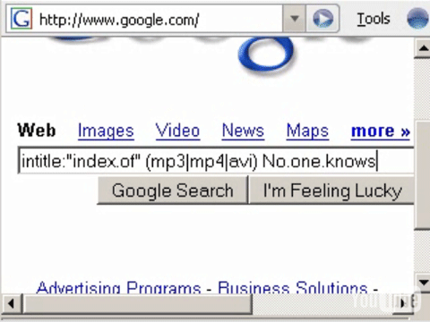

<iframe width="420" height="315" src="https://www.youtube.com/embed/MK7S4rdQZIA" frameborder="0" allowfullscreen></iframe>

Un video tutorial subido en YouTube ofrece en primicia como usar Google para localizar música y archivos de video en menos tiempo de lo que tardarías descargándotelo a través de un P2P.

En el “Financial Times” han puesto el grito en el cielo al descubrir como un chaval de 21 años llamado Jimmy Ruska mostraba en un video como utilizando directamente el motor de búsqueda de Google se pueden localizar archivos desprotegidos.

Según dicha publicación la fórmula de Ruska funciona en Yahoo y otros motores de búsqueda similares.

El video -de nueve minutos de duración- muestra como centrar la búsqueda mediante palabras clave que apartan el spam y otros resultados indeseados.

Matt Cutts, ingeniero encargado de la calidad de los resultados de búsqueda en Google, dijo que el video era tan sólo una tentativa para encontrar paginas web que contuviesen una lista de archivos que incluyesen la palabra MP3. “Por favor, aquí no hay nada que ver, vuelvan a sus casas”.

Sin embargo esto muestra una característica del código de búsqueda de Google que muchos usuarios no conocían. Al menos hasta que los del “Financial Times” hablaron del video.

El codigo a utilizar es el siguiente:   ** intitle:”index.of” (mp3|mp4|avi) titulo.del.fichero.con.puntos.en.lugar.de.espacios -html -htm -php -asp -cf -jsp**

El autor también explica como hacer un acceso directo en Firefox para poder hacer busquedas sin tener que escribir toda esa linea…

Vía [TheInquirerES](http://es.theinquirer.net/2007/07/11/musica_en_google_mas_rapido_qu.html)

