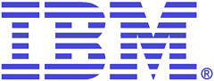

Esta semana en una conferencia celebrada en la Universidad del sur de California, cinco científicos de IBM ofrecieron sus predicciones de lo que nos deparará el mundo tecnológico y sus efectos en la vida planetaria a mitad de siglo.

**Potencia de proceso descomunal en la palma de la mano**. Bill Pulleyblank, responsable del desarrollo de BlueGene, las supercomputadoras más poderosas del mundo, indicó que en 2050 las características de estos gigantes, estarán disponibles en la palma de la mano. Explicando su predicción, indicó que un Mini Cooper, integra más tecnología que el Apollo 13, la nave espacial “que casi mata a Tom Hanks”, en referencia a la película del mismo nombre que contó la odisea de la nave enviada a la Luna.

**Aprovechar la fotosíntesis**. Sharon Nunes, responsable de la investigación de iniciativas “verdes” en el Centro de Biología Informática de IBM, predice algo que puede parecer obligado en el siglo 20 pero que está en pleno debate: en 2050, el agua potable y la energía estará disponible en todo el planeta, gracias a los avances en biología sintética y biología de sistemas. Nunes puso como ejemplo la fotosíntesis para construir células solares y convertir algas en combustibles limpios con el medioambiente.

**Extensión de la vida y procesamiento humano en paralelo**. Don Eigler, el científico que en 1989, utilizó un pequeño número de átomos xenon para escribir el nombre de su empresa usando un microscopio con helio líquido que mismo había construido, apuesta por la nanotecnología y las tecnologías asociadas para En sus predicciones del 2050, Eigler se concentró en la nanotecnología y en la tecnología agregada que permita extender la esperanza de vida humana, “fabricando nuevas estructuras de escala nanométrica para medicina regenerativa”, con dispositivos dentro del cuerpo humano que controlarán y administrarán automáticamente las medicinas necesarias. También habló sobre el procesamiento en paralelo para que una persona pudiera pensar de manera consciente en dos problemas a la vez, con la ayuda de dispositivos embebidos. Además predice que en 2050 tendremos portátiles 100.000 veces más potentes que los actuales.

**Genoma personales y medicina regenerativa**. Ajay Royyuru que lidera el Centro de Biología Computacional de IBM, predice que antes de 2050 todo el mundo tendrá un genoma personal, una información genética personalizada con la que predecir el comportamiento de cada individuo. Las células madre y la bilogía sintética curarán enfermedades en lugares específicos en lugar de tolerar la ausencia de un órgano o tejido.

**Inteligencia colectiva**. Jeff Jonas, ingeniero jefe del Entity Analytic Solutions Software Group, que trabaja en proyectos como correlación de datos y criptografía, predice que la inteligencia colectiva “estará a disposición de todos como nuestro agente digital personal”.

Aunque me temo que alguno de nosotros no llegaremos a verlo, si os interesa el tema del artículo podéis revisar [un informe de 2005](http://www.tendencias21.net/En-los-proximos-50-anos-la-tecnologia-cambiara-nuestras-vidas_a706.html), donde expertos de la compañía British Telecom anticipaban las innovaciones de los próximos cincuenta años: “En 2046 se habrá consolidado la energía nuclear de fusión, en 2041 existirá una pequeña ciudad en la Luna, en 2036 tendremos el primer ascensor espacial, en 2031 los robots serán más inteligentes que nosotros, en 2026 habrá combates de boxeo entre androides, en 2021 los yogurts nos contarán chistes, en 2016 los coches serán pilotados automáticamente, en 2017 podremos ir de vacaciones a un hotel en órbita….. hasta llegar en el 2051 a las comunicaciones telepáticas generalizadas y la transferencia de la información contenida en un cerebro humano a una máquina.

