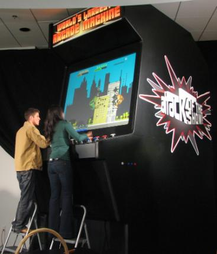

Vía [Kelokon.com](http://kelolon.com/reportajes.php?id=5) nos encontramos con este interesenta artículo:

**1.** La máquina recreativa más grande del mundo mide 4,11 de largo metros y tiene unos pulsadores como platos de lentejas, aparte de una pantalla de 1,81 metros. En ella se pueden jugar a más de 150 juegos distintos, eso sí, subidos a una escalera.

**2.** Para promocionar la consola Xbox 360 en Australia, Microsoft organizó la mayor batalla de globos de agua de la historia, lanzándose más de 51.400. No sabemos muy bien si entre los participantes o todos directamente a la compañía de Redmond.**3.** Un videojuego de 1987 sobre Jack el Destripador fue el primer juego de la historia en recibir la clasificación para mayores de 18 años, debido a sus violentas imágenes.

**4.** El videojuego más caro de la historia ha sido [GTA IV](http://es.wikipedia.org/wiki/Grand_Theft_Auto_IV), llegando a costar su desarrollo más de 100 millones de dólares, que a estas alturas ya han sido sobradamente recuperados. El anterior juego más caro de desarrollar de la historia fue Shenmue de Dreamcast costando 80 millones de dólares, aunque este no consiguió recuperar la inversión.

**5.** La mansión con más habitaciones de la historia de los videojuegos es la aparecida en Castelvania: Symphony of the nigth, de Psx, con 1890 habitaciones. Esperamos que paguen pluses a la chica de la limpieza.

**6.** La escena cinemática más larga aparecida en un videojuego es de Metal Gear Solid para Psx, aparece al derrotar a Metal Gear Rex, y dura nada menos que 15 minutos y 17 segundos. Al terminar dicha secuencia es más que probable que hayamos olvidado cómo se jugaba al juego.

**7.** El juego con más personajes para seleccionar es Lego Star Wars, que suma 96, pero al poder combinar diferentes piezas y partes del cuerpo entre sí podemos tener la friolera de un millón de personajes seleccionables. ¿Quién es el valiente que se pasa el juego con todos?

**8.** Street Fighter 2: The Movie, es el primer videojuego de la historia en estar basado en una película que a su vez también se basa en un videojuego. Como es lógico tanta degeneración no podía ser buena y el juego tuvo un fracaso comercial estrepitoso.

**9.** Mortal Kombat fue el videojuego que llevó a crear la ERSB, la organización que clasifica los videojuegos en función de edad y violencia en Estados Unidos, donde incluso dicho videojuego llegó a estar presente en las discusiones del congreso.

**10.** El primer videojuego de disparos de la historia se creó en 1961. Se llama Spacewar! y se realizó en tan solo 200 horas.

**11.** El primer Half-Life es el juego más premiado de la historia, recibiendo más de 90 premios, además de 51 clasificaciones como “El mejor juego del año”.

**12.** La mayor recaudación de la historia en un solo día por la venta de un videojuego fue con la puesta a la venta de Halo 3, consiguiendo 151 millones de dólares, repetimos, en su primer día de salida.

**13.** La mayor saga de los videojuegos si contamos su número de entregas es sin duda Megaman. Desde el original de Nes hasta nuestros días, la saga tiene más de 43 secuelas. ¿Será la entrega 44 donde por fin maten a Megaman?

**14.** El mejor juego de futbol de la historia según la valoración de los usuarios es Sensible Soccer, donde su tremenda y adictiva jugabilidad sorprendieron para el nivel técnico de la época.

**15.** Colin Mc Rae: Dirt, tiene un elaborado sistema de sonido realista, en el cual se pueden mezclar, ATENCIÓN: 1.005.772.154.467.879.035.136 sonidos. Ya hay que tener el oído fino. Me espeluzna pensar en quien es el campeón que los ha escuchado todos para poder contarlos.

**16.** All Nipon Airways, aerolínea japonesa, dispone de cuatro aviones totalmente pintados con personajes de Pokemon, e incluso las azafatas lucen delantales de los mismos. Por si no tuviésemos suficiente temor a volar…

**17.** En el multijugador de rol masivo Everquest 2, podíamos teclear “/pizza” y entonces nos conectábamos directamente al portal de Pizza hut desde el juego, aceptando pedidos a domicilio. Muy útil para gente que no quiere o puede salir a la calle y aun les faltan 32 horas para matar al dragón.

**18.** La puntuación más alta que se puede lograr en el videojuego PAC-MAN es 3.333.360 millones de puntos. Solo 5 personas en toda la historia la han conseguido.

**19.** La universidad de Washington creó en 1991 “Virtual Retinal Display”, una tecnología que emplea laser de baja frecuencia para escribir directamente la información en nuestra retina, y que nuestro propio ojo se convierta en el monitor. Hacen falta voluntarios para el experimento, ¿Quién se apunta?

**20.** El videojuego con más extensión por recorrer es Armed Assault, que dispone de un terreno de 400 km cuadrados. No sabemos si recorrerlo entero en patín nos desbloquea algún premio en el juego.

