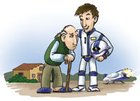

Hoy mientras leía un artículo en la [Wikipedia](http://es.wikipedia.org/wiki/Paradoja_del_viaje_en_el_tiempo), he llegado por casualidad o destino a un artículo que dice así…

La **paradoja del viaje en el tiempo**, o **paradoja del abuelo**, es una [paradoja](http://es.wikipedia.org/wiki/Paradoja "Paradoja") que se cree expresada por primera vez por el [escritor](http://es.wikipedia.org/wiki/Escritor "Escritor") [francés](http://es.wikipedia.org/wiki/Francia "Francia") de [ciencia ficción](http://es.wikipedia.org/wiki/Ciencia_ficci%C3%B3n "Ciencia ficción") [René Barjavel](http://es.wikipedia.org/wiki/Ren%C3%A9_Barjavel "René Barjavel") en su [novela](http://es.wikipedia.org/wiki/Novela "Novela")*Le voyageur imprudent* (*El viajero imprudente*, [1943](http://es.wikipedia.org/wiki/1943 "1943")).

Se parte del supuesto que una persona realiza un [viaje a través del tiempo](http://es.wikipedia.org/wiki/Viaje_a_trav%C3%A9s_del_tiempo "Viaje a través del tiempo") y mata al padre biológico de su padre/madre biológico (abuelo del viajero), antes de que éste conozca a la abuela del viajero y puedan concebir. Entonces, el padre/madre del viajero (y por extensión, ese viajero) nunca habrá sido concebido, de tal manera que no habrá podido viajar en el tiempo; al no viajar al pasado, su abuelo entonces no es asesinado, por lo que el hipotético viajero sí es concebido; entonces sí puede viajar al pasado y asesinar a su abuelo, pero no sería concebido, y así indefinidamente.

Se alude a ella como paradoja del abuelo cuando el viajero del tiempo conoce a su abuela en el pasado y altera los actos que dieron lugar a que ésta conociera a su futuro marido; con lo cual, no tienen hijos, y éstos no tienen al viajero temporal.

