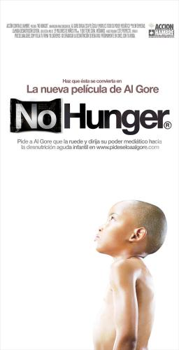

Del ganador del Oscar. Del productor de uno de los documentales más vistos de los últimos años. Del Nobel de la Paz. Del ex vicepresidente de los Estadoas Unidos de América. Al Gore presenta *No Hunger*. Una película sobre la desnutrición infantil. Sobre los 19 millones de niños en peligro de muerte por el hambre. De las soluciones que existen a esta epidemia, que podría frenarse con una inversión de 3.000 millones de euros. Al Gore vuelve a poner su poder de convocatoria, a favor de una causa justa. Al igual que en *Una verdad incómoda*, el norteamericano busca de nuevo llamar la atención sobre una realidad palpable a la que los países ricos dan la espalda. Tras sumar miles de conversos a la lucha contra el cambio climático, tras llevarse premios cinematográficos, tras poner el dedo en la llaga del calentamiento del planeta, Gore se fija ahora en un tratamiento sencillo que sí puede salvar vidas…

<iframe allowfullscreen="" frameborder="0" height="453" src="http://www.youtube.com/embed/RSxJQF0bwZA?feature=oembed" width="604"></iframe>

**Pero No Hunger no existe.** Todavía no. Al Gore aún no ha rodado nada. No existen productores, ni cámaras, ni guionistas, ni multimillonarias campañas de promoción. Aún no ha preparado Gore el esmoquin para la próxima ceremonia de los Oscar. Los actores de Hollywood unidos a la causa de la ecología aún no han preparado los discursos para sumarse a este nuevo reto.

Quienes sí existen son los 55 millones de niños en riesgo de desnutrición. Existen los 19 millones que sufren hambre severa. Dejan de existir 5 millones de niños cada año por falta de tratamiento. Y existe ese tratamiento: es un paquetito, un alimento terapéutico a base de pasta de cacahuete, con alto contenido energético, que puede tomarse en casa, que no necesita cocción y soporta temperaturas extremas. Simplemente, se abre una esquinita del paquete y se chupa. Como un caramelo, pero salvando vidas. Cuesta unos 40 euros, y dice el director técnico de Acción contra el hambre, Amador Gómez, que con este paquetito se pueden curar el 80% de los niños desnutridos que atiende la ONG.

¿Qué pinta Al Gore en todo esto? Acción contra el hambre quiere que ruede No hunger. Que se moje. Que ponga todo su poder mediático para llamar la atención sobre el hambre infantil. ¿Tú también quieres que Al Gore ruede? Pídeselo: no tienes más que entrar en [www.pideseloaalgore.org](http://www.pideseloaalgore.org/) y añadir tu firma. 7.837 personas lo han hecho ya.

