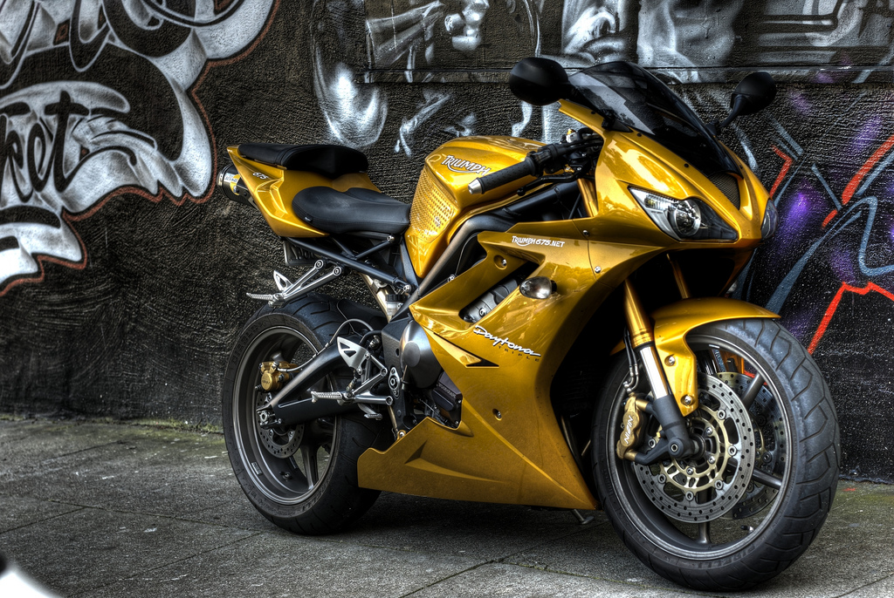
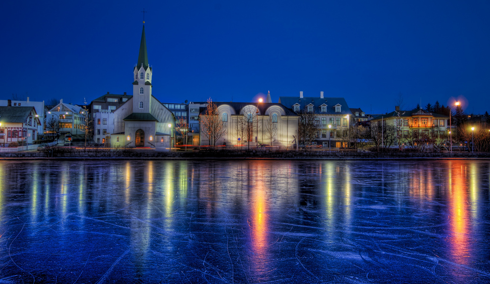
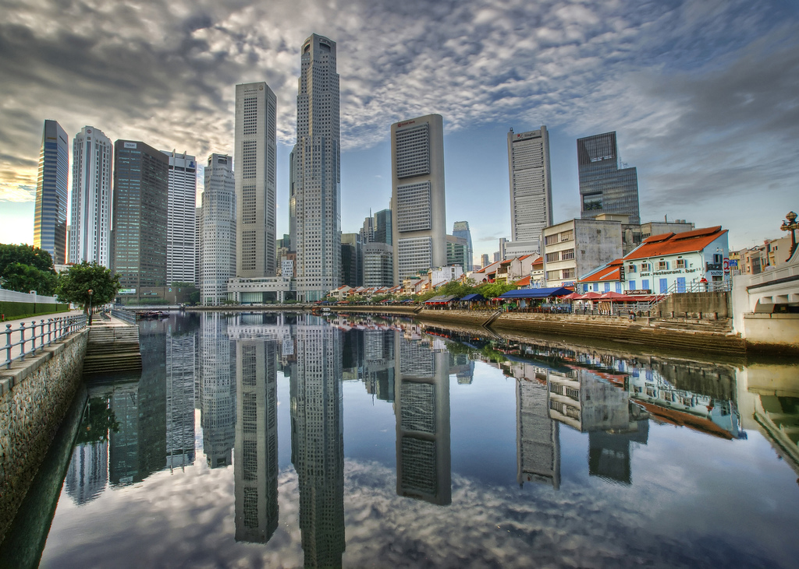
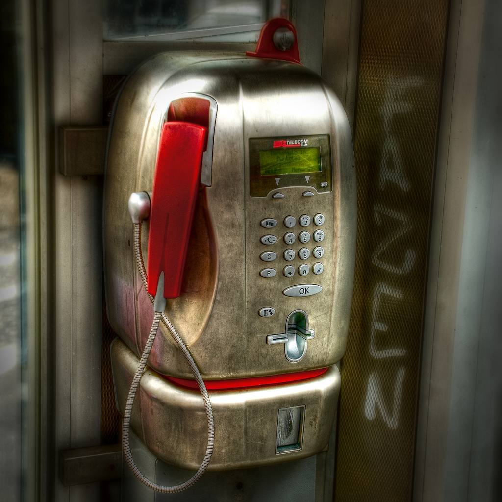
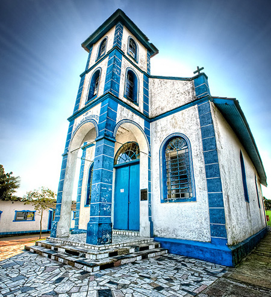

**¿Qué es la fotografía HDR?**

La **fotografía HDR (o HDRI, High Dynamic Range Imaging)** es una técnica para procesar imágenes que busca abarcar el mayor rango de niveles de exposición en todas las zonas. Esto se consigue mediante la mezcla de varias fotos de la misma imagen con diferentes exposiciones.

**Algunos ejemplos de fotografias HDR**

Triumph Daytona HDR

Frozen Pond HDR

Distrito de negocios en Singapur HDR

Cabina telefónica HDR

Iglesia HDR

**8 Consejos Clave para hacer Fotos HDR Espectaculares**

**1. Utiliza un trípode**

Para poder combinar una imagen de alto rango dinámico necesitarás varias exposiciones. Lo ideal es hacer varias fotos con el mismo encuadre y distintos parámetros de exposición.

En caso de que dispares en JPEG necesitarás necesariamente usar un trípode, porque de otro modo no podrás juntar las distintas fotos que saques.

Pero en caso de que vayas a hacer HDR a partir de una sola imagen RAW también te vendrá bien, ya que ayudará a que la foto resultante sea lo más nítida posible.

**2. En JPEG, usa el disparador remoto**

El problema de disparar con trípode es que cualquier mínimo movimiento puede provocar que la posición del trípode varíe, haciendo que posteriormente no encajen las distintas tomas que hayamos realizado.

Utilizando un disparador remoto con la cámara evitarás que se pueda mover la cámara al pulsar el botón de disparo, echando a perder la fotografía.

Si no dispones de uno, puedes probar a utilizar el temporizador de la cámara. Pero que sepas que, si tu cámara lo permite, estás perdiendo la oportunidad de disponer de un disparador remoto por menos de 5 euros.

**3. Usa el menor valor ISO posible**

En alguna ocasión hemos explicado el significado de la sensibilidad ISO de las cámaras digitales.

Cualquier valor ISO por encima del mínimo que permita la cámara se traducirá en un mayor nivel de ruido en las fotografías resultantes. En HDR es fundamental disponer de imágenes lo más limpias posibles, ya que el ruído tiende a dispararse en la fase de tone mapping.

Por lo tanto, y más si estás utilizando trípode, selecciona el menor ISO que tu cámara te permita. Obtendrás fotografías de mejor calidad.

**4. Usa RAW para objetos en movimiento**

Si quieres hacer fotografías de objetos en movimiento, necesitarás obtener tu imagen HDR de una sola toma.

Esto es bastante lógico, ya que con distintas capturas no encajarán posteriormente ciertos elementos de la foto, generando sombras extrañas.

Así que, haz la foto en RAW para poder extraer varias imágenes con distintas exposiciones de la misma fotografía original.

**5. Prueba a fotografiar objetos estáticos con elementos en movimiento**

Si vas a hacer una foto a algo estático con elementos en movimiento en el fondo, como pueden ser escenas urbanas con gente andando o coches circulando, prueba a disparar en JPEG.

Esos elementos secundarios en movimiento suelen crean efectos bastante curiosos.

**6. Objetos metálicos**

Los elementos de metal tienden a provocar efectos bastante llamativos.

Este efecto se debe a la gran variación de luz y sombra que puede recogerse en tan poco espacio, ni mas ni menos que el tamaño que ocupe en nuestra foto el objeto metálico.

Así que, si puedes, prueba a incluir algún objeto metálico en tu fotografía.

**7. Fotografía objetos con fuertes texturas y diferencias de color**

Los contrastes fuertes generan gran diversidad de luces y sombras, que es la esencia de la fotografía HDR.

Al igual que ocurre con los objetos metálicos, cualquier tipo de contraste fuerte es un recurso muy agradecido a la hora de crear imágenes HDR.

**8. Utiliza el modo de bracketing automático**

Si tu cámara dispone de este modo de disparo, úsalo. Fija el valor de la apertura para conseguir la misma profundidad de campo en todas las tomas y haz varias fotos con distintos tiempos de exposición. Cuantas más fotografías tomes, más información tendrás y mejores resultados podrás obtener en el tratamiento HDR posterior.

Via [DZoom.org.es](http://www.dzoom.org.es)

**Enlaces relacionados**

- [Fotografía HDR](http://www.dzoom.org.es/noticia-1444.html)
- [HDR con Photomatix](http://www.dzoom.org.es/noticia-1445.html)
- [HDR con Photoshop](http://www.dzoom.org.es/noticia-1585.html)
- [Artizen HDR](http://www.dzoom.org.es/noticia-1605.html)
- [Colección de Fotografias HDR Impresionantes](http://www.dzoom.org.es/noticia-1586.html)
- [Creación de imágenes HDR con software libre](http://rendergraf.wordpress.com/2008/03/23/creacion-de-imagenes-hdr-con-software-libre/)
- [HDR Japan](http://www.hdrjapan.com/)

ACTUALIZACIÓN: He encontrado [esta web](http://www.createhdr.com/) que permite aplicar el efecto HDR a nuestras fotos. Lo he intentado probar, pero parece que están aún en modo de pruebas y hay algunos fallos. Lo comento, por si en un futuro ya estuviera arreglado…

