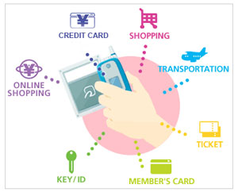

El oficinista japonés Satoshi Tada paga sus compras, obtiene comida gratis y logra descuentos en tiendas sólo con utilizar su teléfono móvil.

“Lo uso bastante todos los días”, dijo el joven de 25 años. “Puedes ponerle crédito si lo necesitas, y no tienes que estar dando vueltas tratando de encontrar un cajero automático. Puedes incluso recibir puntos de compra porque está conectado a las tarjetas de crédito”, añadió Tada.

Las grandes firmas como Visa y Nokia todavía están probando el uso de los teléfonos como medio de pago, pero en Japón más de 50 millones de personas, es decir la mitad de todos los usuarios de terminales móviles, ya cuentan con equipos que fácilmente pueden reemplazar a las carteras.

Japón no sólo ha sido el pionero con la [tecnología](http://es.noticias.yahoo.com/tecnologia.html) sino también con los modelos comerciales que posibilitarán que en el futuro que los móviles que operan como monederos electrónicos se conviertan en un método de pago estándar.

“La gente siempre lleva los móviles consigo, y les resultaría útil que tuvieran una función financiera”, observó Hironobu Sawakeel, analista de JPMorgan Securities en Tokio.

El éxito en Japón y las pruebas en otros países han demostrado que esta iniciativa apunta a que los terminales reemplacen a las tarjetas de crédito y al dinero en efectivo, para que funcionen como forma de pago en transporte, entretenimiento, y se conviertan además en llaves electrónicas.

Pero existen otros obstáculos; desde romper la barrera psicológica de los escépticos consumidores a usar los móviles como sistemas de crédito, a elaborar nuevos modelos comerciales a medida que se desdibujan las líneas entre los bancos, las entidades financieras y las compañías de telefonía móvil.

En este sentido, Japón está marcando tendencias.

La mayor compañía de tarjetas de crédito del mundo, MasterCard, dijo el mes pasado está negociando con varios bancos para el lanzamiento de billeteras electrónicas, y espera durante ver en los próximos dos años una actividad sustancial en los bancos abocados al sector minorista.

“Ahora los bancos dicen: No dudo de la tecnología. Necesitamos solucionar el modelo comercial entre las industrias de móviles y de pagos. No es una tarea trivial”, afirmó James Anderson, vicepresidente de la división de comercio en móviles de MasterCard.

Para Tada, que rara vez saca su billetera de cuero de su bolsillo, el móvil hace todo el trabajo.

“Para hacer compras, lo uso donde pueda (…) Y también uso cupones como los Gourmet Navigator Touch cada vez que puedo”, dijo.

Los consumidores de entre 20 y 40 años son los principales usuarios de los servicio y según los estudios los usuarios son fieles a esta forma de pago, lo que la convierte en una herramienta útil para que las compañías sigan los hábitos de compra de sus clientes.

Vía [Yahoo noticias](http://es.noticias.yahoo.com/10/20081123/ttc-japon-moviles-compras-fe50bdd.html)

