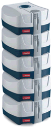

Esta noticia es el resultado de una jornada de reyes magos sin regalos y de una procrastinación aguda, lo cual se traduce en buscar ideas para saciar mi obsesión compulsiva para ordernar cosas de forma más eficiente (si, necesito ayuda…)

Si tenemos en cuenta que muchos de nosotros (frikis) llevamos desde hace 10 años grabando en CD casi todo lo que pasa por nuestras manos, a estas alturas, la cantidad de Cd’s acumulados debe ser bastante alarmanete… del orden de miles..

Como buenos “piratillas” que somos, acostumbrados a tenerlo todo al grito de Click!!, es nuestro deber buscar formas de encontrar más rápido y comodamente el CD de la peli que queremos ver esta noche y para eso necesitamos hacer algo de compras geeks…

En total tendré más de 600 CDs y unos 20 DVDs, así que necesitaría más de 5 unidades de éste producto de Imation. **Cada unidad de Disk Stakka puede ordenar hasta 100 discos**. La principal característica de éste producto es que se puede conectar mediante USB al ordenador, y mediante el software OpdiTracker de Opdicom se puede crear una base de datos con el contenido, título y demás de cada disco para tenerlos ordenados.

También existe la posibilidad de apilar cada Disk Stakka en grupos de 5 en 5 unidades. Podemos tener 5 Disk Stakka juntos en un mismo paquete, y estos cinco conectarlos a su vez con otros 95 Disk Stakka mediante hubs, llegando a poder utilizar hasta 100 cajitas, es decir, poder tener hasta 50.000 discos ordenadores mediante software.

El precio de cada unidad ronda los 100 euros, y se puede comprar en España en [varios puntos de venta oficiales](http://www.imation.es/where_to_buy/index.html) de Imation.

Más información | [Imation](http://www.imation.es/products/disc_stakka/index.html)

Más información | [Opditrack](http://www.opdicom.com/products/opdiTracker.asp)

