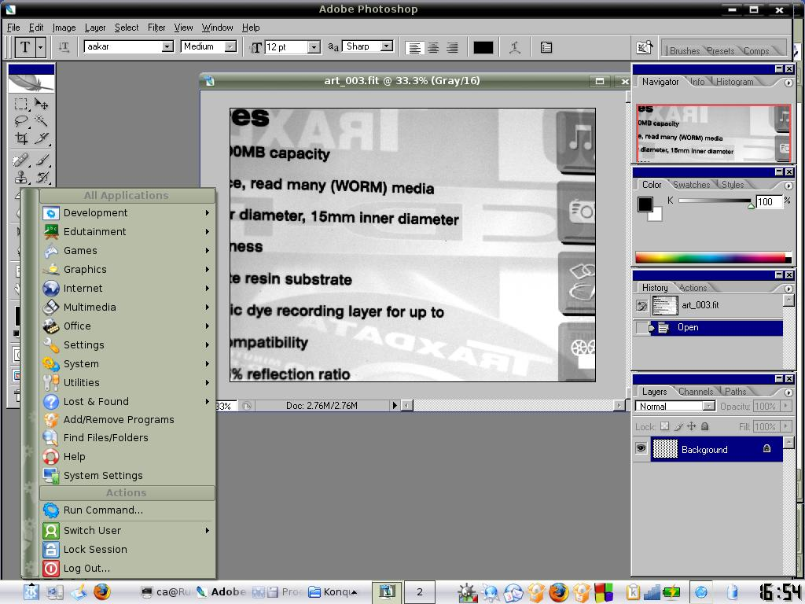

Seguro que mas de uno de vosotros tenéis instalado *Windows* exclusivamente para usar alguna de las aplicaciones de Adobe ( [Photoshop](http://www.adobe.com/es/products/photoshop/photoshop/), Flash, Premiere, After Effects ). Este es uno de los problemas mas importantes que supone a un usuario de *Windows* pasarse a *Linux*, pero como todo con el tiempo va cambiando y últimamente le esta tocando a nuestro querido *Linux* por suerte para nosotros.

La última versión de Wine, la 1.1.6 nos permite la instalación y ejecución de estos programas fácilmente. Todavía se nota (sobre todo en Dreamweaver) una pequeña diferencia de rendimiento con respecto a windows, principalmente al trabajar con muchos archivos, pero por lo menos, ya es posible generar contenido de calidad en Flash desde cualquier distribución que soporte esta versión de wine.

Para poder instalar algunas de las aplicaciones, a veces hay que realizar algunos cambios en los archivos durante la instalación. Para ver un listado de las aplicaciones compatibles, haz [click aqui](http://appdb.winehq.org/objectManager.php?bIsQueue=false&bIsRejected=false&sClass=vendor&iId=12&sAction=view&sTitle=View+Vendor).

Más info | [Instalar Photoshop en Linux](http://www.forat.info/2007/09/22/photoshop-en-linux-debian-con-wine-el-remedio-de-todos-tus-males/)

More info | [Wine Wiki](http://wiki.winehq.org/AdobePhotoshop) (english)

More info | [How to install](http://arnholm.org/linux/cs2/index.htm) (english)

