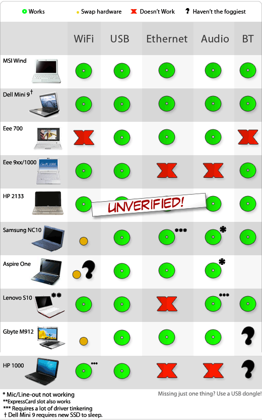

Para aquellos de vosotros que esteis aburridos de Windows/Linux o que estéis interesados en probar Mac OS sin tener que gastaros una pasta…, la solución pasa por instalar una de las copias hackeadas (que circulan por los canales p2p habituales) en uno de los dos netbooks completamente compatibles: MSI Wind (akoya medion o advent) o DELL Mini 9.

**Nota**: La instalación de este software anula el contrato  EULA de Apple, incluso aunque tengas una copia legal de Mac OS. La siguiente es una tabla de compatibilidad entre los modelos de netbook y Mac OS.

