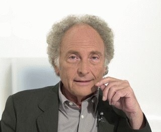

<iframe allowfullscreen="" frameborder="0" height="453" src="http://www.youtube.com/embed/puyGQWX_a1M?feature=oembed" width="604"></iframe>

Interesante capítulo del programa “Redes”, presentado por el famoso científico y economista “Eduard Punset”.

