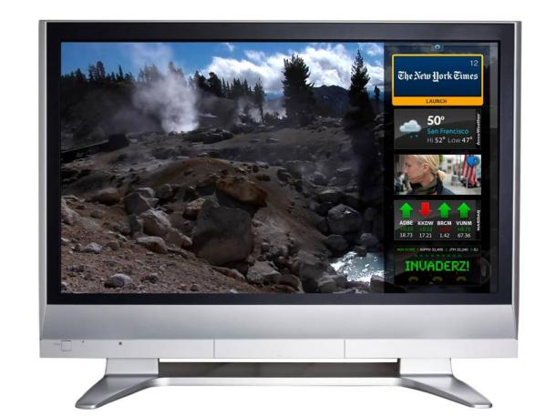

**Adobe Flash ha anunciado hoy que su teconología estará próximamente disponible en televisores,** una de las mayores noticias para la integracion entre **Internet y el televisor.**

Si bien no se sabe exactamente cuándo estará disponible, es un paso muy importante para la integración en el futuro de la **televisión por Internet, y de Internet en el televisor.**

La mayor parte del **contenido multimedia de Internte funciona mediante Flash**, por lo que la incorporación de **Flash** en el elemento más cotidiano de nuestros gadgets para el hogar general una suerte de integración, por lo que nuestros gadgets pueden llegar a estar completamente integrados entre sí.

A partir de éste anuncio, **los diferentes gadgets y dispositivos tendrán que integrarse** ya que el anuncio abarca también al ** Blu-Ray, sistemas de cine en casa, receptores de medios digitales y todo tipo de dispositivo multimedia.**

La idea es la incorporación así como sucediera con la** inclusión en los smartphones**, y los dispositivos compatibles estarían a la venta a principios del próximo año según la crisis lo permita.

Vía [Cnet](http://news.cnet.com/8301-1023_3-10222984-93.html?part=rss&subj=news&tag=2547-1_3-0-20)

