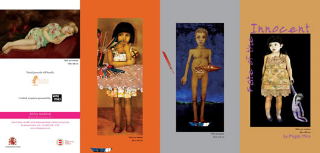

Mi tia “Madín” se estrena en Hong Kong con una exposición de pinturas.

A continuación, la [nota de prensa que le ha dedicado el diario “El mundo”](http://www.elmundo.es/elmundo/2009/05/09/cultura/1241867087.html):

La exposición **‘Suerte del inocente’** reúne por primera vez en Hong Kong 14 obras de la artista catalana Magda Mira en la galería de arte contemporáneo español [Sofía Gaspar](http://www.sofiagaspar.com/).

Todos los trabajos, realizados en su estudio de Barcelona entre los últimos meses de 2008 y 2009, tienen como protagonistas a** niños que representan la abundancia** de los que viven en el primer mundo y las escaseces y penurias a las que se ven expuestos los más pequeños del mundo en desarrollo.

“Me gustan las obras que te sacan de la pasividad”, dijo Magda Mira, quien se desplazó a Hong Kong desde España para inaugurar la muestra. “Las galerías tienen que mostrar buen arte, independientemente de si son temas duros o livianos. En este caso me gustó el cariño y un cierto punto surrealista que transmiten”, expresó por su parte la galerista Gaspar, confiada en el éxito de la muestra y en la aceptación que generará entre los coleccionistas locales.

La creadora, influenciada por artistas tan dispares como el español **[Antonio López](http://es.wikipedia.org/wiki/Antonio_L%C3%B3pez_Garc%C3%ADa) y el británico-irlandés [Francis Bacon](http://es.wikipedia.org/wiki/Francis_Bacon_(pintor))**, así como la fotógrafa madrileña [Ouka Leele](http://es.wikipedia.org/wiki/B%C3%A1rbara_Allende_Gil_de_Biedma), aborda el hambre, la problemática de la inmigración en pateras y la contaminación ambiental.

Mira, introduce en sus trabajos cada uno de los temas de forma indirecta, integrados en las prendas de los protagonistas o en el telón de fondo sobre el que los representa.

Para Mira, que expone habitualmente en España, y puntualmente en Francia, no es la primera vez que trabaja **el tema de los niños, uno de sus preferidos**, ya que según la artista, se siente atraída “especialmente por sus miradas, cargadas de inocencia”. ‘Niña con helado’ y ‘Niña con muñeca’ marcan el contrapunto a ‘Niña saltando’ y ‘Bajo la lluvia’ con los que la artista critica las disparidades.

Las obras son ricas en materiales y técnicas, empleando desde lienzos a escayola y papeles sobre los que luego dibuja y pinta con lápiz, témperas y acuarelas, atreviéndose a probar incluso con aceite de oliva para lograr efectos de humedad.

La muestra, que se estrenó el viernes, permanecerá expuesta hasta el próximo 12 de junio.

