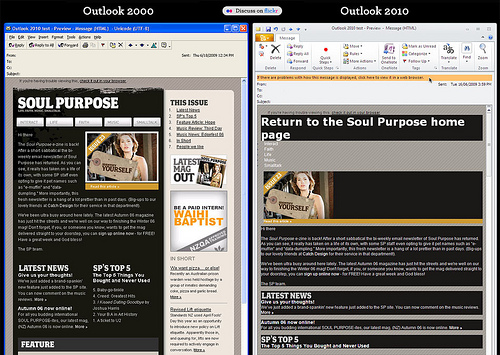

La próxima actualización del programa de correo electrónico Microsoft Outlook retrocede otros cuantos años *al pasado*, diez para ser exactos. Después de que la versión 2007 de Outlook prescindiese de utilizar el motor HTML de Internet Explorer para pasar a *tirar* del de Word, [parece que el nuevo Outlook 2010 seguirá utilizando el motor HTML obsoleto](http://www.email-standards.org/blog/entry/microsoft-to-ignore-web-standards/). El del programa para edición de textos no se actualiza desde hace más de un lustro y ya venía siendo un problema en Outlook 2007.

Muchos [medios especializados han puesto el grito en el cielo](http://www.sitepoint.com/blogs/2009/06/24/outlook-2010-to-set-new-standard-in-irritation/), y miles de usuarios se han apuntado a la petición [Fix Outlook](http://www.fixoutlook.org/)*(Arreglad Outlook)* para enviar un “mensaje claro” a Microsoft sobre su disconformidad al respecto y aprovechando que ha solicitado opiniones sobre su beta. Nadie entiende que Microsoft no aproveche esta actualización para mejorar unas de las peores características de Outlook desde que Microsoft lo *rompiera* con la última actualización 2007, aunque parece un episodio relacionado con temas de seguridad e integración.

Como ejempo, la imagen publicada en el artículo del [Email Standards Project](http://www.email-standards.org/) –entidad que trabaja para asegurar el buen cumplimiento de los estándares web en cuestiones de correo electrónico– muestra el mismo mensaje de correo en formato HTML visualizado en el viejo Outlook 2000, *literalmente* del siglo pasado, comparado con el resultado del mismo mensaje en la beta de Outlook 2010,

<cite></cite>[Outlook 2000 vs 2010 por Freshview](http://www.flickr.com/photos/freshview/3637814200/)

Sigue leyendo en [Microsiervos](http://www.microsiervos.com/archivo/internet/outlook-2010-usara-word-visualizar-mensajes-html.html)

