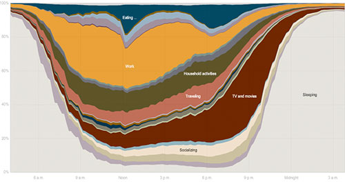

[**How Different Groups Spend Their Day**](http://www.nytimes.com//interactive/2009/07/31/business/20080801-metrics-graphic.html "How Different Groups Spend Their Day - Interactive Graphic - NYTimes.com") es una interesante infografía interactiva en la que se pude ver en qué emplean su tiempo los estadounidenses mayores de 15 años, aunque los resultados probablemente se puedan extrapolar a muchos otros países, en la que estos se pueden filtrar por sexo, edades, raza (algunas), estudios, y número de hijos, y en la que se puede aislar cada una de las cartegorías haciendo clic en ella.

Como era de esperar, se pasan un montón de tiempo durmiendo, aunque los que tienen dos o más hijos son los que menos duermen ;-)

Via [Microsiervos](http://www.microsiervos.com/)

