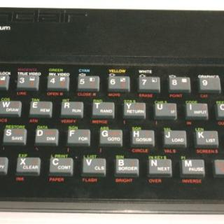

<iframe allowfullscreen="" frameborder="0" height="453" src="http://www.youtube.com/embed/pmfHHLfbjNQ?feature=oembed" width="604"></iframe>

[Big Ideas (don’t get any)](http://vimeo.com/) from [James Houston](http://vimeo.com/user354216)

Tremendo! proyecto de títulación del Diseñador Gráfico James Houston. Desafortunadamente no alcanzó a presentar su video para el concurso que había organizado Radiohead para su video Nude (Big Ideas) y decidió simplemente colgarlo en internet.

Pueden leer la descripción del proyecto directamente en [la página de Vimeo](http://www.vimeo.com/1109226) donde James colgó su video.

El hardware que utilizó seguro que le resulta familiar a más de uno…

Sinclair ZX Spectrum – Guitars (rhythm & lead)  
 Epson LX-81 Dot Matrix Printer – Drums  
 HP Scanjet 3c – Bass Guitar  
 Hard Drive array – Act as a collection of bad speakers – Vocals & FX

