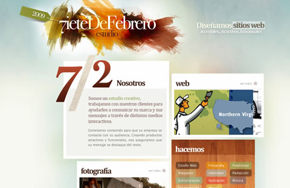
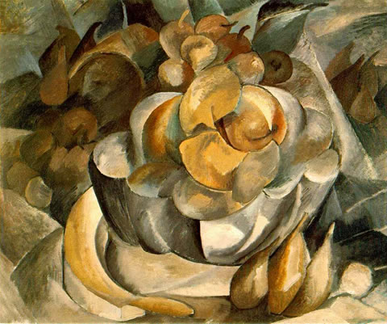
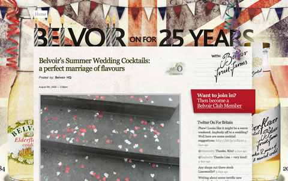

#### [Joan Mitchell](http://www.artnet.com/awc/joan-mitchell.html), *Untitled*, 1960

Una página web que Mitchell pudiera haber diseñado: [Siete De Febrero](http://www.sietedefebrero.com/)

 

#### [Georges Braque](http://en.wikipedia.org/wiki/Georges_Braque), *Fruit Dish*, 1908-09

Una página web que Braque pudiera haber diseñado: [Belvoir Fruit Farms](http://blog.belvoirfruitfarms.co.uk/)

 

[Seguir leyendo](http://www.smashingmagazine.com/2009/08/27/if-famous-painters-were-web-designers/) (en inglés)…

