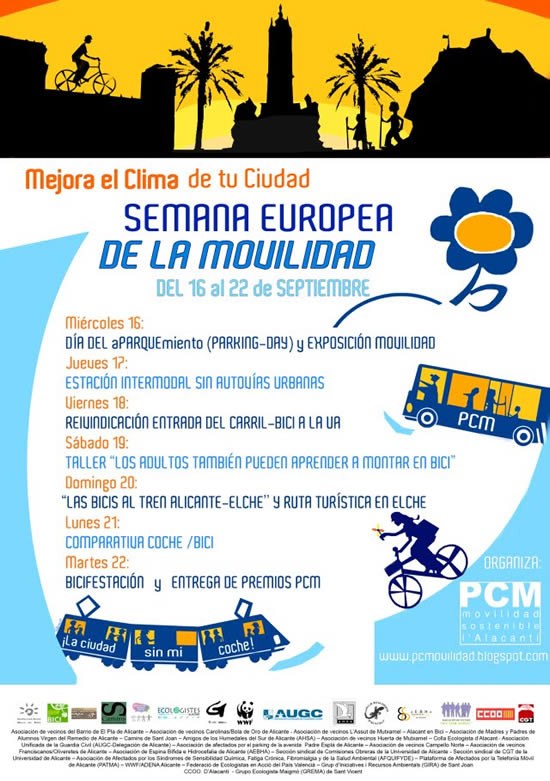

Mejora el clima de tu ciudad» es el lema de la Semana Europea de la Movilidad, con la que se pretende demostrar que los ciudadanos, las autoridades locales y otros sectores de la sociedad pueden contribuir a la lucha contra el calentamiento global fomentando un cambio radical del uso del coche privado hacia medios de transporte más sostenibles

Del 14 al 22 de septiembre, en toda Europa y por supuesto, también en Alicante por la [PCM](http://pcmovilidad.blogspot.com).[ Más informacón aquí](http://pcmovilidad.blogspot.com/2009/09/programa-semana-europea-de-la-movilidad.html)

