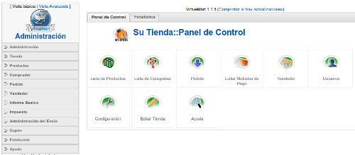

Una de las principales ventajas de los CMS es que podemos ir añadiendo módulos que flexibilizan nuestra plataforma pudiendo crear tanto una página corporativa como una tienda virtual o un catálogo simplemente añadiendo un módulo. Es el caso de **Virtuemart el complemento de Joomla para crear una tienda online**. Y esto con la ventaja que nos aporta un CMS como Joomla para poder ir actualizando nuestra tienda con facilidad.

Joomla es un sistema muy completo para montar nuestra página o si así lo deseamos nuestra tienda online. Es un sistema basado en Apache, PHP y MySQL y de código libre con lo cual os lo podéis descargar e instalar para montaros vuestra propia intranet e ir así conociendo el sistema. **Para sacarle todo el partido son necesarios ciertos conocimientos de creación de páginas web**, no muchos, pero si no podéis hacer el esfuerzo son muchos los sitios y profesionales que os montarán vuestra página con este sistema.

Respecto al componente tendremos que **instalarlo una vez tengamos ya realizada previamente la instalación de Joomla**. Tengo que decir que la instalación de este complemento se me ha revelado, por decirlo de alguna manera, un poco puñetera y finalmente lo he realizado ayudándome de un instalador remoto que tiene y me ha funcionado sin problemas.

*  
 Panel de Control de Virtuemart*

*[Seguir leyengo el artículo aquí…](http://www.tecnologiapyme.com/ebusiness/virtuemart-el-complemento-de-joomla-para-crear-una-tienda-online)  
*

Más Información | [Virtuemart ](http://virtuemart.net/)  
 Ejemplo | [Catalogo online creado con Virtuemart](http://www.rcforja.com/)

