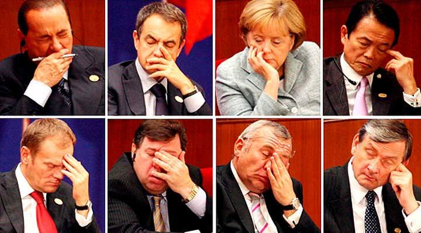

**- Es la conclusión a la que ha llegado un grupo de investigadores de la Universidad de Bélgica**  
**- Las pruebas demuestran que los trasnochadores se mantienen activos más tiempo**  
**- Pueden mantener la atención mental durante más horas que los madrugadores**

A quien madruga, ¿Dios le ayuda? Un estudio de la Universidad de Liège en Bélgica parece desmontar este dicho popular, ya que ha revelado que el cerebro de **los madrugadores se cansa antes** que el de las personas que suelen trasnochar.

Los científicos, dirigidos por Christina Schmidt, estudiaron los hábitos de 16 personas extremadamente madrugadoras y de 15 más acostumbradas a pasar la noche en vela. En el laboratorio ambos grupos durmieron siguiendo sus patrones de sueño preferidos mientras se les hacían pruebas cognitivas y un escáner medía su actividad cerebral, [según recoge la última edición de la revista *Scientifc America*](http://www.scientificamerican.com/).

Una hora y media después de despertarse, tanto el cerebro de los más madrugadores como el de los noctámbulos se mantenía igual de alerta. Pero** tras 10 horas y media sin dormir, los ‘buhos’ obtenían mejores resultados** en acciones que requerían atención. Mientras, los más madrugadores se sentían más somnolientos y realizaban estas tareas de forma más lenta. Además, la zona cerebral que alberga nuestro [reloj circadiano](http://es.wikipedia.org/wiki/Reloj_circadiano) (que marca el ritmo biológico de los seres humanos) también presentaba una mayor actividad en el el grupo de los noctámbulos.

Los científicos concluyeron que la capacidad del ser humano para mantenerse alerta y su habilidad para concentrarse se ven afectadas tanto por la cantidad de tiempo que una persona está despierta como por el momento del día, debido a que los **ritmos del reloj circadiano** funcionan según un ciclo de luz y oscuridad. Al variar el ciclo de la luz, se altera también el área del cerebro donde se aloja el grupo de neuronas que regula nuestro ritmo biológico.

Los resultados demuestran que **los trasnochadores suelen ‘vencer’ a las personas que madrugan en la cantidad del tiempo** que pueden estar despiertos sin fatigarse mentalmente y que a demás, los madrugadores no pueden sobreponerse a esta fatiga por falta de sueño.

