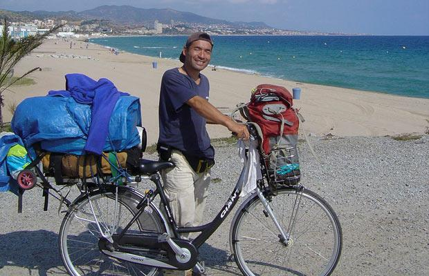

Keiichi Iwasaki, de 36 años, salió en su bicicleta Shopper Raleigh en 2001 para ir de gira por Japón. Pero él se divirtió tanto que cogió un ferry a Corea del Sur y desde entonces ha completado un ciclo a través de 37 países sin tener que regresar a casa. Él ha sido robado por piratas y detenido en la India, casi murió cuando fue atacado por un perro rabioso en el Tíbet y se casó casi en Nepal.

[Galería de fotos de sus viajes aquí](http://www.telegraph.co.uk/news/picturegalleries/worldnews/6168323/Keiichi-Iwasaki-travels-over-29000-miles-on-his-bicycle.html)

En total, el Sr. Iwasaki ha completado un ciclo más de 45.000 km (27.961 millas) sobre su favorito bicicletas Raleigh comprador pero dos han sido robados y dos se han roto, así que ahora va en su quinto.

Su mayor logro es la escalada más alta del mundo cima del Monte Everest, que se sitúa en 8.848 m (29.029 pies), desde el nivel del mar sin necesidad de utilizar ningún transporte.

Sr. Iwasaki, oriundo de Maebashi, Japón, dice que sólo su fuerza de voluntad””le ha mantenido en marcha.

Dijo: ”La mayoría de los viajeros y aventureros, pero necesita el dinero en vez de dar una oportunidad de viajar por el mundo Quiero aclarar que ese sueño puede hacerse realidad si usted tiene una fuerte voluntad.

”He estado viajando durante ocho años y continuará haciéndolo de dinero que recibo de realizar trucos. No llevo una tarjeta de crédito o cheques de viajero.”Mi voluntad fuerte es muy importante y espero que este viaje lo demuestra. Yo quería viajar por el mundo en mis veinte años, pero no he sido capaz de hacerlo hasta que tuve 28.”Me dije a mí mismo que «Mi vida se acabará pronto, antes de hacer lo que quiero hacer!”, Así que decidí iniciar este viaje.

”Yo no quería usar aviones, porque quería ver y sentir todo con mi propia piel. Con la bicicleta, siempre puedo sentir el aire y la atmósfera del lugar.”

El Sr. Iwasaki salió de su casa el 15 de abril de 2001, con sólo 160 yenes, alrededor de £ 1, en el bolsillo después de que se aburrió de trabajar para que el aire de su padre, la empresa acondicionado.

Caminó por todo Japón por un año antes de comprar un billete de ida a Corea del Sur en marzo de 2002.

Desde entonces ha viajado por el mundo en sus bicicletas Shopper Raleigh y financiado sus viajes mediante la realización de trucos de magia.

En mayo de 2005, se convirtió en el primer japonés en escalar el Monte Everest desde el nivel del mar sin necesidad de utilizar ningún transporte.

También ha enfilado de la fuente del río Ganges en la India hasta el mar, un viaje de 1.300 kilómetros que le llevó 35 días.

El Sr. Iwasaki se encuentra actualmente en Suiza esperando para subir el pico más alto de Europa, el Mont Blanc.

A raíz de esto, planea viajar a África, a través de América del Sur y luego hacer el camino de regreso a Japón por primera vez en más de una década a través de América del Norte.

Se cree que esto le llevará cinco años antes de que empiece a escribir un libro sobre su viaje.
