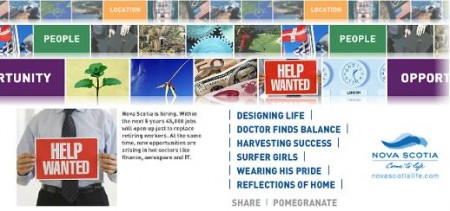

[PomegranatePhone](http://www.pomegranatephone.com/)**tiene de todo** para competir con el iPhone 3G, el BlackBerry Storm, el Nokia N96, el Samsung F480 y el LG VX9100.

Posee una excelente cámara, proyector para presentaciones de negocios, navegador web y cliente de correo, traductor multi-idioma y todo lo que quiere, y necesita, un ejecutivo cuando está fuera de su oficina… si!, hasta sirve café del gusto que querramos!

[youtube]http://www.youtube.com/watch?v=1e4X10hOh9o[/youtube]

**PomeGranatePhone no es un teléfono celular, es una jugada maestra de marketing viral de una [ciudad canadiense](http://novascotia.com/) como [Nueva Escocia](http://www.pomegranatephone.com/novascotia.html)**, y logró atraer la [atención de media web](http://www.google.com/search?q=PomeGranatePhone&ie=utf-8&oe=utf-8&aq=t&rls=org.mozilla:es-AR:official&client=firefox-a).

 

La campaña fue desarrolla por [Bristol Group](http://www.bristolgroup.ca/), [Egg Films](http://www.eggfilms.ca/)/[Hatch](http://www.hatchpost.ca/hatch-home.shtml) y [Breathe Media](http://www.breathemedia.net/welcome.htm).

