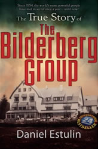

<iframe allowfullscreen="" frameborder="0" height="400" mozallowfullscreen="" src="http://player.vimeo.com/video/6790193" webkitallowfullscreen="" width="604"></iframe>

Después de ver la entrevista, quedan confirmadas las teorías que tenía en mente sobre toda esta historia de la gripe A.

Recomiendo la lectura del libro: “La verdadera historia del Club Bilderberg” de Daniel Estulin. Se puede encontrar información de este grupo en la wikipedia, pero obviamente no te dirán toda la verdad. Este libro nos habla sobre un grupo selecto, formado por la élite mundial, con personajes como Bill Gates, Rockefeller (el padre en sus inicios y el hijo actualmente), Juan Luis Cebrián (presidente del grupo PRISA).

Este grupo se reúne cada año en un lugar desconocido para todos. Cada año invitan a algunos personajes como Esperanza Aguirre, los reyes de España, los Bush, etc. Encubren las reuniones diciendo que se discuten temas de interés mundial, si fuera así, ¿por qué no se publican estas decisiones? ¿Por qué no se sabe nada al respecto?

Sé que para algunos suena a ciencia ficción. Un grupo formado por mandatarios mundiales, políticos o económicos? Que conspiran para controlar el mundo? Obteniendo así aún más poder del que tienen?

No es tan increíble. **No tenemos ni la más remota idea de lo que está pasando en realidad en el mundo**.

Click aquí para leer una [entrevista alucinante a Daniel Estulin](http://www.taringa.net/posts/offtopic/952068/La-verdad-sobre-el-club-Bilderberg-%C2%BFParanoia-Extrema.html). Se me ponen los pelos de punta… Un país con centrales nucleares e industrializado se convierte en un país autónomo, que compra menos energía, y no necesita pedir créditos y no acumula deuda…, ¡y entonces no pueden tener bien agarrado a ese país! Por eso la guerra con Irán dice que será este otoño…  

Nos tienen preocupados con llegar a fin de mes, tener dinero para pagar todo lo que tenemos encima, alimentar a una familia, buscar trabajo … Así no hay quien se preocupe por temas de interés mundial, no hay quien salga a la calle a manifestarse a pedir un poco de verdad.

Lo que tengo claro es que no me vacunan. Ni de coña vamos.

Recomiendo la lectura del libro que he mencionado antes. También animo a ver un documental que abre un poco los ojos, a la vez que desespera. Quizás lo conozcas: “Zeitgeist”

<iframe allowfullscreen="" frameborder="0" height="340" src="http://www.youtube.com/embed/4Z9WVZddH9w?feature=oembed" width="604"></iframe>

y la segunda parte de Zeitgest: Addendum, un documental centrado en el dinero y su poder para controlarnos.

<iframe allowfullscreen="" frameborder="0" height="340" src="http://www.youtube.com/embed/EewGMBOB4Gg?feature=oembed" width="604"></iframe>

ACTUALIZACIÓN 1: Aquí hay una [réplica al documental de Zeitgeist](http://natsufan.livejournal.com/28198.html)

ACTUALIZACIÓN 2: añado algunos datos [extraidos de aquí](http://intercambia.net/temas/index.php/resumen-del-documental-zeitgeist-addendum/) para meditar:

**¿Quien lidera esto?**

La corporatocracia. Un oligopolio de empresas que controla los medios y a los políticos al financiarlos. Además las corporaciones se intercambian con los politicos poniendo exdirectores de empresas en puestos de gobierno.

**Datos de este sistema**

En la actualidad hay mas esclavos que nunca.

La diferencia entre el 20% más rico y el 20% más pobre en 1960 era de 1:34 ahora es 1:74

El número de pobres aumentó un 17%. mientras el PIB aumentó un 40% entre 1970 y 1985.

Entre 1985 y 2000 la gente que vive con un dolar aumentó el 18%.

Los valores morales se perpetuan y se imitan. Las naciones son corruptas, las empresas tratan de replicarse, sobrevivir en el tiempo y tratan de eliminar todas sus amenazas. Eso es lo que sostiene este sistema injusto.

**Un análisis de la situación**

Ser ético no es rentable. La competencia no permite el comercio justo.

A las empresas no les importa el bienestar social. El monetarismo es lo que guia todo esto.

Los vertidos, los supers que destruyen comercios, los ERE’s son lo mismo, persecución de ganancia. Es igual de inmoral cualquiera de las tres: provocar un daño para ganar tú.

El sistema considera más importante la ganancia que el bienestar. Por tanto el monetarismo es un sistema que provoca corrupción.

Tenemos los recursos para hacer todo en este mundo, pero en el sistema monetario, no sirve, los politicos miran cuando cuestan las cosas no el bien que provocan. En tiempos de guerra no hace falta dinero para construir una super armada (EEUU II guerra mundial) pero después para cosas de paz y bienestar sí que hace falta…

La ley de oferta y demanda es enemiga de la abundancia. Es necesario que haya escasez para que aumenten los precios. Esto siginifica que la abundancia y la sostenibilidad nunca serán perseguidas por las empresas.

Es por tanto imposible un mundo sin pobreza, guerras, o que nos comportemos éticamente.

El dinero es una barrera para obtener bienes necesarios. Porque existe por la existencia de escasez (real o asumida)

Pero ¿Puede haber un sistema donde los recursos sean abundantes y gratis? sí.

**Alternativa**

Es el tiempo de las armas de creación masiva. Una sociedad basada en una economía de recursos y con alta importancia al desarrollo tecnológico que significa una vida mejor.

Los poderes no harán ningún cambio por lo que desde abajo hemos de iniciar el movimiento con medidas como estas:

1-Desobediencia al sistema, cambiar nuestra conducta, dar ejemplo para que vean que las cosas no son como piensan.

2-Exponer el timo de los bancos (mueve el dinero a otro sitio, vénde todo lo de ellos, etc..)

3-Apaga la tv (protege internet como medio de información libre, todo lo demás está controlado)

4-Rechaza el ejército.

5-No apoyar las compañías energéticas.

6-Rechaza el sistema político controlado por las corporaciones.

7-Únete al [thezeitgeistmovement.com](http://thezeitgeistmovement.com/)

