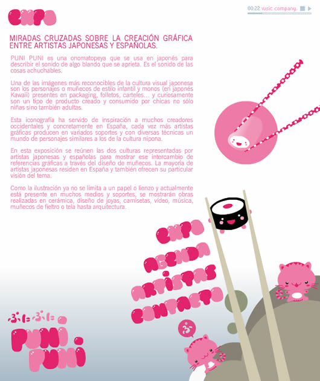

Por casualidad mientras navegaba por Internet he encontrado [esta web](http://www.punipuniexpo.com/) sobre una exposición de diseñadoras españolas y japonesas. Hacen cosas muy “monas” y la musiquita es una delicia =)

También me han gustado mucho los diseños de [Charuca](http://www.charuca.net/), sin duda me parece un auténtico filón…, que pena que un servidor no tenga mucha experiencia para dibujar! Quizás en el futuro, cuando la tecnología de Matrix nos permita cargar aplicaciones en nuestro cerebro, una de las primeras que cargaría sería esta :)

