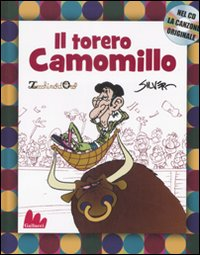

 *Colorblind [acuarela] – Mathiole 2009*

He quedado totalmente enamorado de esta ilustración. Me parece perfecta en su expresión, originalidad, fuerza de los colores, formato, ¡una genialidad! El diseñador se llama Mathiole y [su portfolio](http://www.mathiole.com) de trabajos es una calidad altísima.

Lo he encontrado mientras navagaba en [Smashing Magazine](http://www.smashingmagazine.com/2009/12/09/50-beautiful-watercolor-paintings/)

