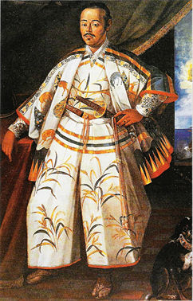
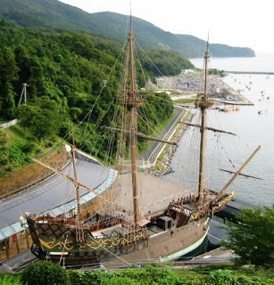

### ¿Quien fue Hasekura Tsunenaga?

*

*[Hasekura Rokuemon Tsunenaga](http://es.wikipedia.org/wiki/Hasekura_Tsunenaga)* (nacido en 1571 y fallecido 7 de agosto 1622) fue un samurai japonés que prestó servicios al daimyo de la ciudad japonesa de [Sendai](http://es.wikipedia.org/wiki/Sendai_%28Miyagi%29), [Date Masamune](http://es.wikipedia.org/wiki/Date_Masamune). Dirigió una misión diplomática a México y luego a Europa entre 1613 y 1620, regresando por último a Japón.

Fue el primer oficial japonés enviado a América y su viaje a Francia pasó a ser el primer caso registrado de contacto directo en las relaciones franco-japonesas.

A fin de establecer una relación comercial y solicitar el envío de misioneros cristianos, el fundador de Sendai, Date Masamune, **envió en 1613 una misión hacia Europa** embarcada en el “*San Juan Baustista*“, velero de estilo occidental, construido por el señorío de Sendai. El nombre de su Subdelegado fue Haskura Tsunenaga, vasallo de Masamune, quien desembarcó primero en la ciudad de Acapulco (México) cruzando el Océano Pacífico, con un galeón español, y luego se dirigió hacia Europa llegando el 20 de diciembre de 1614.

Visitó Madrid (España) y Roma (Italia) **convirtiéndose así en el primer japonés que cruzó el Océano Atlántico**.

La misión japonesa comandanda por Hasekura, en audiencia del rey Felipe III de España, el 30 de enero de 1615, le trajo una carta de Date Masamune ofreciéndole un tratado. El Rey le respondió que haría lo posible para cumplir sus peticiones.

En Italia, a dicha misión se le concedió una entrevista con el Sumo Pontífice. Su largo viaje terminó casi siete años después de su partida del Japón. Este es uno de los hechos más relevantes en la historia de la populosa ciudad japonesa de Sendai.

El embajador japonés, Hasekura, fue bautizado el 17 de febrero por personal de la capellanía real española con el nuevo nombre de Felipe Francisco Hasekura.

**La misión partió de Sevilla hacia México en junio de 1617** después de un periodo de dos años en Europa, pero fue aquí cuando algunos japoneses decidieron quedarse en España, concretamente en la ciudad sevillana de [Coria del Río](http://es.wikipedia.org/wiki/Coria_del_R%C3%ADo), donde sus descendientes todavía conservan el apellido “Japón”.

### La simbiosis con España

En la actualidad existen muchos ciudadanos en la ciudad de Coria del Rio, que no solo poseen el adoptado apellido “Japón” como herencia transmitida de esos primeros japoneses que decidieron quedarse en la localidad, sino que no resulta difícil adivinar en ellos/as ciertas facciones que corroboran su descendencia japonesa.

El prestigioso investigador, poeta y novelista coriano, Daniel Pineda Novo, gran conocedor de esta materia, asegura que el motivo principal que empujó a echar raíces a estos navegantes en esta ciudad, no fue otro que **el encanto de las bellas mujeres que encontraron** y el **carácter abierto y hospitalario** que le brindaron sus habitantes.

Por entonces, Coria del Río, además de ser una sociedad con una economía básicamente agrícola, vivía manifiestamente volcada al río y de los frutos que el mismo ofrecía a su comunidad, siendo un importante puerto fluvial y comercial en el Guadalquivir, motivo que debió servir de canalizador de la fusión de ambas culturas.

Actualmente, podemos afirmar, que el coriano hoy, es plenamente consciente del lazo que le une con el pueblo japonés. Sabe que una gran cantidad de sus vecinos comparten la misma sangre y reconocen la figura del embajador japones Haskura como el catalizador de esa peculiar relación. Desde que fue descubierta, el Ayuntamiento ha velado por mantener el respeto y aumentar las relaciones culturales bilaterales con el gobierno japones, a través de la figura de su embajador en España.

###### Fotografías de Wikipedia y de Coria del Rio por [Alonso Díaz](http://www.alonsodr.com/)
