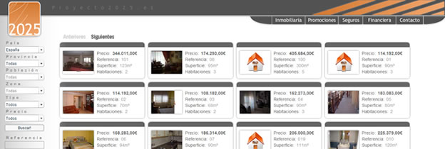
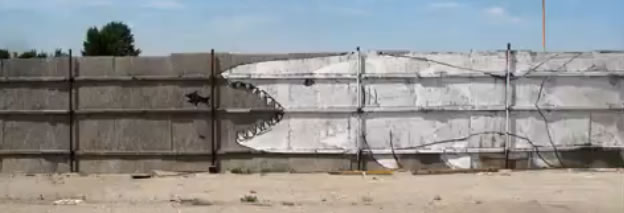
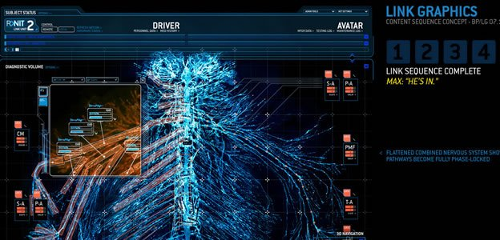

La imagen de arriba se llama “La gran ola de Kanagawa” y su autor es [Hokusai](http://es.wikipedia.org/wiki/Hokusai). [[Ampliar imagen](http://http://www.esacademic.com/pictures/eswiki/84/The_Great_Wave_off_Kanagawa.jpg)]

Desde que empecé a interesarte por la cultura japonesa, siempre me han resultado muy atractivas las pinturas Ukiyo-e (aunque no sabia que se llamaban así). Quizás es la combinación de usar el color blanco para resaltar la espuma del mar y la nieve junto con el estilo tipo cartoon. Además, los temas que retratan las pinturas me transmiten una buena energía.

Ukiyo-e literalmente significa “pinturas del mundo flotante”. Ukiyo-e es un género de arte japonés que se produjo durante el período Edo (1600-1868). Durante más de 200 años Japón se cerró a cualquier influencia extranjera y la vida en las ciudades se centró por completo en torno a los placeres de la vida y el arte. El arte Ukiyo-e fue producido en masa utilizando técnicas de impresión en madera. Dependiendo de la popularidad del artista se producian más o menos unidades de las pinturas y después las impresiones originales fueron destruidas para asegurar que los compradores tuviesen algo único.

Los grabados Ukiyo-e suelen representar las escenas típicas de esa época: el teatro Kabuki, retratos de geishas, samurais, luchadores de sumo, la gente que viaja por la carretera de Tokaido (de Kioto a Edo / Tokio), la cosecha de arroz con el monte Fuji en el horizonte …

Dos de los artistas del ukiyo-e más famosos son [Hiroshige](http://es.wikipedia.org/wiki/Hiroshige) y [Hokusai](http://es.wikipedia.org/wiki/Hokusai), el cual trabajó creando miles de originales ukiyo-e a principios del siglo XIX. Además, gracias a lo fácil que era hacer varias copias, las pinturas ukiyo-e llegaron al mundo occidental y llegaron a influenciar a pintores de la época como [Van Gogh](http://es.wikipedia.org/wiki/Vincent_van_Gogh) o [Monet Claude](http://es.wikipedia.org/wiki/Claude_Monet).

Se dice que [Hokusai](http://es.wikipedia.org/wiki/Hokusai) creó más de 30.000 obras de arte originales, sin embargo él es sobre todo conocido por sus *Treinta y seis vistas del monte Fuji*, una serie de pinturas que retratan la vida cotidiana de la gente de la época con el monte Fuji en el horizonte. Sin embargo, tal vez ganó más popularidad por su trabajo de 1814 Hokusai [Manga](http://es.wikipedia.org/wiki/Manga), una serie de caricaturas y pinturas de humor que se consideran el origen del manga japonés de hoy en día, el cual se conoce en todo el mundo.

Además de escenas de paisajes, representaciones de teatro, retratos, etc, algunos artistas empezaron a usar la misma técnica para producir en masa grabados de escenas de sexo explícito. Este tipo de arte erótico que se conoce como [shunga](http://es.wikipedia.org/wiki/Shunga), y es considerada como una de las primeras producciones pornográficas en la historia. Hoy en día los grabados eróticos no son muy comunes, sin embargo el manga erótico, conocido como [hentai](http://es.wikipedia.org/wiki/Hentai), comparte ciertas similitudes con los shunga tradicionales.

Si vienes a Japón, uno de los mejores lugares para disfrutar del arte ukiyo-e es el *Ota Memorial Museum of Art* situado cerca de la estación de [Harajuku](http://www.kirainet.com/english/harajuku-and-shinjuku-photowalk/).

Via [Kirainet](http://www.kirainet.com/english/)

**Páginas sobre el Ukiyo-e:**

- [Galería de Ukiyo-e](http://www.ukiyoe-gallery.com/)
- [Proceso de cómo hacer un grabado Ukiyo-e](http://woodblock.com/encyclopedia/entries/000_09/000_09_frame.html)
- [Cómo reconocer las firmas de los artistasUkiyo-e](http://user.bahnhof.se/%7Esecutor/ukiyo-e/signatur.html)

