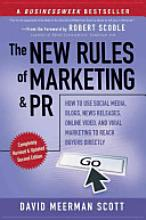

Hay algo de siniestro en el mundo de las relaciones públicas tradicionales. A pesar de los cócteles y los beneficios que suelen estar asociados al trabajo, una de las razones por las que no seguí esa carrera fue que las RP nunca son realmente Relaciones Públicas. No tratas realmente con los clientes, sino con los medios de comunicación para asegurarte de que obtendrás la cobertura en prensa para tu producto. Para ser eficaz en las relaciones públicas, una tiene que estar en la muchedumbre, codeandose con la gente popular y los periodistas, asistiendo a sus fiestas y cócteles con el fin de llamar la atención sobre tu producto. Pero no solo eso. Para ser una relaciones públicas de primera división, tienes que estar siempre impecable, con la mejor ropa y el maquillaje perfecto. Todo con el objetivo de que te saquen fotos y las publiquen en las revistas más “in”… Eso tiene mucho trabajo. Tengo amigas de relaciones públicas que aman su trabajo y son buenas en ello, pero personalmente, yo no voy a sucumbir a los rigores diarios de estar bella por el bien de un producto.

Aunque las relaciones públicas tradicionales siguen siendo una práctica efectiva en Asia (donde el deseo de pertenecer al grupo popular dicta el consumo de marcas), me alegra que Internet esté allanando el terreno de juego. El poder de los medios tradicionales ha disminuido desde los albores de Internet. [David Meerman Scott](http://http//www.davidmeermanscott.com/ "David Meerman Scott") describe muy bien este fenómeno en su libro “Las nuevas reglas del marketing y las relaciones públicas”. David ha dado un montón de información de como Internet ha puesto a las RP de vuelta a donde deberian estar. Con la Web 2.0 y en especial con los medios de comunicación sociales y las herramientas de redes, ahora se puede entablar un diálogo directo con tus clientes, evitando el tener que codearse con los periodistas. El libro es una buena introducción para alguien como yo, que todavía tiene una historia de amor con las Relaciones Públicas y el Marketing, pero se niega a tener un compromiso de matrimonio tradicional con los medios de comunicación. Lo que aprendí es que con una combinación potente de herramientas de medios sociales, una puede promover su producto e incluso recibir lealtad y fidelidad del cliente. ¿Cómo hacerlo? Por lo que he aprendido del libro de David, aquí dejo un fragmento:

- RP Tradicionales vs RP Nuevas – mientras que las últimas no matan a las otras, es hora de buscar una estrategia online para tu producto.
- Usa Facebook, Twitter y los blogs para promocionar tu producto — pero aquí está la parte interesante, no hables para nada acerca de tu producto! Los clientes / lectores se resisten a recibir noticias a través de RP tradicionales y sería una mala estrategia. Hay que darles la información que es importantes para ellos y hacerles participar en una conversación. Piensa en ello como si fueras a beber una buena taza de café con un amigo nuevo e interesante. ¿No lo quieres aburrir, ¿verdad?
- Desarrolla relaciones con tus diferentes segmentos de compradores. En lugar de inventar solo una estrategia compatible con las masas, esfuérzate en conocer a tu público también. Si tu producto le gusta a las mujeres de 35 años de edad y al mismo tiempo a los adolescentes, crea diferentes tipos de contenido para cada segmento de clientes. No puedes hablar de cosas de mamás a los adolescentes, ¿verdad?
- Intégrate en la comunidad de blogs. Los bloggers tienen una voz poderosa en Internet, sobre todo porque la gente confía en ellos más que en los anuncios. Consigue que tanto ellos como tus clientes prueben tu producto y hablen de ti.
- Conviértete en una “celestina” y deja que tus clientes se comuniquen entre sí. Puedes crear un foro para sumarte a sus conversaciones.
- No midas tu ROI (retorno de la inversión) de forma tradicional, sino a través de los comentarios de los usuarios.

Este libro debe ser tu nueva biblia si deseas promocionar tu producto o empresa. Con las nuevas reglas, me siento segura de quedarme a los cócteles, incluso si mi peinado no luce muy bien :-)

(PD. Seguiré escribiendo más entradas sobre medios de comunicación social aquí a Webmarket. Voy a compartir con vosotros las cosas nuevas que aprenda acerca de la estratosfera social online.)

