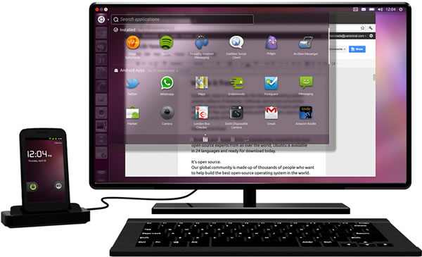

**Última hora:** Disponible el [5 de Abril de 2012 en Clove](http://www.clove.co.uk/htc-one-x-white) por 492 libras / 590€

En [Three](https://www.three.co.uk/Discover/Coming_Soon?s_search=prodsearch), [O2](http://www.o2.co.uk/comingsoon/HTCOneX), [Orange](http://www.gsmarena.com/orange_adds_htc_one_x_one_s_and_sony_xperia_u_to_lineup-news-3909.php) y [Vodafone](http://shop.vodafone.co.uk/shop/mobile-phone/htc-onex?icmp=int-vod-mobphon-hrbnr-bt1) (promo en portada) también lo van a sacar seguramente con un plan de consumo por 2 años. Te puedes apuntar para que te avisen…

## Mi opinión personal

Desde hace unas semanas, he estado estudiando móviles Android de doble núcleo como el Samsung Galaxy Note o el Galaxy S2, pero quería esperar al [Mobile World Congress](http://www.mobileworldcongress.com) para ver si iban a sacar algún movil con 4 núcleos pronto. **¿Para qué cuatro núcleos?** Porque en un futuro muy próximo podremos usar el móvil como nuestro ordenador portatil. Tan solo hay que instalar [Ubuntu Android y enchufarlo a una pantalla vía HTC Media Link HD](http://www.ubuntu.com/devices/android). **Estamos cerca del gadget definito**, ese que puede tomar fotos de calidad, video Full HD, llamar/enviar mensajes y además poder instalarle un sistema operativo como Ubuntu para poder trabajar en condiciones donde queramos.

[youtube]http://www.youtube.com/watch?v=ZQozs5tXxwY[/youtube]

## Análisis del HTC One X

El buque insignia de **HTC** fue presentado oficialmente hace cinco días, a pesar de haber sufrido innumerables filtraciones en las últimas semanas

Llamado a ser uno de los triunfadores del [Mobile World Congress](http://www.mobileworldcongress.com), el **HTC One X**, llama poderosamente la atención por utilizar un hardware de última generación: ******Nvidia Tegra3**, funcionando a 1.5GHz. Una auténtica bestia parda.

El *chipset* de Nvidia se caracteriza por contar con **cuatro núcleos en el procesador**, más uno de apoyo, en lo que Nvidia ha decidido denominar como **4-PLUS-1**. Tampoco anda corto de memoria **RAM, con 1GB**, ni tampoco en **almacenamiento, con 32GB**. Vamos a conocerlo en vídeo:

[youtube]http://www.youtube.com/watch?v=tFdInvU1w4Y[/youtube]

La pantalla, un aspecto en el que Samsung siempre se impone con su tecnología (entendemos que también es algo subjetivo), sigue siendo LCD (concretamente Super LCD2), pero con la nueva alta resolución Android, **1280×720 píxeles**, y **4.7 pulgadas** en su diagonal.

Tampoco se han olvidado del [soporte NFC](http://es.wikipedia.org/wiki/Near_Field_Communication), que ningún fabricante importante está descuidando, y sumándose en este Mobile World Congress a otras empresas como LG.

Hay dos aspectos que no a todo el mundo gustarán, en vistas de conseguir un mejor diseño y contar con menos elementos: la batería no es accesible por el usuario, y desaparece la ranura para tarjetas MicroSD. También resulta interesante conocer que utiliza tarjetas **MicroSIM**.

HTC nos cuenta que para un tacto **más suave, menos metálico**, del aparato, se ha utilizado una nueva técnica de microperforación del policarbonato, y ha eliminado elementos metálicos. Va a estar disponible en varios colores, como blanco o gris.

Las dimensiones del HTC One X son bastante buenas para la tecnología que estrena: 134.36 × 69.9 x **8.9 milímetros**, con un peso de 130 gramos. La batería es de **1.800mAh**.

## HTC quiere subir su nivel con las cámaras

La cámara principal es un aspecto que parece bastante cuidado, al menos sobre el papel, ya que se presenta con un sensor retroiluminado de **8 megapíxeles** con una apertura **f2.0**. La cámara frontal es de 1.3 megapíxeles.

Nos cuentan que se ha incorporado un nuevo procesador dedicado a la cámara con el que se mejora la velocidad en encendido (0.7 segundos), entre tomas, o a la hora de realizar el enfoque automático (0.2 segundos). Un poco contradictorio no encontrarnos con botón dedicado a la cámara.

Dejando presionado el botón en pantalla de la cámara, se acciona un modo ráfaga, y luego nos muestra en pantalla una selección de las imágenes para que descartemos y nos quedemos con la mejor toma. Otra particularidad es la posibilidad de tomar fotos mientras estamos grabando vídeo en alta definición.

## HTC Sense 4.0 sobre Ice Cream Sandwich

Como era de esperar la presentación del dispositivo ha derivado de forma importante en el software y servicios de HTC, capitaneados por la personalización **HTC Sense 4.0** sobre [Ice Cream Sandwich](http://www.android.com/about/ice-cream-sandwich/).

Algunas mejoras implementadas en esta nueva versión son el acceso a **25GB de datos vía Dropbox** (por dos años), la integración de Beats Audio en todas las aplicaciones, y un actualizado **HTC Sync** que permite sincronizar sin cables con iTunes o Windows Media Player.

Análisis via [Xataka](http://www.xataka.com/moviles/htc-one-x-con-nvidia-tegra-3-llegara-a-europa-en-abril)

 

