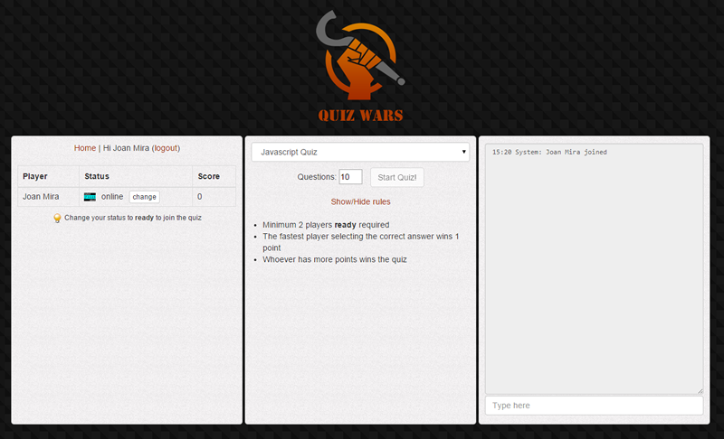
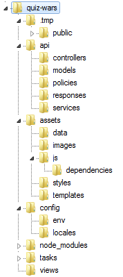
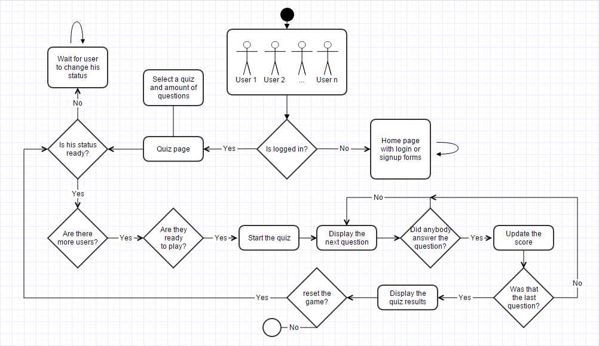
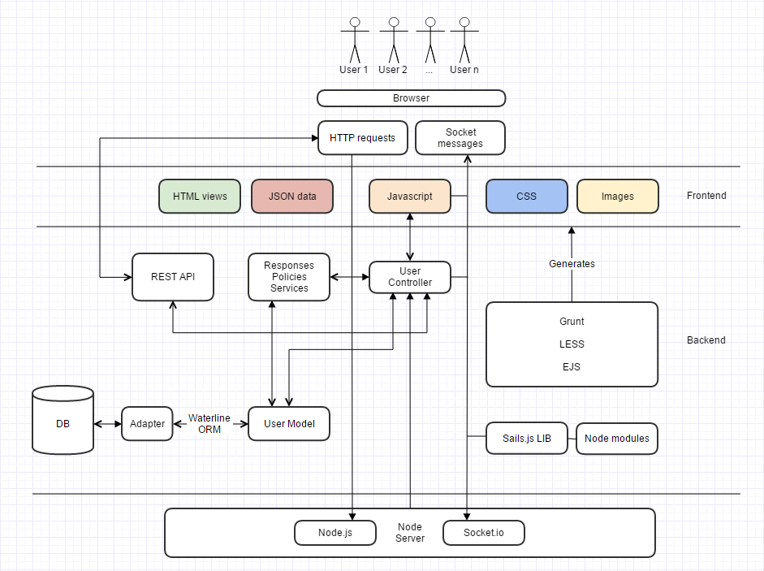

<h2>1. Introduction</h2>
This tutorial intends to explain how to build a game like <a href="http://quizwars.herokuapp.com/">Quiz Wars</a> with the MVC <a href="http://sailsjs.org/">Sails.js</a> framework. <a href="http://quizwars.herokuapp.com/">Quiz Wars</a> is a real time multi-player responsive web app to solve quizzes. The aim is to be the quickest answering quiz questions and win against other players. It has been developed trying to follow the <a href="http://bp.sapient-lab.com/">Sapient Dev Standards</a> as much as possible, with a mobile first approach in mind and a module pattern structure for the frontend. Currently it's in early development stages, but the main user journey to enter and finish a quiz with other players is working in any browser/device.

<h3>Current features/rules</h3>
<ul>
	<li>Flexible and scalable quiz DB based on JSON files (see /assets/data/javascript.json)</li>
	<li>User authentication (signup and login) with password encryption</li>
	<li>Chat room with system status messaging</li>
	<li>Geolocation based on socket IP address (at the moment not working in Heroku)</li>
	<li>An unlimited number of players can play at the same time</li>
	<li>Minimum 2 players with a "ready" status are required to start a quiz</li>
</ul>
<h3>Future features</h3>
<ul>
	<li>Support for different chat/quiz rooms</li>
	<li>URL based invites to play a determined quiz</li>
	<li>Support for multiple quizzes (at the moment, if a quiz is already running, starting a second quiz would break the first one)</li>
	<li>Build a widget to embed quizzes in other websites</li>
	<li>Add many more quizzes of different topics: design, photography, business, UX and of course coding!</li>
	<li>Add a pictionary type feature: one user draws and the others have to guess it</li>
	<li>Global user score ranking</li>
	<li>Posibility to add teams/clans and competitions</li>
	<li>Most popular quizzes list</li>
	<li>Improve the chat (ie. "user is typing...")</li>
</ul>
<h3>Tech stack</h3>
<ul>
	<li><strong>Backend</strong>: Sails.js (based on Express, Node.js, Waterline ORM and Socket.io)</li>
	<li><strong>Frontend</strong>: HTML5, LESS, JavaScript, jQuery, EJS, Bootstrap, Parsley</li>
	<li><strong>Tools</strong>: Grunt, Git, Heroku, Bitbucket</li>
</ul>
<h3>Requirements</h3>
This tutorial assumes that the reader feels comfortable coding with Javascript, JSON files, HTML. LESS and jQuery.
<h2>2. About Sails.js</h2>
Sails is an MVC framework to manage the whole development pipeline of an application (frontend and backend). It makes it easy to build custom, enterprise-grade Node.js apps. It is designed to emulate the familiar MVC pattern of frameworks like Ruby on Rails, but with support for the requirements of modern apps: data-driven APIs with a scalable, service-oriented architecture. It's especially good for building chat, realtime dashboards, or multiplayer games; but you can use it for any web application project - top to bottom. These are some of its features:
<ul>
	<li><strong>It's 100% Javascript</strong></li>
	<li><strong>You can use any database system</strong>: Sails bundles a powerful ORM, Waterline, which provides a simple data access layer that just works, no matter what database you're using</li>
	<li><strong>Auto-generate REST APIs</strong>: Sails comes with blueprints that help jumpstart your app's backend without writing any code</li>
	<li><strong>Easy WebSocket Support</strong>: Sails translates incoming socket messages for you</li>
	<li><strong>Reusable security policies</strong>: Sails provides basic security and role-based access control by default</li>
	<li><strong>Frontend agnostic</strong>: Sails is designed to be compatible with any frontend strategy; whether it's Angular, Backbone, iOS/ObjC, Android/Java, Windows Phone, or something else entirely</li>
	<li><strong>Flexible asset pipeline</strong>: Sails ships with Grunt- which means your entire frontend asset workflow is completely customizable</li>
</ul>
<h2>3. Sails.js installation</h2>
<a href="http://quizwars.herokuapp.com/">Quiz Wars</a> is based on <a href="http://https//github.com/balderdashy/sails">Sails v0.10</a>. Simply <a href="http://sailsjs.org/#/getStartedhttp://">follow the official Sails.js tutorial</a> to install Node.js in your preferred operating system.

Once you have Node.js installed, proceed to install Sails.js by typing the following in your console. Note: in Windows you don't need to use "sudo"
<pre>sudo npm -g install sails</pre>
Download the <a href="http://quizwars.herokuapp.com/">Quiz Wars</a> <strong>source code</strong> from ### URL Comming soon ### [326 Kb] and extract its contents into whatever location you prefer (i.e. D:DevSitesquiz-wars)

Note: If you were creating a new Sails.js app with the default folder structure and templates, then you could type:
<pre>sails new testProject</pre>
In your console, navigate to the previous folder and type the following to install the dependencies (Node modules). These are defined in "package.json"
<pre>npm install</pre>
Once we have all the files and the dependencies downloaded, we can proceed to start the Node server and the app
<pre>sails lift</pre>
At this point, if you visit (<a href="http://localhost:1337/">http://localhost:1337/</a>) you will see the Quiz Wars running or the default home page if you created a new project
<h2>4. Sails.js folder structure</h2>
</a>
<ul>
<li><strong>/.tmp/public</strong>: where the distribution files are compiles. These files are what we see when we load the website</li>

<li><strong>/api</strong>: all the backend files. In the "policies" folder are stored rules for application user access. "responses" contains files like the web server errors (404, 403, 500, etc). We can include in this folder the functions that handle specific tasks like deciding how to manage users with different access levels. It could be done in the controller, but it's a best practice not to bloat the controllers with a lot of business logic.</li>

<li><strong>/assets/data</strong>: JSON files with the quiz questions</li>

<li><strong>/assets/images</strong>: all the frontend images</li>

<li><strong>/assets/styles</strong>: LESS files</li>

<li><strong>/assets/js</strong>: all the frontend logic and its javascript dependencies</li>

<li><strong>/config</strong>: all the configuration files</li>

<li><strong>/tasks</strong>: all the Grunt tasks</li>

<li><strong>/view</strong>: all the HTML markup of our pages</li></ul>
<h3>Other important files</h3>
<ul>
	<li><strong>"/config/sockets.js"</strong>: this file has two methods, "onConnect" and "onDisconnect". We use these methods to handle the socket connections</li>
	<li><strong>"/config/models.js"</strong>: this file allows us to specify which DB connector we want to use and the way we want to migrate the data</li>
	<li><strong>"/config/routes.js"</strong>: this file allows us to connect URLs with views and endpoints to controller methods</li>
</ul>
<pre class="html">module.exports.routes = {

    // HTML Views
    '/': { view: 'index' },
    '/quiz': { view: 'quiz' },

    // Endpoints
    'post /login': 'UserController.login',
    'post /signup': 'UserController.signup',
    '/logout': 'UserController.logout',
};
</pre>
<h2>5. Flow diagram</h2>

<h2>6. Architecture diagram</h2>
<a 
<h2>7. The sitemap, layout and the views</h2>
Whenever I build a new project, the first thing that comes to my mind is the sitemap. This elemental document is very important to create a picture in your mind of how is going to be the user journey and how the pages are interconnected. In Quiz Wars, the sitemap is very simple. There are only two views/pages, "index" and "quiz". The user journey consists on logging into the system or signing up as a new user. Then you get redirected to the quiz page, where you will remain until the end of your session.

By default, Sails is configured to use EJS (Embedded Javascript) as its view engine. The syntax for EJS is highly conventional- if you've worked with php, asp, erb, gsp, jsp, etc., you'll immediately know what you're doing.
<ul>
	<li><strong>"/view/index.ejs"</strong>: this is the homepage, where we have two forms (toggled with jQuery), the login and signup forms. The first form posts data to the "/login" endpoint, which is connected with the "login" method in the "user" controller. The second one posts data to "/signup", which is connected to the "signup" method in the "user" controller</li>
	<li><strong>"view/quiz.ejs"</strong>: this page holds the rest of the available content in the website. There are three panels: the score table, the quiz panel and the chat panel</li>
</ul>
The views make use of <strong>"/view/layout.ejs"</strong>, which is the template that holds the common elements, like the meta and link tags, the body declaration and all the JS dependencies:
<pre class="html">&lt;!DOCTYPE html&gt;
&lt;html&gt;
    &lt;head&gt;
        &lt;title&gt;Quiz Wars&lt;/title&gt;
        &lt;meta name="viewport" content="width=device-width, initial-scale=1, maximum-scale=1"&gt;
        &lt;link rel="stylesheet" href="/styles/bootstrap.min.css"&gt;
        &lt;link rel="stylesheet" href="/styles/importer.css"&gt;
    &lt;/head&gt;
    &lt;body&gt;
        &lt;header id="logo"&gt;&lt;/header&gt;
        &lt;script src="/js/dependencies/jquery.min.js"&gt;&lt;/script&gt;
        &lt;script src="/js/dependencies/parsley.min.js"&gt;&lt;/script&gt;
        &lt;script src="/js/dependencies/sails.io.js"&gt;&lt;/script&gt;
        &lt;script src="/js/app.js"&gt;&lt;/script&gt;
        &lt;script src="/js/user.js"&gt;&lt;/script&gt;
        &lt;script src="/js/chat.js"&gt;&lt;/script&gt;
        &lt;script src="/js/quiz.js"&gt;&lt;/script&gt;
        &lt;script src="/js/events.js"&gt;&lt;/script&gt;
        &lt;%- body %&gt;
    &lt;/body&gt;
&lt;/html&gt;
</pre>
The layout support is only implemented for the EJS view engine. If you prefer to use a different engine (jade, handlebars, mustache underscore, etc), you can change it in "<strong>/config/views.js</strong>".
<h2>8. The homepage</h2>
The homepage contains just two classic HTML forms for logging in the user or sign him up. The only usual logic is the evaluation of the session to determine if the user is already logged in:
<pre class="html">&lt;% if (req.session.me) { %&gt;
    &lt;a href="/quiz"&gt;Quiz&lt;/a&gt; | &lt;a href="/logout"&gt;Logout&lt;/a&gt;
&lt;% } else { %&gt;
  &lt;!-- show the login/signup form --&gt;
&lt;% } %&gt;
</pre>
In the code example above, we are evaluating if the session object has the user data or not. We assign the user data to the session after a successful login in <strong>"/api/responses/login.js"</strong> -&gt; req.session.me = user.id;

Another aspect I would like to highlight is the form validation taken care by <a href="http://parsleyjs.org/">parsleyjs</a>. This is being done by adding attributes to the input fields like data-parsley-trigger="keyup", data-parsley-maxlength="30" or required.

Note: currently there's no error reporting when the user tries to login with the wrong username/password.
<h2>9. The quiz page</h2>
The markup is quite straight forward. There are <strong>three panels</strong>: the score table (&lt;div id="players-panel"&gt;&lt;/div&gt;), the quiz panel (&lt;div id="quiz-panel"&gt;&lt;/div&gt;) and the chat panel (&lt;div id="chat-panel"&gt;&lt;/div&gt;). Again, we only display the contents if the user has an active session, otherwise the user will see the message "<em>You are not logged in</em>".

The quiz dropdown contains the names of the JSON files as values:
<pre class="html">&lt;select id="quiz-dropdown" class="form-control"&gt;
  &lt;option value="javascript.json"&gt;Javascript Quiz&lt;/option&gt;
  &lt;option value="html5.json"&gt;HTML5 Quiz (not yet ready)&lt;/option&gt;
&lt;/select&gt;
</pre>
And the button to restart the quiz, which has a simple page reload: onClick="window.location.reload()"
<h2>10. The User Model</h2>
In an MVC framework, we have models, views and controllers. The models allow us to define the logic that will interact with our DB. Sails.js uses an ORM (although they prefer to call it "a brand new kind of storage and retrieval engine") called <a href="https://github.com/balderdashy/waterline">Waterline. </a>It provides a uniform API for accessing stuff from different kinds of databases, protocols, and 3rd party APIs. That means you write the same code to get and store things like users, whether they live in Redis, mySQL, LDAP, MongoDB, or Postgres. Waterline strives to inherit the best parts of ORMs like ActiveRecord, Hibernate, and Mongoose, but with a fresh perspective and emphasis on modularity, testability, and consistency across adapters.

In Quiz Wars, the DB is based on the filesystem (the default method). From a development perspective, it's great because we don't need to worry about creating tables and connecting with the DB, plus we can reset the data very easily by selecting the 3rd migration option when lifting the app using "sails lift". To see the migration options, the "migrate" value has to be commented out in <strong>"/config/models.js"</strong>.

Now, let's study the User model of Quiz Wars (the only model we need) in <strong>"/api/models/User.js"</strong>:
<pre class="html">module.exports = {

    autosubscribe: ['destroy'],

    attributes: {
        name: {
            type: 'string',
            required: true
        },
        email: {
            type: 'email',
            unique: true,
            required: true
        },
        password: {
            type: 'string',
            required: true,
            minLength: 6
        },
        avatar: {
            type: 'string',
            required: false
        },
        status: {
            type: 'string',
            defaultsTo: 'offline',
            required: false
        },
        score: {
            type: 'integer',
            defaultsTo: 0,
            required: false
        },
        ip: {
            type: 'string',
            required: false
        }
    }
};
</pre>
Creating a model feels very similar (conceptually speaking) to creating a new table in a DB. Each attribute can have certain properties, like a type, be unique or required, have a default state, a minimum length, etc. For a full list of attribute properties you can refer to the <a href="https://github.com/balderdashy/waterline-docs/blob/master/models.md">Waterline Model documentation</a>. Each model serves as an interface to communicate our controllers with our DB.

In this model, we are storing the basic information for each user, being the <strong>status</strong> the most important. A user can have one status at a time and it can be: "<strong>online</strong>", when the user is connected but it's not ready to play nor playing, "<strong>ready</strong>", when the user has confirmed that wants to join the next quiz and "<strong>playing</strong>", when the user is currently playing a quiz game. If the user has an "offline" status, it means that it's not connected and therefore will not appear on the score/players table.

Aside from the attributes, models also contain the logic to query the DB. In Quiz Wars, we have two methods (in the same file where we have the attributes), signup and attemptLogin:
<pre class="html">signup: function (inputs, cb) {

  var password = inputs.password;
  var hasher = require("password-hash");
  password = hasher.generate(password);

  // Create a user
  User.create({
      name: inputs.name,
      email: inputs.email,
      password: password,
      avatar: inputs.avatar
    )
    exec(cb);
},

attemptLogin: function (inputs, cb) {

    // Create a user
    User.findOne({
        email: inputs.email
    })
    .exec(cb);
}
</pre>
The "signup" method uses a node module called "password-hash". This module creates a hash from the password string that we can safely store in the DB. Once our data is ready to be stored, we call the "create" query to store it in the DB. For a complete list of queries that we can use with Waterline, please refer to the <a href="https://github.com/balderdashy/waterline-docs/blob/master/query.md">queries documentation</a>. The create query will fail if the email address is already in the DB due to the "unique" property set in the email attribute.

The "attemptLogin" method tries to find a user in the DB with the same email address as the one passed as a parameter. Notice that the error handling is not included in the model. That's a job for the controller...
<h2>11. The User Controller</h2>
The User controller encapsulates all the application logic between the homepage and quiz page and the User model. All its methods, either call the model to perform a query in the DB, or call a response or emit a socket event. Let's see them a bit more in detail:
<ul>
	<li><strong>login</strong>: this method basically calls "api/responses/login.js" with the input values from the login form</li>
	<li><strong>logout</strong>: we assign null to the session and redirect the user to the homepage</li>
	<li><strong>signup</strong>: it calls the signup method from the User model, handles the returned response and redirects the user if the signup is successful</li>
	<li><strong>chat</strong>: this emits a socket event with the verb "messaged" and the parameters passed to the function. This message will be received in the frontend by all connected users</li>
	<li><strong>status</strong>: this method takes care of updating the status of a given user or a group of users depending if the value of the ID attribute is a number or a string respectively. The process to update a user is: query the DB, i.e. user.find(...) -&gt; loop users, users.forEach(...) -&gt; assign new value, user.status = req.param('status') -&gt; save(). After the user is updated in the DB, we emit a socket event to inform the rest of the users. Notice that the error handling has not yet been implemented</li>
	<li><strong>start</strong>: emit a socket event to inform the rest of the users that the quiz has started. At the same time, we are sending them a sequence of numbers which correspond to the random indexes of questions that the user who started the quiz generated</li>
	<li><strong>score</strong>: a simple method to broadcast to all the sockets connected that a determined user has a new score. At the moment we are not saving the score in the DB, but this will be necessary if we want to implement a persistent ranking</li>
</ul>
<pre class="html"><code>module.exports = {

    login: function (req, res) {

        // See `api/responses/login.js`
        return res.login({
            email: req.param('email'),
            password: req.param('password'),
            successRedirect: '/quiz',
            invalidRedirect: '/'
        });
    },

    logout: function (req, res) {

        req.session.me = null;

        // If this is not an HTML-wanting browser, e.g. AJAX/sockets/cURL/etc.,
        // send a simple response letting the user agent know they were logged out
        // successfully.
        if (req.wantsJSON) {
            return res.ok('Logged out successfully!');
        }

        // Otherwise if this is an HTML-wanting browser, do a redirect.
        return res.redirect('/');
    },

    signup: function (req, res) {

        // Attempt to signup a user using the provided parameters
        User.signup({
            name: req.param('name'),
            email: req.param('email'),
            password: req.param('password'),
            avatar: req.param('avatar'),
        }, function (err, user) {
            // res.negotiate() will determine if this is a validation error
            // or some kind of unexpected server error, then call `res.badRequest()`
            // or `res.serverError()` accordingly.
            if (err) return res.negotiate(err);

            // Go ahead and log this user in as well.
            // We do this by "remembering" the user in the session.
            // Subsequent requests from this user agent will have `req.session.me` set.
            req.session.me = user.id;
            req.session.name = user.name;

            // If this is not an HTML-wanting browser, e.g. AJAX/sockets/cURL/etc.,
            // send a 200 response letting the user agent know the signup was successful.
            if (req.wantsJSON) {
                return res.ok('Signup successful!');
            }

            // Otherwise if this is an HTML-wanting browser, redirect to /welcome.
            return res.redirect('/quiz');
        });
    },

    chat: function (req, res) {
        sails.io.sockets.emit("chat", {verb:"messaged", data:{from: req.param('sender'), msg: req.param('msg')}})
    },

    status: function (req, res) {

        if (typeof req.param('id') === 'string') { // We want to change the status of a group of users

            User.find({status: req.param('id')}).exec(function(err, users) {
                if (err) {
                    return res.negotiate(err);
                }
                else {
                    users.forEach(function (user) {
                        user.status = req.param('status');
                        user.save();
                    });
                }
            });
        }
        else {
            User.findOne({id: req.param('id')}).exec(function(err, user) {
                if (err) {
                    return res.negotiate(err);
                }
                else {
                    req.session.me.status = req.param('status');
                    user.status = req.param('status');
                    user.save();
                }
            });
        }

        sails.io.sockets.emit("chat", {verb:"changedStatus", data:{id: req.param('id'), status: req.param('status')}})
    },

    start: function(req, res) {
        sails.io.sockets.emit("chat", {verb:"startQuiz", data:{user: req.param('user'), sequence: req.param('sequence')}})
    },

    score: function(req, res) {

        User.findOne({id: req.param('id')}).exec(function(err, user) {
            if (err) {
                return res.negotiate(err);
            }
            else {
                /*user.score += 1;
                user.save();*/
                sails.io.sockets.emit("chat", {verb:"score", data:{id: req.param('id'), name: user.name}})
            }
        });
    }
};
</code></pre>
<h2>12. The login response</h2>
Why do we need to separate this logic from the controller? This might be the first question that comes to your mind and  in many cases, that would actually be preferable.  This example uses a "fat" custom response to demonstrate how we could do it if for instance, we need the backend to support multiple user roles, with different login behaviour. We might need to send back a few different kinds of success/failure codes, with different messages based on the outcome. In that case, it would be most sensible to create a custom version of the logic here rather than in the relevant controller action.

This login function in "<strong>api/responses/login.js</strong>" basically attempts to login the user, verifies that the password from the login form matches the hash in the DB, assigns the user ID and name to the session and handles any possible error/response.
<pre class="html">module.exports = function login(inputs) {

    inputs = inputs || {};

    // Get access to `req` and `res`
    var req = this.req;
    var res = this.res;

    // Look up the user
    User.attemptLogin({
        email: inputs.email
    }, function (err, user) {

        if (err) return res.negotiate(err);
        if (!user) {

            if (req.wantsJSON || !inputs.invalidRedirect) {
                return res.badRequest('Invalid username/password combination.');
            }
            return res.redirect(inputs.invalidRedirect);
        }

        var password = inputs.password;
        var hasher = require("password-hash");
        if (hasher.verify(password, user.password)) {

            // "Remember" the user in the session
            // Subsequent requests from this user agent will have `req.session.me` set.
            req.session.me = user.id;
            req.session.name = user.name;

            // If this is not an HTML-wanting browser, e.g. AJAX/sockets/cURL/etc.,
            // send a 200 response letting the user agent know the login was successful.
            // (also do this if no `successRedirect` was provided)
            if (req.wantsJSON || !inputs.successRedirect) {
                return res.ok();
            }

            // Otherwise if this is an HTML-wanting browser, redirect to /.
            return res.redirect(inputs.successRedirect);
        }
        else {
            if (req.wantsJSON || !inputs.invalidRedirect) {
                return res.badRequest('Invalid username/password combination.');
            }
            return res.redirect(inputs.invalidRedirect);
        }
    });
};
</pre>
<h2>13. The socket.js config file</h2>
The file located at <strong>"/config/socket.js"</strong> is being used to find out if a user has already a session created. Let's say you sign up in the page and you have a socket opened. Then for whatever reason you lose the Internet connection and your sockets gets disconnected. When your connection is back and you reload the page, the first method that will be triggered when your socket comes alive again is "onConnect". Here we will check if your session is already logged in the DB and if that's the case we will resume your activity as it was before your connection was interrupted.

OnConnect will also subscribe you to watch changes in the User Model, save your IP address and save your data in the session object.

OnDisconnect will set your status to "offline" and broadcast to the rest of the users that you left the app.
<pre class="html"><code>onConnect: function(session, socket) {

    // Proceed only if the user is logged in
    if (session.me) {

        User.findOne({id: session.me}).exec(function(err, user) {

            var socketId = sails.sockets.id(socket);

            user.status = 'online';
            user.ip = socket.handshake.address.address;
            user.save(function(err) {
              // Publish this user creation event to every socket watching the User model via User.watch()
              User.publishCreate(user, socket);
            });

            // Create the session.users hash if it doesn't exist already
            session.users = session.users || {};

            // Save this user in the session, indexed by their socket ID.
            // This way we can look the user up by socket ID later.
            session.users[socketId] = user;

            // Persist the session
            session.save();

            // Get updates about users being created
            User.watch(socket);

            // Send a message to the client with information about the new user
            sails.sockets.emit(socketId, 'hello', user);
        });
    }
}

onDisconnect: function(session, socket) {

     try {

         if (session.users !== undefined) {

             // Look up the user ID using the connected socket
             var socketId = sails.sockets.id(socket);
             var userId = session.users[socketId].id;

             if (userId) {

                 // Get the user instance
                 User.findOne(userId).exec(function(err, user) {

                     // Set the user offline
                     user.status = 'offline';
                     user.save();

                     // Publish the destroy event to every socket subscribed to this user instance
                     User.publishDestroy(user.id, null, {previous: user});
                 });
             }
         }
     } catch (e) {
          console.log("Error in onDisconnect: ", e);
     }
}
</code></pre>
<h2>14. The frontend modules</h2>
The frontend modules are located in "/assets/js/". Currently we have "<strong>chat.js</strong>", "<strong>events.js</strong>", "<strong>quiz.js</strong>" and "<strong>user.js</strong>". The entry point for the application is located in "app.js". With the current basic approach of the game, we just need one instance of each module running at the same time because a given user can only play in one quiz at a time. But if in the future we want to add more features, like multiple chat rooms or private messages, it would be a good idea to refactor the modules to be more flexible.
<h3>Let's start with app.js</h3>
<pre class="html"><code>io.socket.on('connect', function socketConnected() {

    QW_MODULES.chat.init();
    QW_MODULES.quiz.init();
    QW_MODULES.user.init();
    QW_MODULES.events.init();

    io.socket.on('hello', function(data) {

        if (data) {
            window.me = data;

            io.socket.get('/user', QW_MODULES.user.updateUserList);
            io.socket.post('/user/chat', {sender: 'System', msg: data.name + ' joined'});
        }
    });

    io.socket.on('user', function messageReceived(message) {

        switch (message.verb) {
            case 'created': QW_MODULES.user.addUser(message.data); break;
            case 'destroyed': QW_MODULES.user.removeUser(message.id); break;
            default: break;
        }
    });

    io.socket.on('chat', function messageReceived(message) {

        switch (message.verb) {
            case 'messaged': QW_MODULES.chat.receiveMessage(message.data); break;
            case 'changedStatus': QW_MODULES.chat.updateStatus(message.data); break;
            case 'startQuiz': QW_MODULES.quiz.loadQuiz(message.data); break;
            case 'score': QW_MODULES.chat.updateScore(message.data); break;
            default: break;
        }
    });
});

io.socket.on('disconnect', function() {
    io.socket.post('/user/chat', {sender: 'System', msg: me.name + ' left'});
});
</code></pre>
The first thing you will notice is that we are not using "onReady/onLoad" to start the app. In this case, I've decided to use the "connect" event of the socket.io library as the entry point to load everything else. The reason of this is to avoid loading the app before we even have a socket connection. If there's no socket available for whatever connection issue, then we don't load the app.

Right since the beginning, we load all the frontend modules prefixed with QW_MODULES. Probably we don't need all of them in the login/signup page, but that's part of an optimization stage that it's not necessary now. The next three functions are socket.io callbacks. We are basically subscribing to those messages: "hello", "user" and "chat". Whenever the backend emits one of those messages, the frontend will receive it. This is call the <a href="http://en.wikipedia.org/wiki/Publish%E2%80%93subscribe_pattern">pub/sub pattern</a> (publish/subscribe). In some of these callbacks, we can find that the message has a verb attached. Sails.js automatically creates events for verbs like "created", "destroyed" and a few more when we interact with the models. In this case, we are calling the addUser and removeUser functions in our frontend user module whenever the backend emits an automatic event when a user is created or destroyed. This is what makes the framework so powerful.

The "hello" callback is triggered when a successful connection is made. If the user reloads the page, it will trigger again. Now, from the frontend we can also emit messages!, that's what we do in lines 13 and 14. The first line uses "get" to retrieve a list of users from the backend API and sends it to the updateUserList method in the frontend user module. Sails.js generates automatic JSON views of the controllers and their actions that are accesible by the URL that matches the name of the controller &amp; action:
<ul>
	<li>"User" controller, "index" action -&gt; /user</li>
	<li>"User" controller, "chat" action -&gt; /user/chat</li>
</ul>
You can try it yourself. Login in Quiz Wars and visit <a href="http://localhost:1337/user">http://localhost:1337/user</a>

The next callback, "chat", is used to update the gameplay and the chat messages. Honestly, instead of "chat" we could have called it "quiz" or "game"... It's main purpose is to act as a virtual router that redirects messages to the right frontend function.

Sadly, the "disconnect" callback is not working :-( I'm not sure why. I've tried to put it inside the "connect" function but it didn't work. Please let me know if you make it work. We are using it to display a message in the chat room when the user leaves the app.
<h3>The user module</h3>
This module is quite self explanatory. "addUser" and "removeUser" take care of updating the users &lt;table&gt; by adding/removing a &lt;tr&gt; and updating the UI (enabling/disabling the quiz button). The "updateUserList" function resets the table when one a new user connects to the app or when someones leaves.
<pre class="html"><code>var QW_MODULES = (function (modules, $) {

    "use strict";

    var self;

    var user = {

        init: function() {

            self = this;
        },

        // Add a user to the list of available users to play with
        addUser: function(user) {

            var found = false;

            // Check if the user is already in the table
            $('#status-table tr').each(function() {
                var hasUser = $(this).attr('id');

                if (hasUser !== undefined &amp;&amp; ('user-' + user.id == hasUser)) {
                    found = true;
                }
            });

            if (!found) {
                var $table = $('#status-table');
                var ready = (user.id == me.id) ? '&lt;button type="button" id="changeStatus" class="btn btn-default btn-xs"&gt;change&lt;/button&gt;' : '';
                var row = '&lt;tr id="user-'+user.id+'"&gt;&lt;td class="name" data-avatar="'+user.avatar+'"&gt;'+user.name+'&lt;/td&gt;
                          &lt;td&gt;&lt;img class="flag" src="http://api.hostip.info/flag.php?ip='+user.ip+'" width="20" height="14" alt=""&gt;
                          &lt;span class="status" data-status="'+user.status+'"&gt;'+user.status+'&lt;/span&gt;'+ready+'&lt;/td&gt;&lt;td class="score"&gt;'+user.score+'&lt;/td&gt;&lt;/tr&gt;';
                $table.append(row);

                QW_MODULES.chat.updateUI();
            }
        },

        // Remove a user from the table of available users to play with, by sending
        // either a user object or a user ID.
        removeUser: function(user) {

            // Get the user's ID.
            var id = user.id || user;
            var userName = $('#user-'+id).text();

            // Remove the corresponding element from the users table
            var userEl = $('#user-'+id).remove();

            QW_MODULES.chat.updateUI();
        },

        // Add multiple users to the users list.
        updateUserList: function(users) {

            $('#status-table tbody tr').remove();

            users.forEach(function(user) {

                if ((typeof user.id === 'undefined') || (user.status === 'offline') || (typeof me === 'undefined')) {
                    return;
                }

                self.addUser(user);
            });
        }
    };

    // return as QuizWars Module
    modules.user = user;
    return  modules;

})(QW_MODULES || {}, jQuery);
</code></pre>
<h3>The events module</h3>
This module creates all the UI events in the app. They are organized by module: login/signup, user, chat and quiz.
<pre class="html"><code>var QW_MODULES = (function (modules, $) {

    "use strict";

    var self;

    var events = {

        init: function() {

              // Login / Signup events
              $('#login-cta').on('click', function() {
                  $('#login').show();
                  $('#signup').hide();
              });

              $('#signup-cta').on('click', function() {
                  $('#login').hide();
                  $('#signup').show();
              });

              // Chat and User events
              $('#message').keyup(function (event) {
                  if (event.keyCode == 13) {
                        QW_MODULES.chat.triggerSendButton();
                  }
              });

              $('#status-table').on('click', '#changeStatus', function() {
                  var status = 'ready';

                  if ($(this).parent().children('.status').attr('data-status') === 'ready') {
                        status = 'online';
                  }

                  io.socket.post('/user/status', {id: me.id, status: status});
              });

              // Quiz events
              $('#rules-cta').on('click', function() {
                  $('#rules').toggle();
              });

              $('#startQuiz').on('click', function() {

                  QW_MODULES.chat.writeMessage('System', me.name + " started a quiz!");

                  $('#quiz-settings').hide();
                  $('#questions tr').remove();

                  io.socket.post('/user/status', {id: 'ready', status: 'playing'});

                  QW_MODULES.quiz.generateSequence();
              });

              $('#questions').on('click', 'input[name="answer"]', function() {
                  if ($(this).attr('disabled') !== 'disabled') {
                        QW_MODULES.quiz.checkAnswer();
                  }
              });
        }
    };

    // return as QuizWars Module
    modules.events = events;
    return  modules;

})(QW_MODULES || {}, jQuery);
</code></pre>
<h3>The chat module</h3>
This module takes care of all the interactions that the user makes with the chat system. Notice that we are posting the message to "/user/chat" which corresponds to the Chat action in the User Controller. I've just realized that the "updateScore" and function might be a bit out of place in this module; it probably sits better in the Quiz module. Nonetheless, this function updates the score in the players table and shows the correct answer to the current question.
<pre class="html"><code>var QW_MODULES = (function (modules, $) {

    "use strict";

    var self;

    var chat = {

        systemMsg: ['I don't mean to be rude, but you are talking to yourself...',
                    'Are you sure you want to continue doing this?',
                    'I have all the time in the world...',
                    'OK, this is getting weird.',
                    'Stop it now',
                    'Please, go and tell somebody to join',
                    'http://www.itsgoodtotalk.org.uk/therapists'],
        currentMsg: 0,

        init: function() {

              self = this;
        },

        triggerSendButton: function() {

              if ($('#message').val() !== '') {
                  self.sendMessage(me.name, $('#message').val());

                  $('#message').val('');
              }
        },

        writeMessage: function(senderName, message) {

              var textarea = $('#messages');
              var currentdate = new Date();
              var message = currentdate.getHours() + ":" + ('0' + currentdate.getMinutes()).slice(-2) + " " + senderName+': '+message+'n';
              textarea.append(message);

              // Scroll to the bottom
              if(textarea.length) {
                  textarea.scrollTop(textarea[0].scrollHeight - textarea.height());
              }
        },

        sendMessage: function(senderName, message) {

              if( $('#status-table tr').length &gt; 2 ) {
                  io.socket.post('/user/chat', {sender: senderName, msg: message});
              }
              else {
                  self.writeMessage('System', systemMsg[currentMsg]);

                  if (currentMsg &lt; systemMsg.length -1) currentMsg++;                   else currentMsg = 0;               }         },         receiveMessage: function(data) {               self.writeMessage(data.from, data.msg);         },         updateStatus: function(data) {               var $el = null;               if (typeof data.id === 'string') {                   $el = $('#status-table').find('[data-status="'+data.id+'"]');               }               else {                   $el = $('#status-table').find('#user-'+data.id+' .status');               }               $el.attr('data-status', data.status).html(data.status);               me.status = data.status;               self.updateUI();         },         updateUI: function() {               var readyPlayers = 0;               $('#status-table tr').each(function() {                   if ($(this).find('.status').attr('data-status') === 'ready') {                         readyPlayers++;                   }               });               if( readyPlayers &gt; 1 ) {
                  $('#startQuiz').removeAttr('disabled');
              }
              else {
                  $('#startQuiz').attr('disabled', 'disabled');
              }
        },

        updateScore: function(data) {

              $('#question-winner').html(data.name + ' was the quickest to answer correctly');
              QW_MODULES.quiz.resolveQuestion();

              $('#status-table tr').each(function() {
                  var hasUser = $(this).attr('id');

                  if (hasUser !== undefined &amp;&amp; ('user-' + data.id == hasUser)) {
                        var newScore = parseInt($(this).find('.score').html()) + 1;
                        $(this).find('.score').html(newScore);
                  }
              });
        }
    };

    // return as QuizWars Module
    modules.chat = chat;
    return  modules;

})(QW_MODULES || {}, jQuery);
</code></pre>
<h3>The quiz module</h3>
This module manages all the logic when the quiz starts. The first step is to generate an array of random indexes from the selected JSON file with the quiz questions. This is done by the function "generateSequence", which loads the JSON via Ajax. Once we know the amount of questions in the JSON file, we create a dummy array filled with numbers, from 0 until the total amount of questions. Then we apply the custom function "shuffle" to mix up all the numbers into a new array. Finally we grab the amount of questions that the user chose and we send them to all the players together with the signal to start the quiz.

When all the users receive the signal to start the quiz, the "loadQuiz" function will be triggered, which will load the first question from the sequence from the JSON file and call "setupQuiz" to start the initial countdown.

Once the initial countdown is over, the first question will appear on the screen (see the "startQuiz" case in the "countdownCallback" function). When a new questions appears on the screen, a new countdown will also start. This countdown will only stop if any of the players clicks on the correct answer (see "checkAnswer" function) or the countdown arrives to the end. In both scenarios, the correct answer will be revealed, the score will be updated and the next question loaded.

The "resolveQuestion" function adds the classes to the answers to display the correct and incorrect ones, then it checks if we are at the end of the quiz and if that's the case it calls the "winner" function. This last function will display the user avatar to rest of the users and display a button to reload the page and start a new quiz.
<pre class="html"><code>var QW_MODULES = (function (modules, $) {

    "use strict";

    var self;

    var quiz = {

        jsonData: null,
        questions: [],
        current: 0,
        interval: 0,
        secondsToStart: 5,
        secondsToAnswer: 20,
        secondsToWait: 5,

        init: function() {

              self = this;
        },

        generateSequence: function() {

              // Get the quiz questions from the selected JSON file
              $.getJSON('/data/' + $('#quiz-dropdown :selected').val(), function (obj) {

                  self.jsonData = obj;
                  var size = obj.questions.length;
                  var requestedSize = parseInt($('#amount').val());
                  var sequence, dummyArray = [];

                  // Limit the quiz size to the amount of available questions
                  if (requestedSize &gt; size) requestedSize = size;

                  // Get an array with numbers as big as the json file
                  for (var i = 0; i &lt; size; i++) {                         dummyArray[i] = i;                   }                   // Shuffle the array and get a slice of it                   dummyArray = self.shuffle(dummyArray);                   sequence = dummyArray.slice(0, requestedSize);                   io.socket.post('/user/start', {user: me.name, sequence: sequence});               });         },         loadQuiz: function(data) {               $('#quiz').show();               $('#changeStatus').hide();               // Check if we still don't have the generated sequence of questions               if (self.questions.length === 0) {                   self.questions = data.sequence;               }               if (self.jsonData === null) {                   $.getJSON('/data/' + $('#quiz-dropdown :selected').val(), function (obj) {                         self.jsonData = obj;                         self.setupQuiz(self.jsonData.title);                   });               }               else {                   self.setupQuiz(self.jsonData.title);               }         },         setupQuiz: function(title) {               $('#quiz-settings').hide();               $('#questions tr').remove();               $('#title').html(title);               $('#progress').attr('max', parseInt($('#amount').val()));               self.countDown($('#countdown'), self.secondsToStart, 'startQuiz');         },         countDown: function($el, secs, stage) {               clearInterval(self.interval);               self.interval = setInterval(function () {                   if (secs &gt; 0) {
                        $el.html(secs);
                        secs--;
                  }
                  else {
                        $el.html('');
                        clearInterval(self.interval);
                        self.countDownCallback(stage);
                  }
              }, 1000);
        },

        countDownCallback: function(stage) {

              switch(stage) {

                  case 'startQuiz': $('#countdown').removeClass('start');
                                    self.loadQuestion();
                                    break;

                  case 'waitTime': $('#question-winner').html('Nobody answered correctly');
                                    self.resolveQuestion();
                                    break;

                  case 'nextQuestion': self.loadQuestion();
                                        break;

                  case 'winner': self.winner();
                                  break;
              }
        },

        loadQuestion: function() {

              $('#question').html('<strong>Question: </strong>' + self.jsonData.questions[self.questions[self.current]].question);
              $('#questions tr').remove();

              $.each(self.jsonData.questions[self.questions[self.current]].answers, function (key, value) {
                  $('#questions').append('&lt;tr&gt;&lt;td class="button"&gt;&lt;input type="radio" name="answer" value="' + key + '"&gt;&lt;/td&gt;&lt;td&gt;' + value + '&lt;/td&gt;&lt;/tr&gt;');
              });

              // Update status and countdown
              $('#quiz-message').html('Seconds remaining to answer: ');
              $('#question-winner').html('');
              self.countDown($('#countdown'), self.secondsToAnswer, 'waitTime');
        },

        checkAnswer: function() {

              //This user cannot answer this question anymore
              $('#questions .button input').attr('disabled', 'disabled');

              var radioButtons = $("#questions input:radio[name='answer']");
              var selectedAnswer = radioButtons.index(radioButtons.filter(':checked'));

              var correctAnswer = self.jsonData.questions[self.questions[self.current]].correct_answer;

              if (selectedAnswer &gt;= 0 &amp;&amp; selectedAnswer === parseInt(correctAnswer)) {
                  //We've got a winner. Broadcast it!
                  io.socket.post('/user/score', {id: me.id});
              }
        },

        resolveQuestion: function() {

              $('#quiz-message').html('Next question in... ');
              $('#questions .button input').attr('disabled', 'disabled');

              var radioButtons = $("#questions input:radio[name='answer']");
              var selectedAnswer = radioButtons.index(radioButtons.filter(':checked'));

              var correctAnswer = self.jsonData.questions[self.questions[self.current]].correct_answer;
              $('#questions tr').eq(correctAnswer).addClass('success');

              if (selectedAnswer &gt;= 0 &amp;&amp; selectedAnswer !== parseInt(correctAnswer)) {
                  $('#questions tr').eq(selectedAnswer).addClass('danger');
              }

              // Update questions index and gameplay
              var quizQuestions = parseInt($('#amount').val());

              if (self.current &lt; quizQuestions) {                   self.current++;                   $('#progress').val(self.current);                   if (self.current === quizQuestions) { //We reached the end of the quiz                         self.countDown($('#countdown'), self.secondsToWait, 'winner');                   }                   else {                         self.countDown($('#countdown'), self.secondsToWait, 'nextQuestion');                   }               }         },         winner: function() {               $('#quiz').hide();               $('#winner').show();               var scores = [];               var players = [];               $('#status-table tbody tr').each(function() {                   scores.push(parseInt($(this).find('.score').html()));                   players.push($(this).find('.name').html());               });               var highScore = Math.max.apply(Math, scores);               var scoreIndex = scores.indexOf(highScore);               var isDraw = false;               $('#status-table tbody tr').each(function(index) {                   if (parseInt($(this).find('.score').html()) === highScore &amp;&amp; scoreIndex !== index) isDraw = true;               });               $('#winner-image').removeClass('no-one-wins');               $('#winner-image').css('background-image', '');               if (highScore &gt; 0) {
                  if (isDraw) {
                        $('#winner-message').html('We have a draw. Well done!');
                        $('#winner-image').addClass('no-one-wins');
                  }
                  else {
                        $('#winner-message').html('And the winner is... <strong>' + players[scoreIndex] + '</strong>!');
                        $('#winner-image').css('background-image', 'url("' + $('#status-table tbody tr').eq(scoreIndex).find('.name').attr('data-avatar') + '")');
                  }
              }
              else {
                  $('#winner-message').html('And the winner is... <strong>no one</strong> :-(');
                  $('#winner-image').addClass('no-one-wins');
              }
        },

        shuffle: function(o) {
              //+ Jonas Raoni Soares Silva
              //@ http://jsfromhell.com/array/shuffle [v1.0]
              for(var j, x, i = o.length; i; j = Math.floor(Math.random() * i), x = o[--i], o[i] = o[j], o[j] = x);
              return o;
        }
    };

    // return as QuizWars Module
    modules.quiz = quiz;
    return  modules;

})(QW_MODULES || {}, jQuery);
</code></pre>
<h2>15. Conclusions</h2>
My experience with Sails.js has been very positive and I recommend everyone who is interested in real time multi-user applications to start a project and discover all its virtues. The learning curve is very mild and all the codebase is very well commented, with references to other files when necessary. Everything in the framework is clear, without redundant files that otherwise would end up bloating it and making more difficult to understand. The only aspect that is not as good as one might like is the documentation and the community. There's a <a href="http://stackoverflow.com/tags/sails.js/hot">stack overflow section for Sails.js</a> with a few interesting topics. It's a very new framework and we hope that in a near future there will be more resources available. Nonethese, that is a minor consideration, at least for small projects.

I would be glad to answer any question or try to help to resolve any issue you might face during the installation process, so please don't hesitate to let me know. At the same time, I am very opened to hear about improvements or mistakes in the code, but please bear in mind that this is example is not intended to be a completed/final product. There are still many features that need to be refined or included.

Many thanks for your time and I hope you have a great time in the exciting world of Node.js! ^_^
<h2>16. Credits</h2>
My research has been based on Sails.js official examples, which can be found in <a href="https://github.com/sails101">Sails 101</a> and these two github projects: <a href="https://github.com/Ajeey/node-sails-chat/">node-sails-chat</a>, <a href="https://github.com/sgress454/sailsChat">sailsChat.</a>
<h2>17. Updates and bugs</h2>
I have tried running Sails.js in a server with Node.js and Apache, but my experience wasn't great. The proxy in the apache vhost was adding a big delay in the socket connection. So I don't recommend running a Node app in a server that is already running Apache. <a href="http://https//www.digitalocean.com/community/tutorials/how-to-create-an-node-js-app-using-sails-js-on-an-ubuntu-vps">More info here</a>.

There's a bug when selecting a quiz different from the first one and starting it. The selected quiz and amount of questions are not being broadcasted to the connected users.
