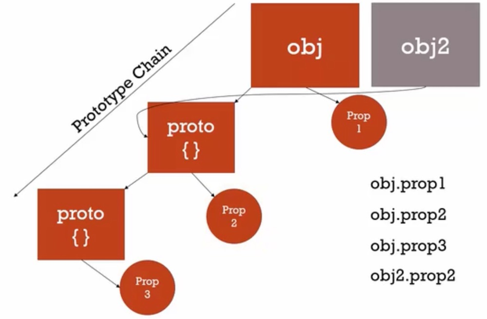

In the [previous part of this article](/javascript-understanding-the-weird-parts/), we learned about execution contexts, types and operators, functions, etc. In this part, we are going to learn more about object oriented programming with Javascript.

###Lecture 53: Classical vs prototypal inheritance

**Inheritance**: one object gets access to the properties and methods of another object.

Classical inheritance: (most popular) is in C++, Java, etc. It's very verbose. We can end up with a massive tree of objects and relationships. Many keywords: friend, protected, private, interface,...

Prototypal inheritance: simple. Extensible. Easy to understand.

###Lecture 54: Understanding the prototype

All objects have a "special property" called the proto {} property. That's the prototype of the object. It can also have its own properties. When we request a property of an object, JS first looks into the object itself to find that property, if it cannot find it, then it looks for the property inside the prototype.

That prototype can also contain another prototype object and JS will always go down the chain. That's called the **prototype chain**.

If we have an object2, it can also point at the same prototype of object1. Objects can share all the same prototype.



Example:

```javascript
var person = {
    firstname: 'Default',
    lastname: 'Default',
    getFullName: function() {
        return this.firstname + ' ' + this.lastname;
    }
}

var john = {
    firstname = 'John'.
    lastname: 'Doe'
}

// Don't do this EVER! for demo purposes only!!!
// This is a browser way to access the prototype but with very bad performance
john.__proto__ = person;
console.log(john.getFullName());
console.log(john.firstname); // It returns John's name, not Person's name because of the prototype chain priority.
```

###Lecture 55: Everything is an object (or a primitive)

```javascript
var a = {};
var b = function() {};
c = [];

console.log(a.__proto__); // returns the base object and we can access toString, etc

console.log(b.__proto__); // returns function Empty() {} and we can access apply, call, bind,...

console.log(c.__proto__); // returns push, pop, indexOf, length, etc

console.log(c.__proto__.__proto__); // that returns the base object
```

Everything leads to the base object. That's the bottom of the prototype chain.

###Lecture 56: Reflection and extend

Reflection: an object can look at itself, listing and changing its properties and methods. We can use that to implement the extend pattern. Let's look at how reflection works:

```javascript
var person = {
    firstname: 'Default',
    lastname: 'Default',
    getFullName: function() {
        return this.firstname + ' ' + this.lastname;
    }
}

var john = {
    firstname = 'John'.
    lastname: 'Doe'
}

// loop through every member in the john object
for (var prop in john) {
    console.log(prop + ': ' + john[prop]);
}

// The previous code will also output getFullName and the function. To avoid that we do:

for (var prop in john) {
    // it will only list it if it's on john's object
    if (john.hasOwnProperty(prop)) {
        console.log(prop + ': ' + john[prop]);
    }
}
```

Conceptual aside: look at the "_extend" method in the Underscore library. Analyse the 'createAssigner' method to understand how reflection is used. It basically uses two loops to assign the properties and methods of the objects passed as parameters to the first object passed as a parameter.

Extend is used in many libraries and frameworks. We could pull that method from Underscore and use it in our own library/project.

In ES6, we have also 'extends', but that's used for a different functionality.

###Lecture 57: Building objects

Function constructors, 'new' and the history of Javascript.

It was called Javascript to attract Java developers. The same way, Microsoft created VBScript to attract their own developers.

So, Java developers were used to create objects like this:

`var john = new Person();`

Although, ES6 will introduce the class keyword, Javascript doesn't really have classes.

So, Java developers thought Javascript was like Java and they recommended it.

```javascript
function Person(firstname, lastname) {
    this.firstname = firstname;
    this.lastname = lastname;
}

var john = new Person('John', 'Doe;);
console.log(john);

var jane = new Person('Jane', 'Doe;);
console.log(jane);
```

'new' immediately creates an empty object. Then it calls the function. Then 'this' will point to that empty object. So, the function becomes the constructor of that object.

###Lecture 58: Function constructors and '.prototype'

Functions have special properties, aside from name, code, etc, they also have a prototype property, which starts its life as an empty object and it's ONLY used by the new operator.

```javascript
function Person(firstname, lastname) {
    this.firstname = firstname;
    this.lastname = lastname;
}

Person.prototype.getFullName = function() {
    return this.firstname + ' ' + this.lastname;
}

var john = new Person('John', 'Doe;);
console.log(john);

var jane = new Person('Jane', 'Doe;);
console.log(jane);</pre>

Person.prototype.getFormalFullName = function() {
    return this.lastname + ', ' + this.firstname;
}

console.log(john.getFormalFullName());
```

So, we can add features to all those objects that we create by using the prototype.

In good code, the methods of an object are set with prototype. Why? Because if we add getFullName to every object, it means they are using a lot of memory. If we add it to the prototype, we only have it once. We just use one copy for all the instances of the object. We are saving memory space, because there's only one prototype for all the objects.

###Lecture 59: Dangerous aside, using 'new' and functions

If we forget to use 'new', the function constructor will return undefind. It's a good practice to use capital letters for constructors. In that way, if we see the new keyword is missing,  we will notice it's wrong.

In ES6, function constructors are likely going away.

###Lecture 60: Built-in function constructors

`var a = new Number(3);`

That creates an object of the type Number with some special methods. We can use a.toFixed();

`var a = new String('John');`

Same thing and we can use a.indexOf('o');

We can also do "John".length

They both store the value in a property called 'PrimitiveValue'. So they are not primitives, they are objects with special methods.

In the same way, we can do the same for dates:

`var a = new Date('10/12/2010');`

We can also do things like:

```javascript
String.prototype.isLengthGreaterThan = function(limit) {
   return this.legth > limit;
}
console.log('John'.isLengthGreaterThan(3));
```

String is an object and we are adding a method to the prototype. We just enhanced the JS language just like that! We have to be careful not to overwrite an existing method.

```javascript
Number.prototype.isPositive = function() {
    return this > 0;
}

console.log(3.isPositive()); // Returns error
```

Javascript doesn't return a number into an object, so we have to do:

```javascript
var a = new Number(3);
a.isPositive();
```

So, it's a good feature, but it gets a bit confusing, because not everything works the same way.

###Lecture 61: Dangerous aside. Built-in function constructors

```javascript
var a = 3;
var b = new Number(3);

a == b // returns true because of coercion
a === b // returns false
```

So, as you can see, that's not a very recommended situation. It's better not to use new to create primitives.

The same way, if we are going to work a lot with dates, it is recommended to use the library [Moment.js](http://momentjs.com).

###Lecture 62: Dangerous aside. Arrays and for..in

```javascript
Array.prototype.myCustomFeature = 'cool!';

var arr = ['John', 'Jane', 'Bob'];
for (item in arr) {
    console.log(item + ': ' + arr[item]);
}
// That will render also myCustomFeature
```

So, in the case of arrays, don't use for..in. Use the for..i classic loop.

###Lecture 63: Object.create and pure prototypal inheritance

This is a new feature for new browsers. If we need to support older browser, we use a **polyfill**, which is code that adds a feature which the engine may lack.

```javascript
var person = {
    firstname = 'Default',
    lastname = 'Default',
    greet = function() {
        return 'Hi' + this.firstname;
    }
}

var john = Object.create(person);
console.log(john);
```

That creates an empty object with a prototype with all the methods indicated above. So, if we want to override those default values, we can do:

```javascript
john.firstname = 'John';
john.lastname = 'Doe';
```

So, the big advantage of prototype vs classic inheritance, is that we can add new methods on the fly and mutate things easily, without complex layers and interactions.

###Lecture 64: ES6 and classes

```javascript
class Person {
    constructor(firstname, lastname) {
        this.firstname = firstname;
        this.lastname = lastname;
    }

    greet() {
        return 'Hi ' + firstname;
    }
}

var john = new Person('John', 'Doe');
```

That is an OBJECT.

To set the prototype, we do it like this:

```javascript
class InformalPerson extends Person {
    constructor(firstname, lastname) {
        super(firstname, lastname);
    }

    greet() {
        return 'Yo ' + firstname;
    }
}
```

Syntactic sugar: a different way to type something that doesn't change how it works under the hood.

###Lecture 65: Odds and ends. Initialisation

Just talking about common syntax errors when creating big literal objects with arrays and functions. Nothing to highlight here.

###Lecture 66: Odds and ends. Typeof, intanceof and figuring out what something is

We can use typeof to figure out the type of primitive or object we are dealing with, but in the case of arrays, we have to use something like this:

```javascript
var d = [];
console.log(Object.prototype.toString.call(d));</pre>

That would output [Object Array]

In the case of objects:

<pre>function Person(name) {
    this.name = name;
}
var e = new Person('Jane');
```

With instanceof Person, we are looking for an object of the type Person down the prototype chain.

There's a very known bug. If you type typeof null, it returns an object.

And typeof functionName returns function.

###Lecture 67: Odds and ends. Strict mode

This tells the JS engine to process the code in a stricter way. For example, in the following case, we mistyped the variable but without the strict mode, it will not throw an error.

```javascript
var person;

persom = {};
console.log(persom);
```

If we put "use strict"; at the beginning, it will throw an error because we are forced to declare a variable in order to use it.

For more info, check [the strict mode reference](https://developer.mozilla.org/en-US/docs/Web/JavaScript/Reference/Strict_mode).

###Lecture 69: Learning from other's good code

An open source education. Github.com contains a great collection of source code where we can learn. So, it's a good practice to occasionally take a look at some of the methods of the libraries we use.

###Lectures 70-72: Deep dive into famous source code. jQuery

These lectures are quite dense in terms of code reviewing, so I will skip commenting about them. You are more than welcome to download the unminified version of jQuery and dive into the code to try to understand how the library it's initialised (without the need of using 'new') and how all the methods are stored in the prototype of fn.

I just like to mention the **method chaining**, which is a very useful way of chaining calls to methods. If you use jQuery, then very probably you already know about this. Like when you add a class and remove another class in the same line:

```javascript
$('.selector').addClass('a').removeClass('b');
```

To achieve that, we only have to 'return this;' in the methods we are calling.

###Lectures 73: Let's build a a framework / library. Requirements

* We are going to call it 'Greetr', an app to greet users
* When given a first name, last name and optional languages, it generates formal and informal greetings
* Support English and Spanish languages
* Reusable library / framework
* Easy to type 'G$()' structure
* Support jQuery

###Lectures 74: Let's build a a framework / library. Structuring safe code

First, create a file called Greetr.js. First we are going to create a new execution context with a self-invoking function.

```javascript
(function(global, $) {

}(window, jQuery))
```

###Lectures 75: Let's build a a framework / library. Our object and its prototype

Create a file called app.js. We are going to imitate jQuery structure. So we don't want to use 'new', we want to use G$() like in jQuery and get an object as a result:

```javascript
var g = G$('John', 'Doe');
```

Then, in Greetr.js:

```javascript
(function(global, $) {

    var Greetr = function(firstName, lastName, language) {
    return new Greetr.init(firstName, lastName, language);

    Greetr.prototype = {};

    Greetr.init = function(firstName, lastName, language) {
        var self = this;
        self.firstName = firstName || '';
        self.lastName = lastName || '';
        self.language = language || 'en';
    }

    Greetr.init.prototype = Greetr.prototype;

    global.Greetr = global.G$ = Greetr;
}

}(window, jQuery))
```

###Lectures 76: Let's build a a framework / library. Properties and chainable methods

Now we are just going to create methods in the prototype and return this in some of them to make then chainable.

```javascript
(function(global, $) {

    var Greetr = function(firstName, lastName, language) {
    return new Greetr.init(firstName, lastName, language);

    var supportedLangs = ['en', 'es'];

    var greetings = {
        en: 'Hello',
        es: 'Hola'
    };

    var formalGreetings = {
        en: 'Greetings',
        es: 'Saludos'
    };

    var logMessages = {
        en: 'Logged in',
        es: 'Inició sesión'
    }

    Greetr.prototype = {

        fullName: function() {
            return this.firstName + ' ' + this.lastName;
        },

        validate: function() {
            if (supportedLangs.indexOf(this.language) === -1) {
                throw "Invalid language";
            }
        },

        greeting: function() {
            return greetings[this.language] + ' ' + this.firstName + '!';
        },

        formalGreeting: function() {
            return formalGreetings[this.language] + ', ' + this.fullName();
        },

        greet: function(formal) {
            var msg;

            if (formal) msg this.formalGreeting();
            else msg = this.greeting();

            if (console) console.log(msg);
            return this;
        },

        log: function() {
            if (console) {
                console.log(logMessages[this.language] + ': ' + this.fullName();
            }
            return this;
        },

        setLang: function(lang) {
            this.language = lang;
            this.validate();
            return this;
        }
    };

    Greetr.init = function(firstName, lastName, language) {
        var self = this;
        self.firstName = firstName || '';
        self.lastName = lastName || '';
        self.language = language || 'en';
        self.validate();
    }

    Greetr.init.prototype = Greetr.prototype;

    global.Greetr = global.G$ = Greetr;
}

}(window, jQuery))
```

so now we can call it like this:

```javascript
var g = G$('John', 'Doe');
g.greet().setLang('es').greet(true);
```

###Lectures 77: Let's build a a framework / library. Adding jQuery support

Imagine we have an HTML form for login users. We just need a dropdown with the two languages supported and a login button. We also need an H1 with the id greeting.

Now we are going to add a method that accepts a jQuery selector and updates whatever the selector is.

To do this, we just need to add the following method in the prototype:

```javascript
    HTMLGreeting: function(selector) {
        if (!$) throw 'jQuery not loaded';

        if (!selector) throw 'Missing jQuery selector';

        var msg;
        if (formal) msg this.formalGreeting();
        else msg = this.greeting();

        $(selector).html(msg);
        return this;
    }
```

###Lectures 78: Let's build a a framework / library. Good commenting

This is specially important in JS because is not very verbose and we could make things very slick but not easy to read.

It's also good to get other developers to check your code and see if it's readable.

###Lectures 79: Let's build a a framework / library. Let's use our framework

Sometimes libraries also use a semi-colon before the self-invoked function as a sanity check (just in case another library wasn't closed properly).

The rest of the lecture is just about connecting the HTML form with the library, which is not particularly adding much value, so I will skip it.

###Lecture 81: Typescript, ES6 and transpiled languages

**Transpile**: convert the syntax of one programming language to another. In this case languages don't really ever run anywhere, but instead are processed by 'transpilers' that generate Javascript.

[Typescript](http://www.typescriptlang.org/) by Microsoft is quite popular. It provides types for variables! i.e. message: string. It also uses class and constructors.

[Traceur](https://github.com/google/traceur-compiler) by Google is also another popular ES6 library.

A lot of teams with long term Javascript projects are using these tools, so that they can write ES6 code (future proof) and at the same time be compatible with the current browsers.

As a personal opinion, I've heard of [BabelJs](https://babeljs.io/) more than any of the previous libraries. [Some people](http://ilikekillnerds.com/2015/01/transpiling-wars-6to5-vs-traceur/) recommend Babel over Traceur if support for JSX is a requirement or if the resulting code quality is also important to you over function.

###Lectures 83: EcmaScript 6.0. Existing and upcoming features

This is probably the best resource out there to learn about the ES6 features: https://github.com/lukehoban/es6features

And that's all. Here is the certificate that you will get if you make the course in Udemy:


