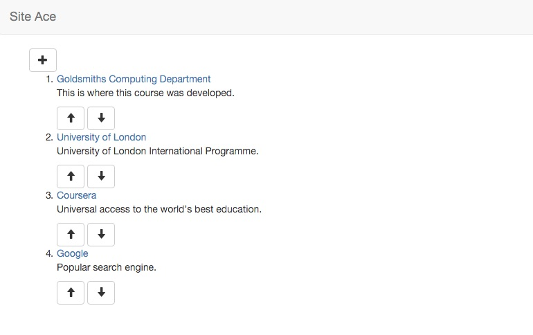

<p class="align-center">
<a class="btn icon icon-external" href="http://siteace-joanmira.meteor.com/" target="_blank">Launch Demo App</a>
<a class="btn icon icon-external" href="https://github.com/gazpachu/siteace" target="_blank">Source code</a>
</p>

This tutorial is the result of my final assignment for the [Introduction to Meteor.js Development course](https://www.coursera.org/learn/meteor-development/) by Dr Matthew Yee-King ([University of London & Goldsmiths](http://www.gold.ac.uk/)) at Coursera. This course is part of a [Responsive Website Development and Design specialisation](https://www.coursera.org/specializations/website-development) that covers the basics of modern full stack web development, from UX design, to front-end coding, to custom databases.

In that course, I learned how to create a complete, multi-user web site using the Meteor.js framework and MongoDB. It's divided in four weeks and has a couple of assignments and several quizzes. All and all, it was a very good introduction to the framework and I hope this tutorial will show everything I learned.

### Requirements

The purpose of the application is to allow users to **share**, **discuss** and **rate** pages they find on the internet. The app also needs to have the following features:

* Use [Bootstrap](http://getbootstrap.com/)
* Users can register and login
* Users can post new websites if they are logged in. Websites posted by users should have a URL and a description
* Users can up and down vote webpages by clicking a plus or a minus button.
* Websites should be listed with the most up voted site first
* The listing page shows when the website was added and how many up and down votes it has
* Users can move to a detail page for a website (using routing)
* On the detail page, users can post comments about a webpage, and they are displayed below the description of the webpage
* Use the HTTP package for Meteor to pull in information about the posted web links automatically, so the user does not need to enter anything other than the URL
* Implement a search function that allows the user to search within the listed sites for keywords
* Recommend websites to users based on things they have up voted and commented on. E.g. if I up vote a site entitled ‘Tofu recipes’, it would recommend other sites with ‘tofu’ and ‘recipe’ in their titles or descriptions
* Deploy the application using the Meteor deploy command

### Part 1. Installing Meteor and creating the app

Go to [meteor.com](https://www.meteor.com/) and follow [the instructions](https://www.meteor.com/install) to install Meteor in your OS.

To create the app, open your terminal, go to the folder where you want to save the app and type:

`meteor create siteace`

This will create a new folder called siteace (the name of the app we are building) with all of the files that a Meteor app needs:

* **siteace.js**: a JavaScript file loaded on both client and server
* **siteace.html**: an HTML file that defines view templates
* **siteace.css**: a CSS file to define your app's styles
* **.meteor**: internal Meteor files (hidden folder)

To run the newly created app:

`cd siteace`

`meteor`

Open your web browser and go to http://localhost:3000 to see the app running. If that's working, then you can stop it by pressing Ctrl+C.

### Part 2. Organising the folder structure

Meteor is a client and server framework, which means we have code for the front-end and code for the back-end. Both use Javascript. The back-end code console logs are rendered in the operating system terminal/console and the front-end console logs are rendered in the browser's console.

One way of deciding which code is going to run in the front-end or the back-end is to use the following conditional statements:

```javascript
if (Meteor.isClient) {
}
if (Meteor.isServer) {
}
```

That is fine for very small apps, but there's a better way of dividing the code using folders:

* **/server**: put all the Javascript files with code that need to be run on the server here
* **/client**: put all the Javascript files with code that need to be run on the client here
* **/lib**: all the Javascript files that have shared code and need to be run before anything else
* **/public**: all the public assets, like images, sounds, JSON, etc

So, let's go ahead and create those folders in our app.

Now rename siteace.js to main.js, siteace.css to style.css, siteace.html to index.html and place them inside the client folder.

Then we are going to create a file called collections.js and place it in the lib folder. That file will hold the definition of the Mongo collections for our DB.

Finally, create a file called startup.js and place it in the server folder. We will use this file to initialise the DB with some dummy data when the app starts.

Once we run meteor again in the console, it will take care of the minification of the files

### Part 3. Routing and defining the markup and templates

Meteor uses [Blaze](https://www.meteor.com/blaze) and [Spacebars](https://github.com/meteor/meteor/blob/devel/packages/spacebars/README.md) (a modified version of Handlebars) to produce reactive Meteor templates when compiled. Wait a minute... **reactive**? Yes, Meteor does update the interface automatically whenever there's a change in the data bound to that UI. At this point you might be thinking: is that like [Facebook's React](https://facebook.github.io/react/)? In a way yes. Should I use React instead? Probably yes, but that's a topic you might want to read more about [here](https://www.discovermeteor.com/blog/blaze-react-meteor/).

For the sake of simplicity, we are going to stick with Meteor's default front-end tools: Blaze and Spacebars.

First let's start by installing the router. Type the following in the terminal:

`meteor add iron:router`

Now we are going to define the application layout (the main placeholders) and the nav bar template. We use 'yield' to define the placeholder where later we will render the chosen templates in the routes. Open index.html and add the following:

```html
<head>
  <title>Site Ace by Joan Mira</title>
</head>

<body>
</body>

<template name="ApplicationLayout">
    {{> yield "navbar"}}
    <div class="container">
        {{> yield "form"}}
        {{> yield "main"}}
    </div>
<;/template>

<!-- template that displays the header with the nav bar -->
<template name="navbar">
    <nav class="navbar navbar-default">
      <div class="container-fluid">
        <div class="navbar-header">
            <a class="navbar-brand" href="/">Site Ace, a social website aggregator by Joan Mira</a>
        </div>
          {{> loginButtons align="right"}}
      </div>
    </nav>
</template>
```

Now we are also adding three more templates, website\_form, website\_list and website\_item. The first one will render a form to allow the user to submit new URLs to the app. The second one will render a list of websites already in the DB and the third one is a partial to render an individual list item in the list of websites:

```html
<template name="website_form">
	<a class="btn btn-default toggle-website-form js-toggle-website-form" href="#">
  		<span class="glyphicon glyphicon-plus" aria-hidden="true"></span>
	</a>
	<div id="website_form" class="hidden_div">
		<form class="js-save-website-form">
		  <div class="form-group">
		    <label for="url">Site address</label>
		    <input type="text" class="form-control" id="url" placeholder="http://www.mysite.com">
		  </div>
		  <button type="submit" class="btn btn-default">Submit</button>
		</form>
	</div>
</template>

<!-- template that displays several website items -->
<template name="website_list">
	<ol>
	{{#each websites}}
	{{>website_item}}
	{{/each}}
	</ol>
</template>

<!-- template that displays individual website entries -->
<template name="website_item">
<li>
	<a href="{{_id}}">{{title}}</a>
	<p>
		{{description}}
	</p>
	<a href="#" class="btn btn-default js-upvote">
		<span class="glyphicon glyphicon-arrow-up" aria-hidden="true"></span>
	</a>
	<a href="#" class="btn btn-default js-downvote">
		<span class="glyphicon glyphicon-arrow-down" aria-hidden="true"></span>
	</a>
	<!-- you will be putting your up and down vote buttons in here! -->
</li>
</template>
```

Notice that instead of url, we used _id to compose the URL of the website link. That will be useful later when we are creating the detail page...

Now we are going to define the Router configuration and the homepage/default route. Open main.js and add the following at the top:

```javascript
Router.configure({
    layoutTemplate: 'ApplicationLayout'
});

Router.route('/', function () {
    this.render('navbar', {
        to: 'navbar' // The name of the main placeholder in applicationLayout
    });
    this.render('website_form', {
        to: 'form'
    });
    this.render('website_list', {
        to: 'main'
    });
});
```

### Part 4. Define the collection and the initial data

Open collections.js and create a new one by typing:

`Websites = new Mongo.Collection("websites");`

Now open startup.js and set some dummy data:

```javascript
// start up function that creates entries in the Websites databases.
Meteor.startup(function () {
    // code to run on server at startup
    if (!Websites.findOne()){
        console.log("No websites yet. Creating starter data.");
          Websites.insert({
            title:"Goldsmiths Computing Department",
            url:"http://www.gold.ac.uk/computing/",
            description:"This is where this course was developed.",
            createdOn:new Date()
        });
         Websites.insert({
            title:"University of London",
            url:"http://www.londoninternational.ac.uk/courses/undergraduate/goldsmiths/bsc-creative-computing-bsc-diploma-work-entry-route",
            description:"University of London International Programme.",
            createdOn:new Date()
        });
         Websites.insert({
            title:"Coursera",
            url:"http://www.coursera.org",
            description:"Universal access to the world’s best education.",
            createdOn:new Date()
        });
        Websites.insert({
            title:"Google",
            url:"http://www.google.com",
            description:"Popular search engine.",
            createdOn:new Date()
        });
    }
});
```

### Part 5. Add some CSS

The form to submit new URLs that we specified in the markup is hidden by default. It only opens when the user clicks in the '+' button. To make this form hidden, we just have to add the following CSS:

```css
.hidden_div {
	display: none;
}

ol {
    padding: 0;
    list-style-type: none;
    counter-reset: section;
}

ol li,
.info {
    counter-increment: section;
    border: 1px solid #CCC;
    border-radius: 5px;
    margin-bottom: 20px;
    padding: 10px;
    background-color: #F8F8F8;
}

ol li::before {
    content: counter(section);
    margin-right: 5px;
    font-size: 80%;
    background-color: #3388BB;
    color: white;
    font-weight: bold;
    padding: 3px 8px;
    border-radius: 3px;
}

.info {
    background-color: #3388BB;
    color: white;
    text-align: center;
}
.info a {
    color: white;
    text-decoration: underline;
}

.website-meta {
    float: right;
    line-height: 35px;
}

.website-meta span {
    font-weight: bold;
}

.comment-meta {
    text-align: right;
    margin: 5px 0 0 0;
}

.toggle-website-form,
#website_form,
.info {
    margin-bottom: 10px;
}

#login-buttons {
    float: right;
    margin-top: 15px;
}

#url {
    float: left;
    width: 50%;
    margin-right: 5px;
}

#search {
    float: right;
    max-width: 150px;
}
```

### Part 6. Add basic events

In order to show/hide the form, we are going to need to capture the click event. Open the main.js file and add the following:

```javascript
Template.website_form.events({
    "click .js-toggle-website-form":function(event){
        $("#website_form").toggle('slow');
    }
)};
```

Here we are just targeting the click event of the .js-toggle-website-form element and toggling its visible state.

At this point, the app should look similar to this (probably a bit better ;-)



### Part 7. Add new URLs to the DB

Before we start coding, we are going to need a Meteor package called HTTP to retrieve the title and description from the website we are adding. You can read more about the package [here](https://themeteorchef.com/snippets/using-the-http-package/). Type the following in the terminal to install it:

`meteor add http`

Due to CORS restrictions, we need to contact the website from the server. So open the startup.js file and create a new method (inside the startup method) to get the title and description from the URL:

```javascript
Meteor.methods({
    getWebsiteData: function (url) {
        this.unblock();
        return Meteor.http.call("GET", url, {"npmRequestOptions" : {"gzip" : true}});
    }
});
```

The GZIP option is to decompress the data in case the server returns it compressed.

No we have to call that method from the front-end when the user submits the form. Open main.js and in the same function we were working in the previous part, add the following event to capture the form submit:

```javascript
    "submit .js-save-website-form":function(event){

        // here is an example of how to get the url out of the form:
        var url = event.target.url.value;
        console.log("The url they entered is: "+url);

        //  put your website saving code in here!
        Meteor.call("getWebsiteData", url, function(error, results) {

            // Dump the markup into a dummy element for jQuery manipulation
            var el = $('<div></div>');
            el.html(results.content);

            // Get the meta data
            var title = $('title', el).text();
            var description = $('meta[name="description"]', el).attr('content');

            // Add the new website in the Websites collection
            Websites.insert({
                title: title,
                url: url,
                description: description,
                createdOn:new Date()
            })
        });

        return false; // stop the form submit from reloading the page
    }
```

You can try to add a few URLs and then reload the page. They new ones should remain there. If you want to reset the DB, just type in the terminal meteor reset.

### Part 8. User authentication

There two Meteor packages that take care of user registration and authentication. To install them type this in the terminal:

`meteor add accounts-ui accounts-password`

And then add the following partial to the navbar (beside the Site Ace title):

`{{> loginButtons }}`

By default, the only enabled fields for user registration are the email and password. If we also want to have a username field, we have to specify it in the package config. Open main.js and add the following at the top:

```javascript
Accounts.ui.config({
    passwordSignupFields: "USERNAME_AND_EMAIL"
});
```

Also, from now on, if we need to check if the user is logged in or we want to access its data, we can do it like this:

```javascript
if (Meteor.user()) {
    Meteor.user().username;
}
```

### Part 9. Allow only logged in users to post new websites

We could do it by hiding the form for not logged in users, but then this could be easily hacked by manipulating the DOM from the console. So we are going to use a form validation task instead. Open main.js and wrap everything inside the submit form event with the approach we specified in the previous part. Also add an else condition and display an alert window with an error message if the user is not logged in:

```javascript
"submit .js-save-website-form":function(event){

    if (Meteor.user()) {
        (...)
    }
    else {
        alert('You need to be logged in to submit websites!');
    }

    return false;
}
```

### Part 10. Display the date and add votes

In the listing page, we are going to display the date the website was added. We need to install a new package called Moments.js, a popular library to work with dates in Javascript:

`meteor add momentjs:moment`

We also need to create a new template function to parse the date. In this case, we are going to make it global, so other templates can use it as well. Open main.js and add this:

```javascript
// format the date
Template.registerHelper('formattedDate', function() {
     return moment(this.createdOn).format("MM/DD/YYYY");  // or whatever format you prefer
});
```

Then, in index.html add a placeholder for the date and the votes right after the voting buttons:

```html
<p class="website-meta">{{formattedDate}} | <span class="js-votes-up">{{up}}</span>↑, <span class="js-votes-down">{{down}}</span>↓</p>
```

We also have to initialise the up and down fields for each website entry in the DB. Open startup.js and refactor the initial items like this. Do it as well in the form submit event in main.js!:

```javascript
Websites.insert({
    title:"Coursera",
    url:"http://www.coursera.org",
    description:"Universal access to the world’s best education.",
    createdOn:new Date(),
    user: "Anonymous", // Use Meteor.user()._id in main.js
    up: 0,
    down: 0
});
```

Finally, we have to save the votes in the DB. To do it, we have to use the 'update' method of the Websites collection. In this case, we are going to define the events for the parent template 'ApplicationLayout'. We do it like this to be able to use these events later in the detail page. Open main.js and add the following:

```javascript
Template.ApplicationLayout.events({
    "click .js-upvote":function(event){
        // example of how you can access the id for the website in the database
        // (this is the data context for the template)
        var website_id = this._id;
        console.log("Up voting website with id "+website_id);

        // put the code in here to add a vote to a website!
        Websites.update({_id: website_id},
                        {$set: {up: this.up + 1}});

        return false;// prevent the button from reloading the page
    },
    "click .js-downvote":function(event){

        // example of how you can access the id for the website in the database
        // (this is the data context for the template)
        var website_id = this._id;
        console.log("Down voting website with id "+website_id);

        // put the code in here to remove a vote from a website!
        Websites.update({_id: website_id},
                        {$set: {down: this.down + 1}});

        return false;// prevent the button from reloading the page
    }
})
```

### Part 11. Sort items by votes up

This is an easy one. We know Meteor templates are reactive, meaning the UI gets updated automatically every time something changes. We are going to take advantage of that by defining a sorting in the website\_list template in main.js:

```javascript
Template.website_list.helpers({
    websites:function(){
        return Websites.find({}, {sort: {up:-1}});
    }
});
```

### Part 12. Implement a detail page using routing

Now we need to create a new route in main.js that will take the website id as a parameter in the URL path and query the DB to get the data of that id. We will also render a new template in the main placeholder:

```javascript
Router.route('/:_id', function () {
    this.render('navbar', {
        to: 'navbar'
    });
    this.render('website_detail', {
        to: 'main',
        data: function() {
            return Websites.findOne({_id: this.params._id});
        }
    });
});
```

Now let's create the new template in index.html:

```html
<!-- template that displays a website detail -->
<template name="website_detail">

    <h1><a href="{{url}}">{{title}}</a></h1>
    <p>
        {{description}}
    </p>
    <a href="#" class="btn btn-default js-upvote">
        <span class="glyphicon glyphicon-arrow-up" aria-hidden="true"></span>
    </a>
    <a href="#" class="btn btn-default js-downvote">
        <span class="glyphicon glyphicon-arrow-down" aria-hidden="true"></span>
    </a>
    <p class="website-meta">Votes: <span class="js-votes-up">{{up}}</span>↑, <span class="js-votes-down">{{down}}</span>↓</p>

</template>
```

### Part 13. Adding comments to the detail page

First we are going to create a new Mongo collection in collections.js:

`Comments = new Mongo.Collection("comments");`

Then two new main placeholders in the ApplicationLayout template and three new templates (very similar to the ones we already have) in index.html:

```html
{{> yield "comments"}}
{{> yield "comment"}}

(...)

<!-- template that displays several comments -->
<template name="comments_list">
    <h3>Comments</h3>
    <ol>
        {{#each comments}}
        {{>comment_item}}
        {{/each}}
    </ol>
</template>

<!-- template that displays individual comment entries -->
<template name="comment_item">
    <li>
        {{comment}}
        <p class="comment-meta">{{formattedDate}} by {{getUser user}}</p>
    </li>
</template>

<!-- template that displays the form to submit a new comment -->
<template name="comment_form">
    <div id="comment_form">
        <form class="js-save-comment-form">
          <div class="form-group">
            <input type="text" class="form-control" id="comment" placeholder="Type your comment here...">
          </div>

          <button type="submit" class="btn btn-default">Submit</button>
        </form>
    </div>
</template>
```

Now, before we continue. Notice that we are using a new helper called getUser. We need this to get the real username from a given user ID (that's what we have in the DB). So add this new helper into main.js:

```javascript
// helper function that returns the username for a given user ID
Template.registerHelper('getUser', function(userId) {
     var user = Meteor.users.findOne({_id: userId});
    if (user) {
        return user.username;
    }
    else {
        return "anonymous";
    }
});
```

Then, we are going to update the detail page route (in main.js) and render the new templates:

```javascript
this.render('comments_list', {
    to: 'comments'
});
this.render('comment_form', {
    to: 'comment'
});
```

Now we have to insert the new comments into the comments collection whenever a logged in user submits the comment form. The schema for this collection is going to store the ID of the website where the comment belongs, the comment itself, the date and the user who wrote it. Notice that to get hold of the website ID, we are going to use the Router params...

```javascript
Template.comment_form.events({
    "submit .js-save-comment-form":function(event){

        if (Meteor.user()) {

            // here is an example of how to get the comment out of the form:
            var comment = event.target.comment.value;
            console.log("The comment they entered is: "+comment);

            Comments.insert({
                website: Router.current().params._id,
                comment: comment,
                createdOn: new Date(),
                user: Meteor.user().username
            });
        }
        else {
            alert('You need to be logged in to submit comments!');
        }

        return false; // stop the form submit from reloading the page

    }
});
```

Now that we have the comments stored in the DB, we need a template helper to render the list of comments. We will filter the query by finding only the comments that have a website ID equal to the one of the current page:

```javascript
Template.comments_list.helpers({
    comments:function(){
        return Comments.find({website: Router.current().params._id});
    }
});
```

### Part 14. Secure and deploy

Finally, we are just going to remove the insecure package (otherwise our DB could be easily compromised):

`meteor remove insecure`

And now we have to allow access to the different DB operations in collections.js:

```javascript
// set up security on collections
Websites.allow({
    insert: function(userId, doc) {

        if (Meteor.user()) {
            if (userId != doc.user) {
                return false;
            }
            else {
                return true;
            }
        }
        else {
            return false;
        }
    }
});

Comments.allow({
    insert: function(userId, doc) {

        if (Meteor.user()) {
            if (userId != doc.user) {
                return false;
            }
            else {
                return true;
            }
        }
        else {
            return false;
        }
    }
});
```

Now that we have some basic security in place, we are ready to deploy to the FREE Meteor servers:

`meteor deploy siteace-joanmira.meteor.com`

That's all! I hope you enjoyed the tutorial and please do let me know if you find any issues. Thanks.

In the following days I might add the functionality remaining: search and recommended websites.
