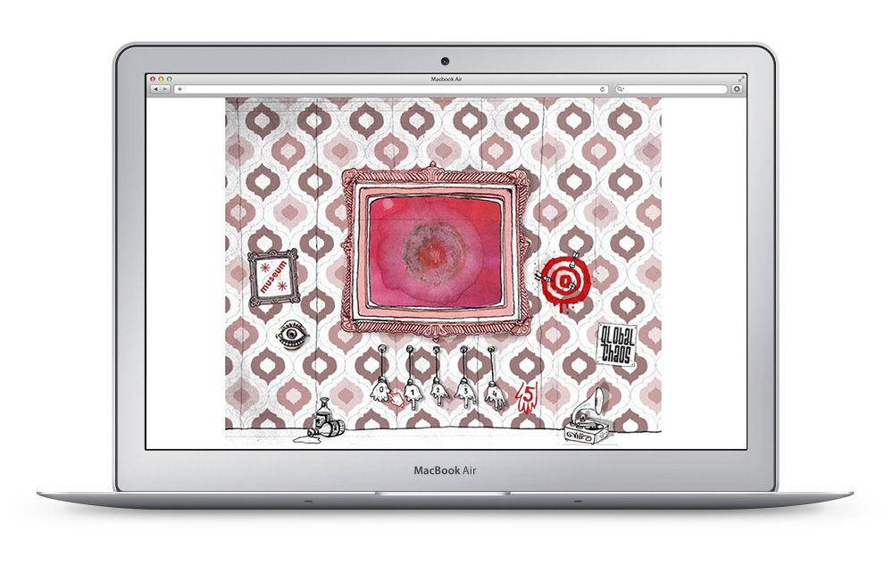

<a class="btn icon icon-external" href="http://work.joanmira.com/webs/lovul/" target="_blank">Launch archived website</a>

L'Òvul was a cultural magazine I got involved with. It was made with love by friends in Barcelona. I built this microsite to display the latest issues of the magazine, info and dates of upcoming events and a few artworks.

Most of the content is now offline, but you can have a look at the quirky animations ;-)

