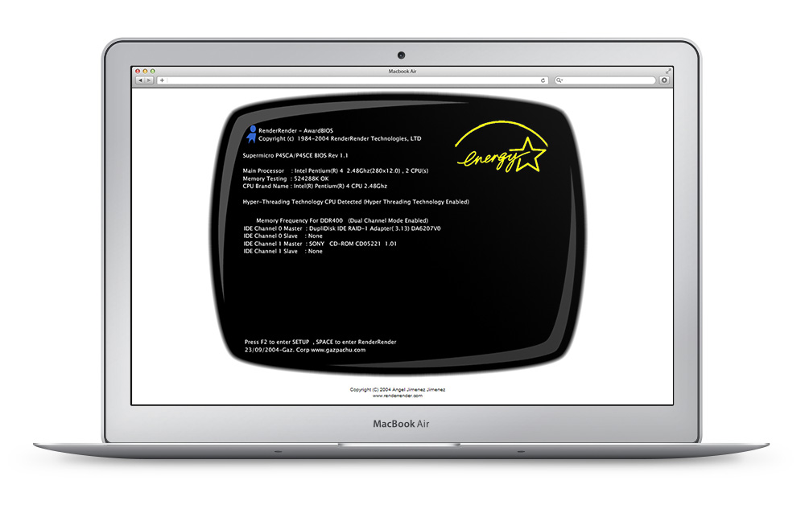
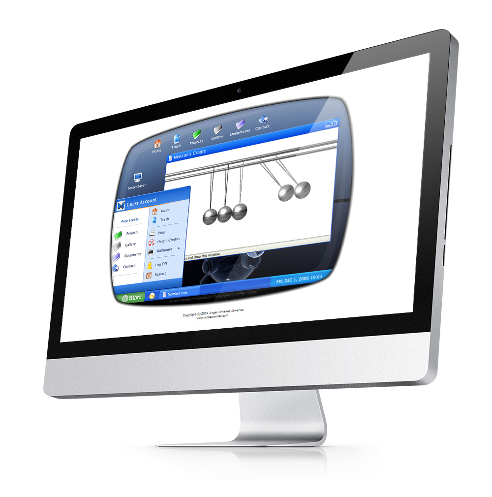

<a class="btn" href="http://work.joanmira.com/webs/renderrender/" target="_blank">Launch archived demo</a>

Render Render is an R&D project I built while working at Slater Labs in Madrid. My aim was to mimic a Windows OS inside a Flash website.

The demo starts with the classic BIOS screen (which has an easter egg if you press F2...). Then it loads the Windows Xp user login screen. After that, the the desktop is displayed and the user can start interacting with the programs (doble click in the icon to open).

