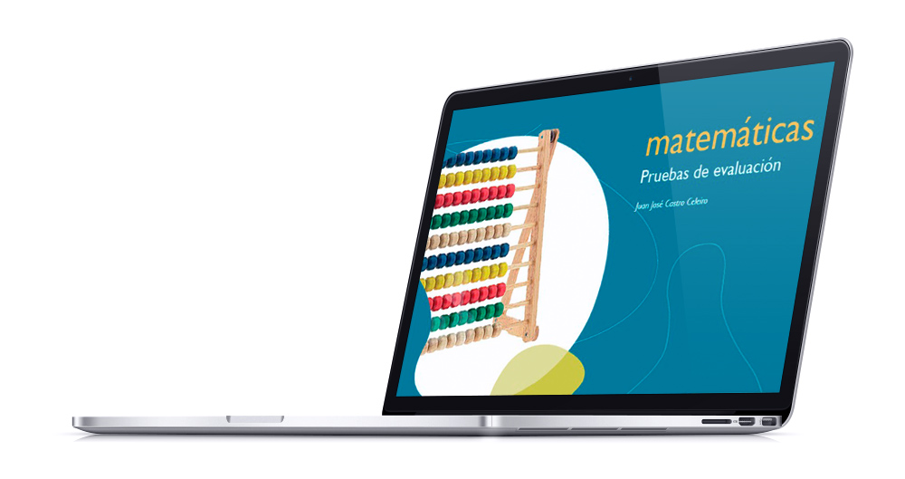
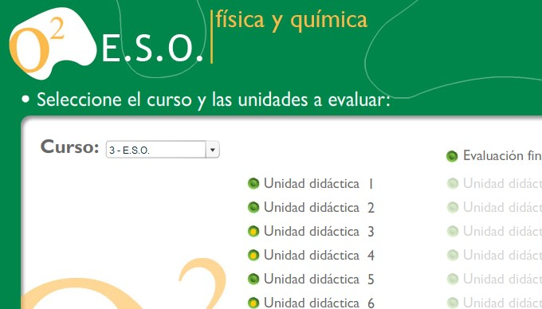
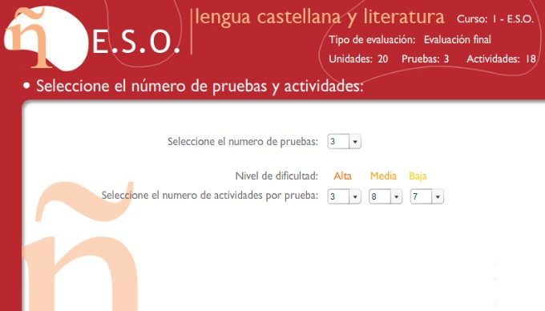
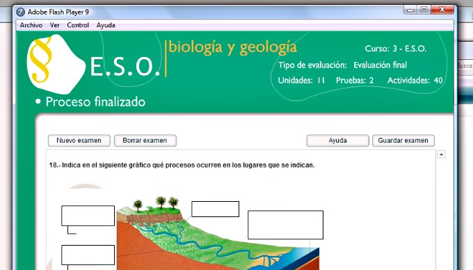
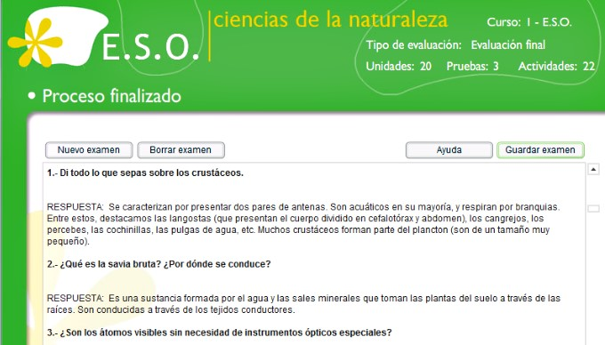

This is one of the longest project I ever worked on. It started in 2005 and lasted until 2012 with **more than 30 different CDs** for different high school levels. I basically built an interactive app to generate exams.

The app reads questions and answers from an XML and randomises them based on a series of configurations that the teacher sets, like the difficulty, number of questions, units, courses, etc.

Once the questions were displayed, the teacher could export them into a Word document, HTML page or print them.

