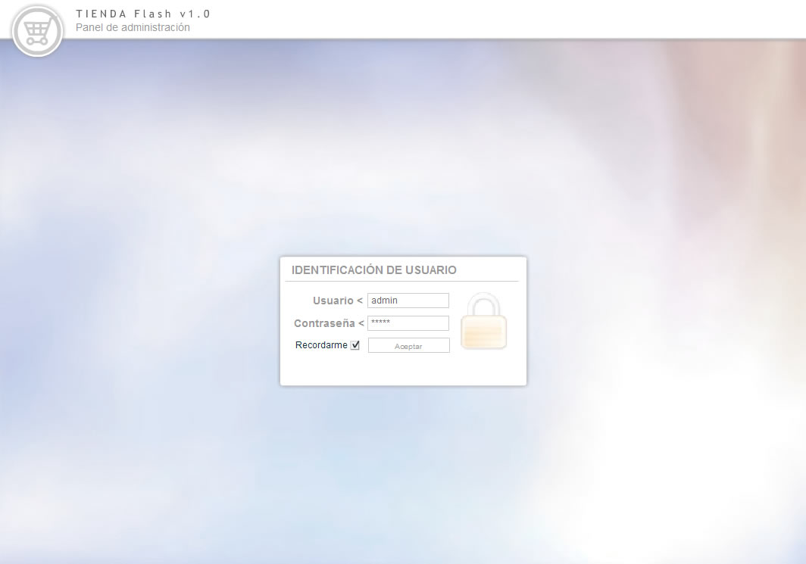
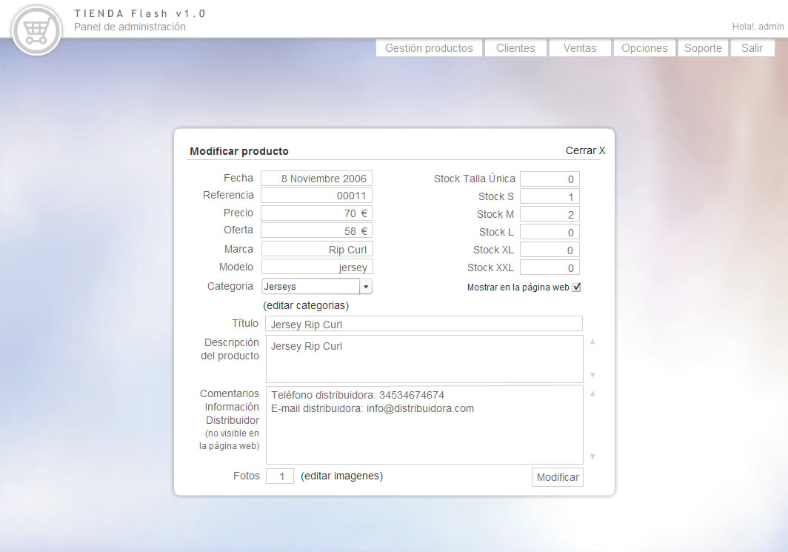
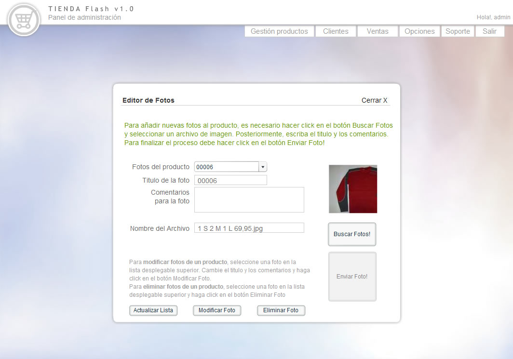
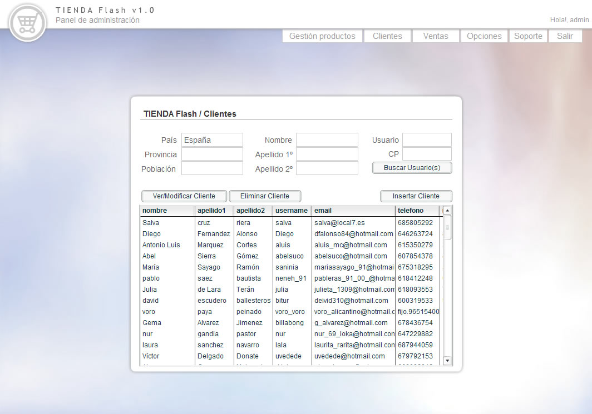

<a class="btn icon icon-external" href="http://work.joanmira.com/webs/local7/" target="_blank">Launch archived website without DB</a>

Local7 contacted us (Webmarket) to build an online shop to sell their products. They wanted a very personal style combined with great UX and an easy payment method.

At this point, I didn't have a system or CMS with this sort of functionality. The open source options available at that time were also very insufficient for the requirements, so I decided to build my own bespoke solution. I called it TIENDAFlash, because it was based in Flash, PHP and MySQL.

TIENDAFlash allows the maximum flexibility in the front-end and a very compatible and extended tech stack for the backend. It also features a custom CMS to add/edit/remove products, categories, photos and customers. I also implemented a credit/debit card payment gateway using the API from ServiRed (a very popular banking network in Spain).

