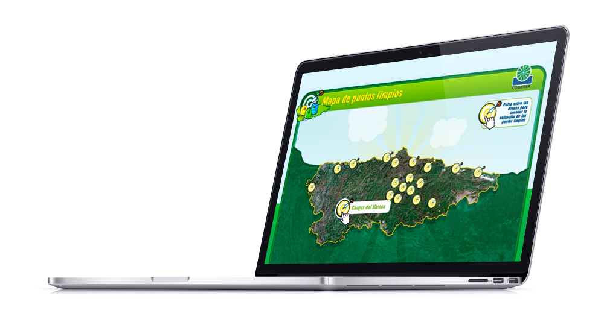
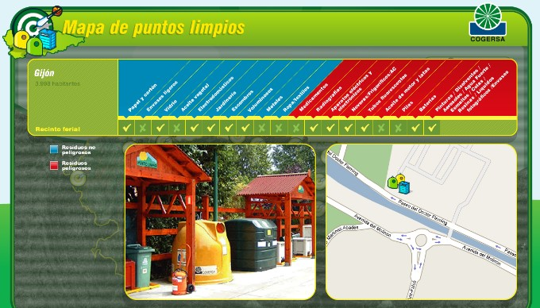
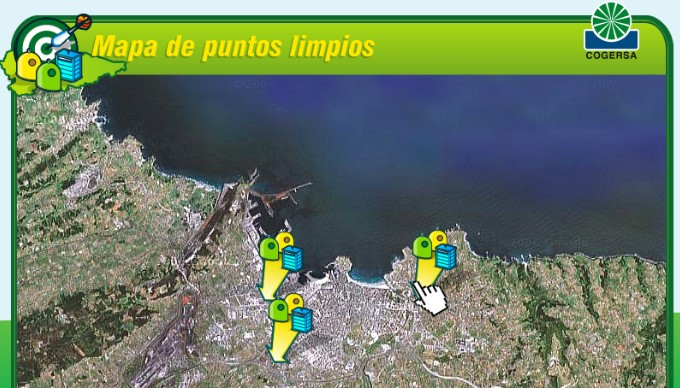
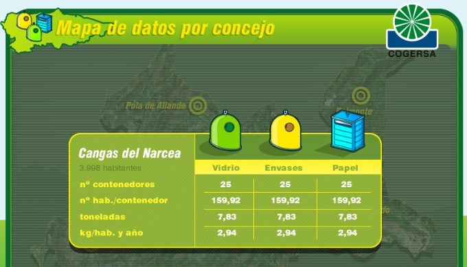
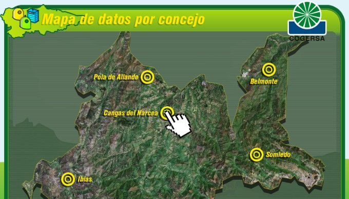

<a class="btn icon icon-external" href="http://work.joanmira.com/desktop/cogersa/cms.swf" target="_blank">Launch app without DB</a>

As part of my business relationship with [IBCMass](http://www.ibcmass.com/), I was asked to create an app for Cogersa to showcase the recycling hotspots in the province of asturias. The app reads an XML feed and loads all the information from an external source, which gets updated by a 3rd party software. Due to a high work load, I asked my partners at [Nitsnets](www.nitsnets.com) to develop this project, so in this case, I worked more as a project manager than a developer.

