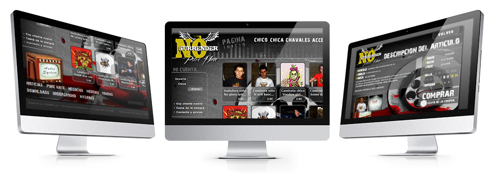
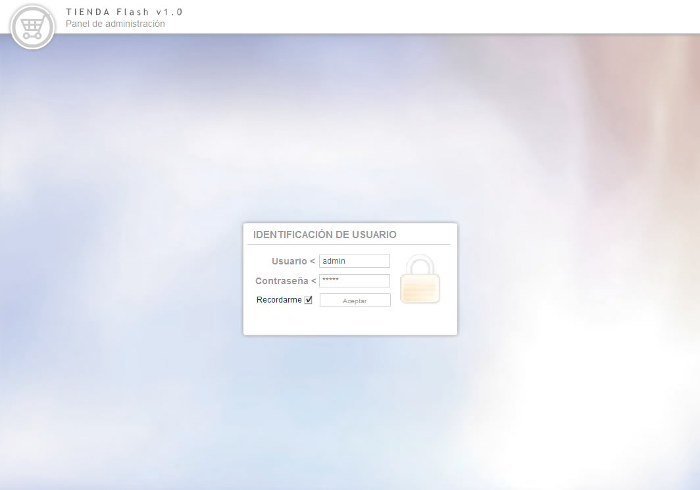
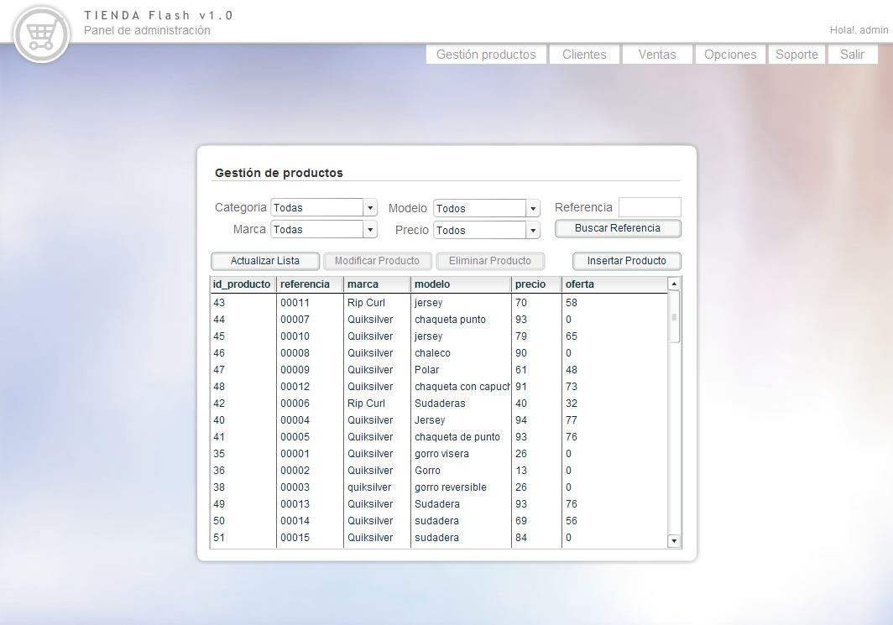
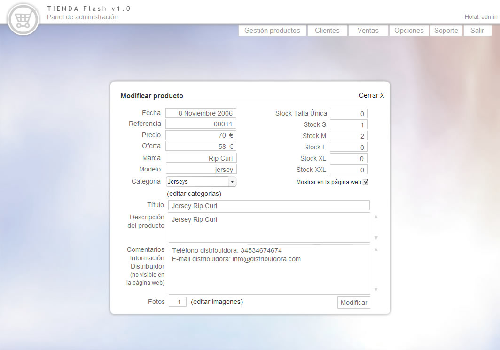
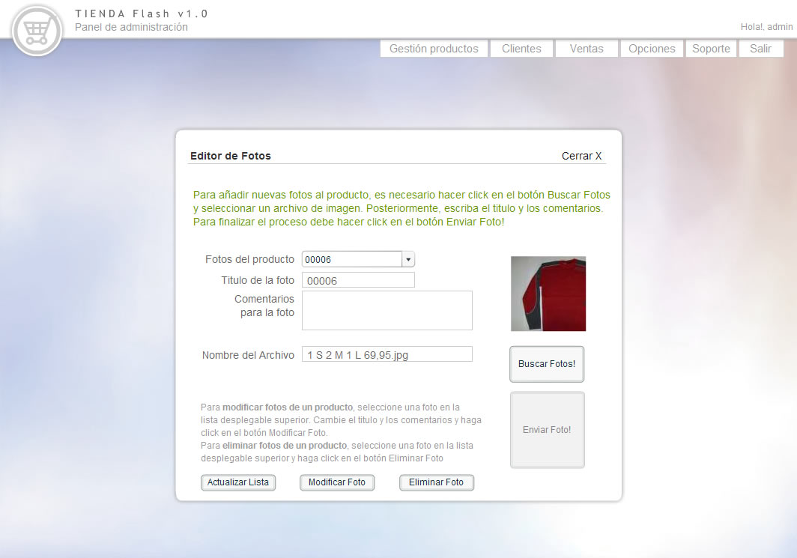
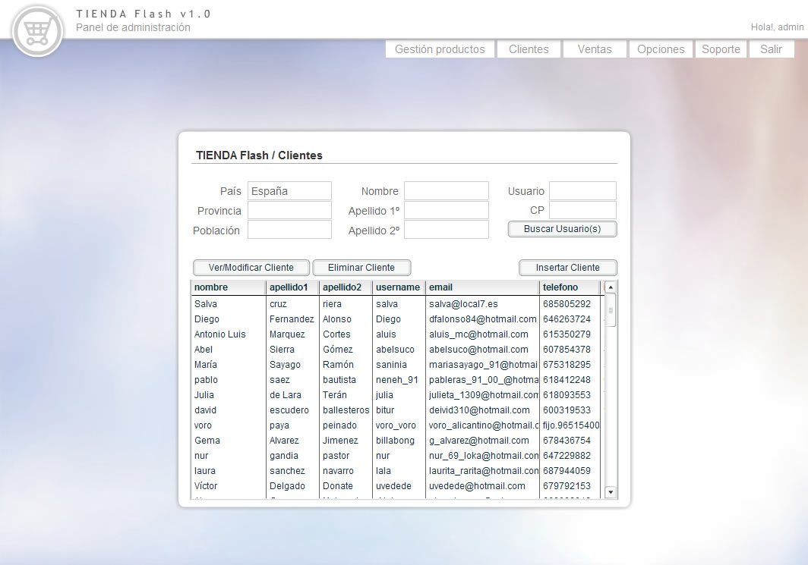
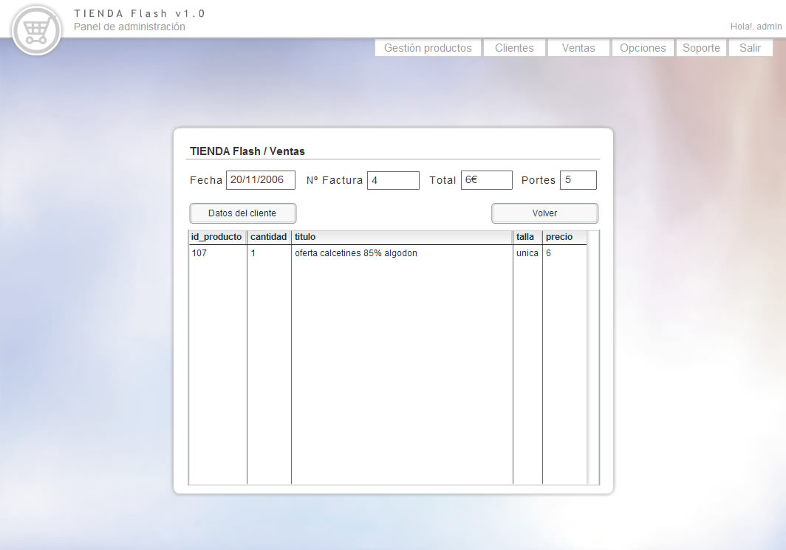
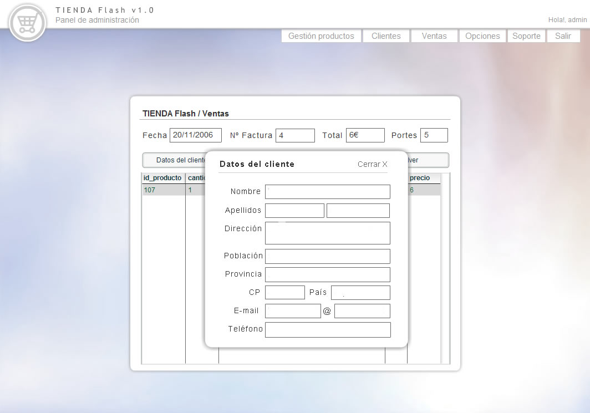

<a class="btn icon icon-external" href="http://work.joanmira.com/webs/nosurrender/" target="_blank">Launch archived website without DB</a>

No Surrender contacted me to build an online shop to sell their products. They wanted a very personal style combined with great UX and an easy payment method.

I used TIENDAFlash, the software that I previously created for another customer that required a Flash online shop. TIENDAFlash is a Flash + PHP + MySQL solution that allows the maximum flexibility in the front-end and a very compatible and extended tech stack for the backend. It also features a custom CMS to add/edit/remove products, categories, photos and customers. I also implemented a credit/debit card payment gateway using the API from ServiRed (a very popular banking network in Spain).

