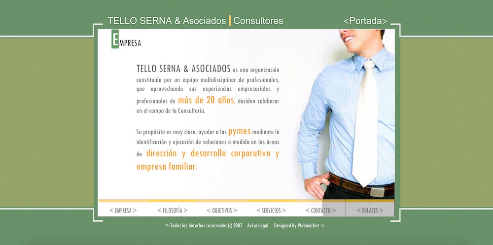
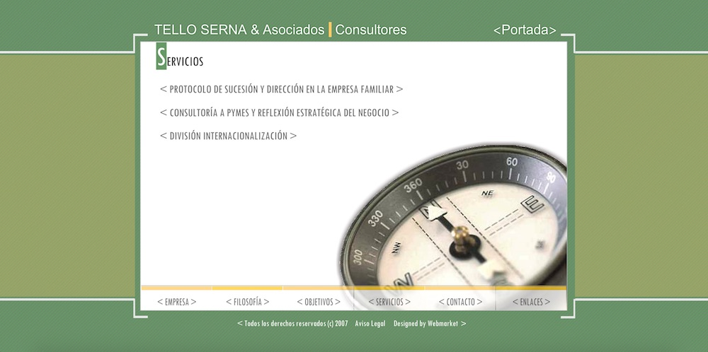

<a class="btn" href="http://work.joanmira.com/webs/telloserna/v1" target="_blank">v1</a>
<a class="btn" href="http://work.joanmira.com/webs/telloserna/v2" target="_blank">v2</a>
<a class="btn" href="http://work.joanmira.com/webs/telloserna/v4" target="_blank">v4</a>
<a class="btn" href="http://work.joanmira.com/webs/telloserna/v5" target="_blank">v5</a>
<a class="btn" href="http://work.joanmira.com/webs/telloserna/v6" target="_blank">v6</a>

This was one of Webmarket's first projects. It's a straightforward Flash website with a custom design, animated content and desktop responsive layout. To complete the project, we hired a freelance graphic designer to create the final version (v6).

