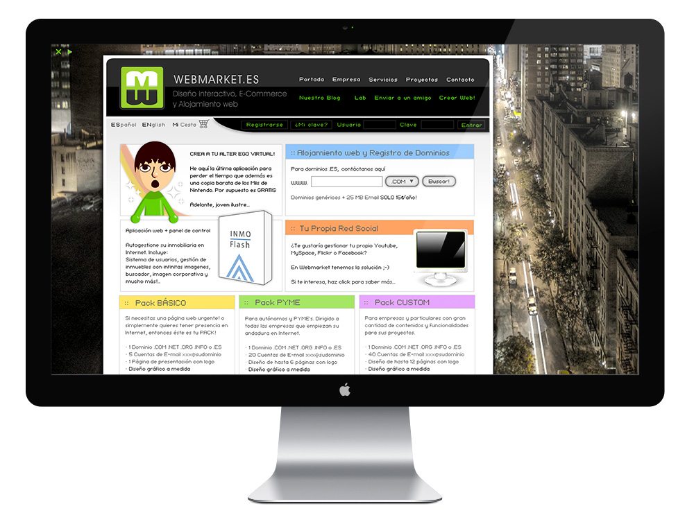
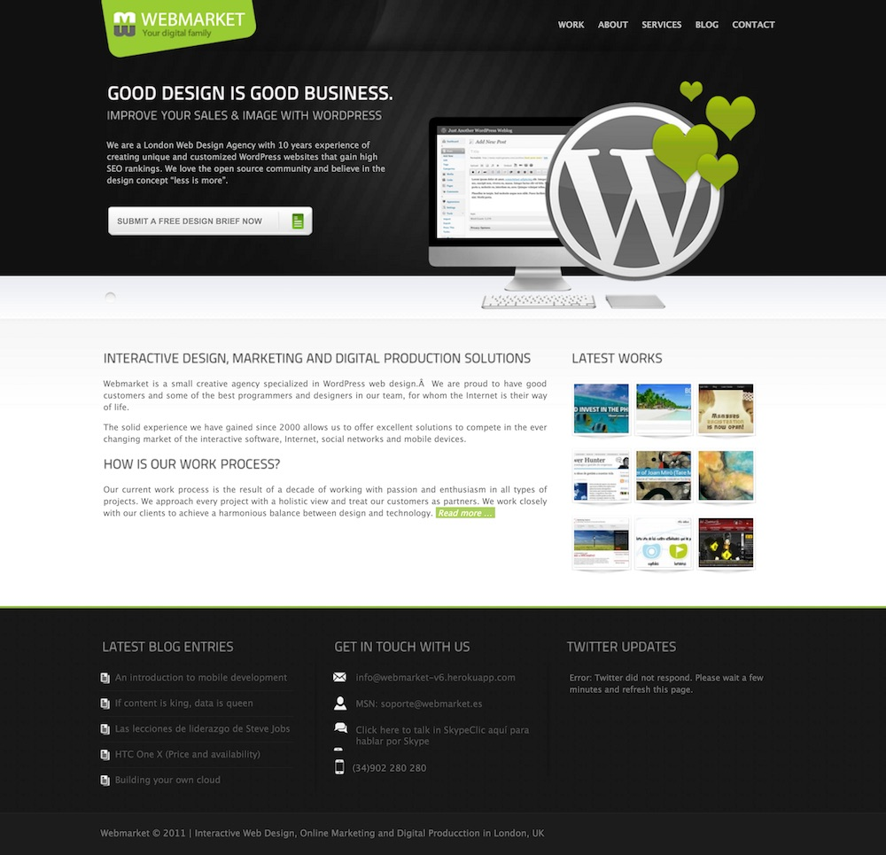
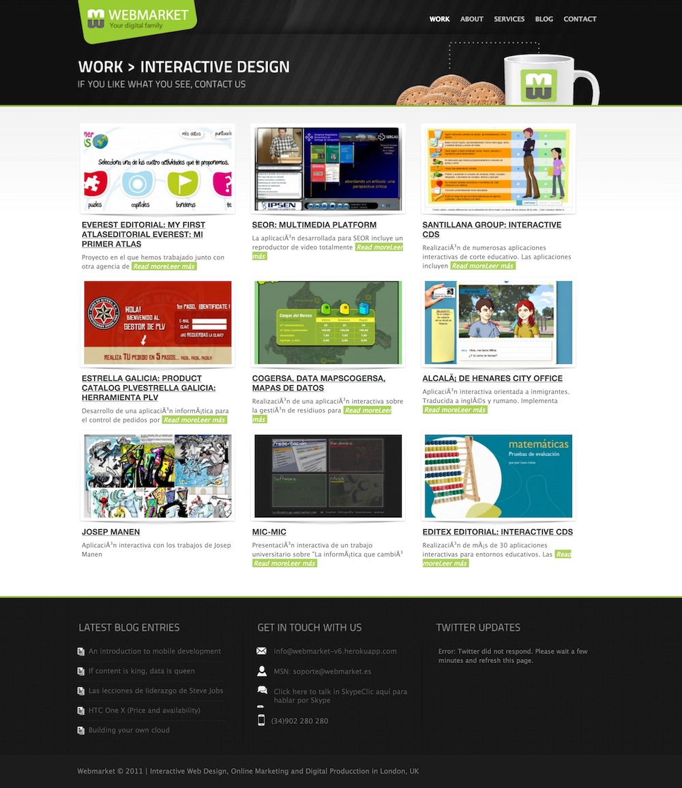
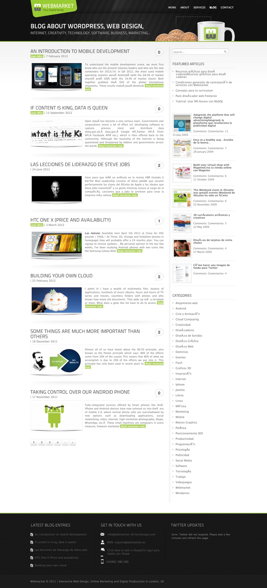
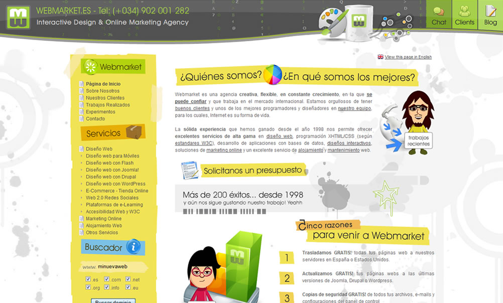
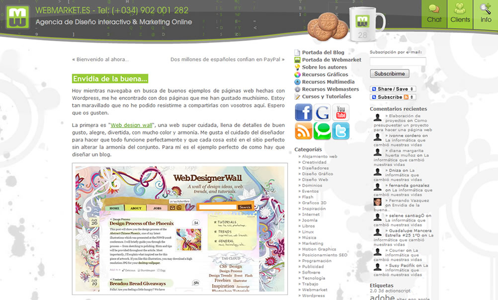
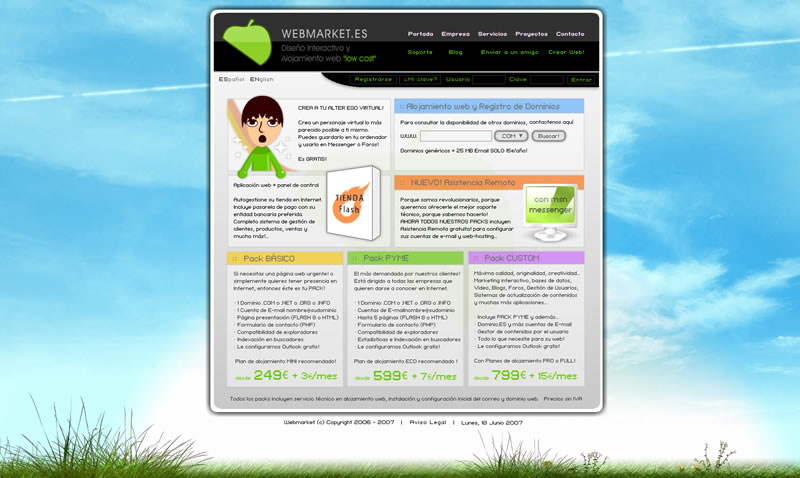
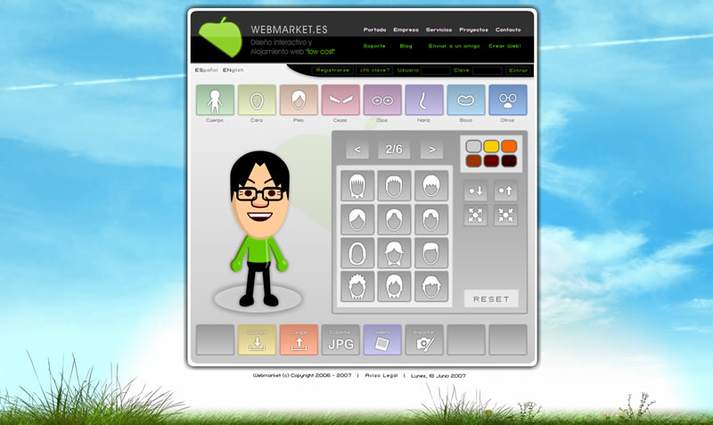
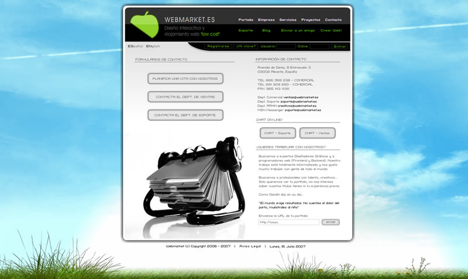

<a class="btn icon icon-external" href="http://webmarket-v6.herokuapp.com" target="_blank">v6 Wordpress</a> <a class="btn icon icon-external" href="http://webmarket-joomla.herokuapp.com" target="_blank">v5 Joomla</a> <a class="btn icon icon-external" href="http://webmarket-wp.herokuapp.com" target="_blank">v5 Wordpress</a> <a class="btn icon icon-external" href="http://work.joanmira.com/webs/webmarket/v3/" target="_blank">v4 Flash</a>

In 2006, I co-founded a small digital agency. After the first year, I continued as a solo venture and partnered with other agencies and freelancers at some points. We specialised in design and development of multimedia applications and websites based on Adobe Flash (AS2), MdM Zinc, Wordpress and front-end technologies.

During the 6 years in business, we worked for brands like: Estrella Galicia, Santillana, Editex, Philippines government, Grupo Soledad, IBCmass, Cogersa, Narcea Multimedia, Digital Toy Shop, IES Miguel Hernández, etc.

Some of the bespoke products we created:

**TiendaFlash**: a Flash, AMFPHP & MySQL e-commerce CMS with unlimited products, VISA/Master Card and Paypal integration

**InmoFlash**: a Flash, AMFPHP & MySQL real-state CMS with unlimited properties

**FinanFlash**: a Flash, AMFPHP & MySQL finance CMS with dynamic PDF generator (FPDF)

We also provided web hosting with cPanel/WHMCS and digital marketing services to our clients (mainly SMEs) and collaborated with other freelance designers, developers and agencies in Spain.

The Webmarket website kept changing and evolving. First it was 100% Flash, then Joomla and at the end it was powered by Wordpress. In the following screenshots, you can find how the website looked like in the latest versions:

