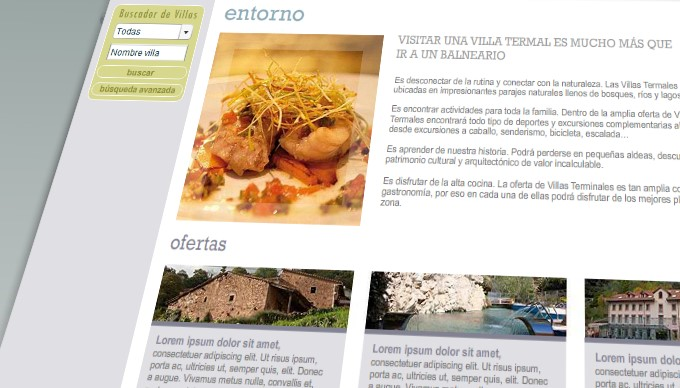
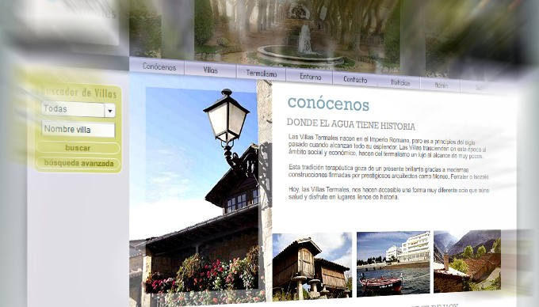
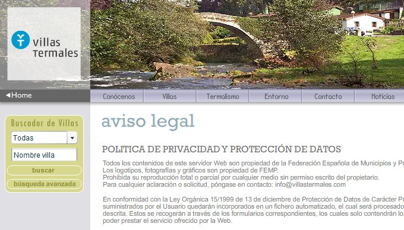

<a class="btn" href="http://work.joanmira.com/webs/villastermales/" target="_blank">Launch archived template</a>

This project was a collaboration with Narcea Multimedia. I was hired to develop a Flash interface driven by a MySQL database to display information about the villas termales in Spain. I work with a graphic designer from Narcea to complete the project. This project was also related with the [Ministry of Industry](http://www.minetur.gob.es/) in Spain and [FEMP](http://www.femp.es/).

The web app included an advanced search feature to allow the users find the right villa termal. It also included downloadable Google Earth and GPS coordinates, image gallery and other data related with the villas which was stored in XML format.

