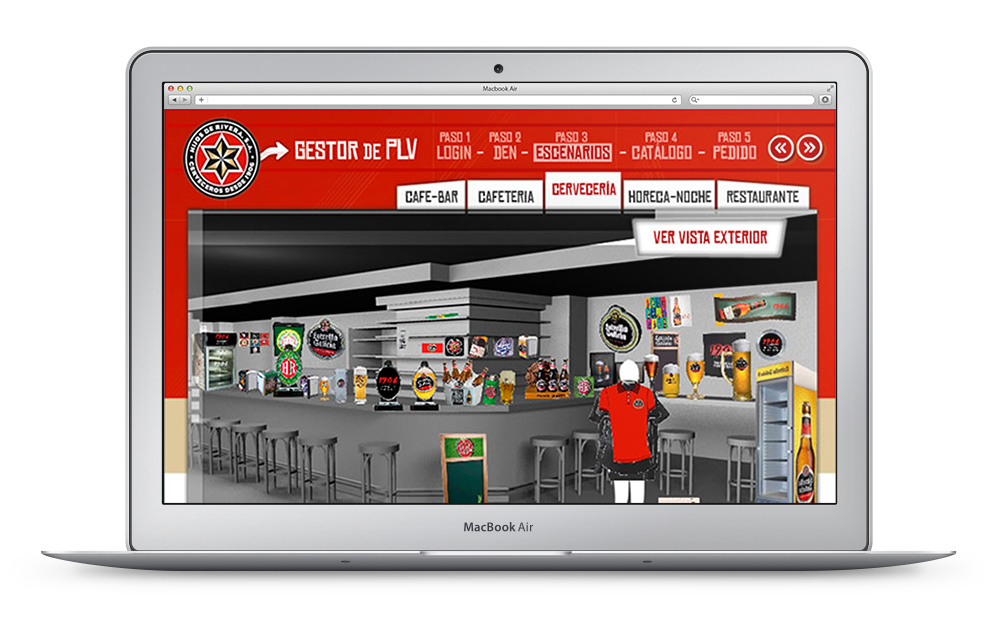
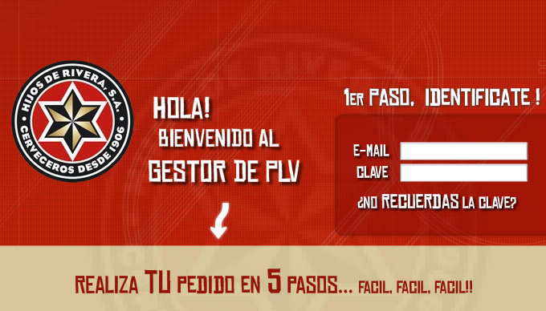
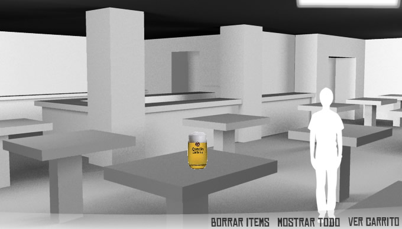
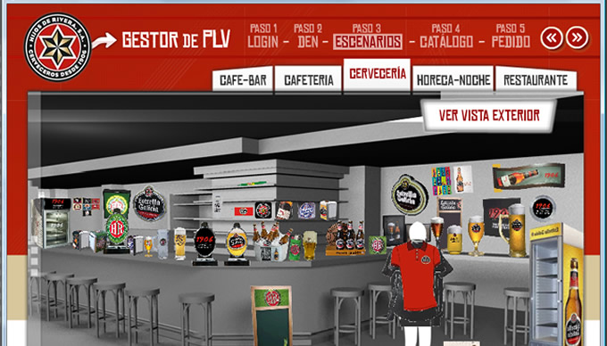
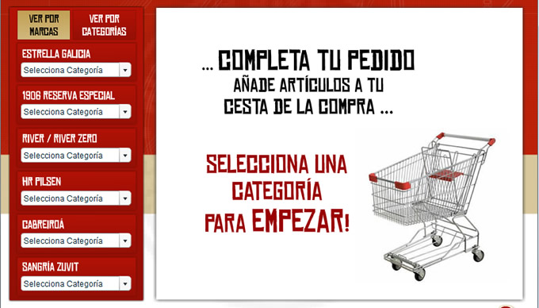
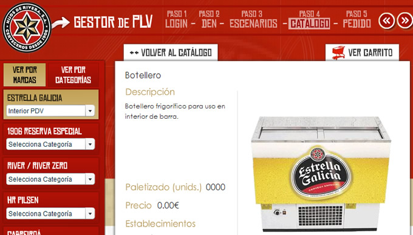
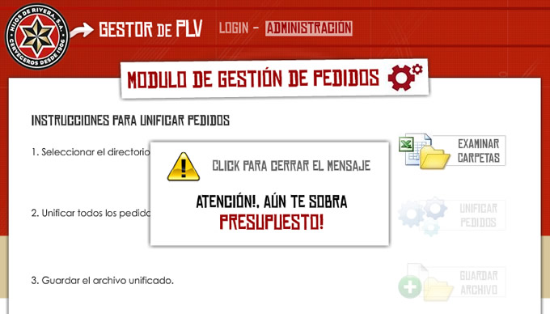

As part of my partnership with Havana Marketing in Barcelona, I built a desktop Flash driven interactive [POS (Point Of Sale)](https://en.wikipedia.org/wiki/Point_of_sale) for Estrella Galicia's corporate customers: restaurants, bars, coffee shops, etc.

The app features a login screen to access to merchandising catalog. The users can drag&drop products to the stage or select them using the sidebar navigation. Once the order is ready, they can submit it. The app will also export the order in Excel format and send it directly to the headquarters.

