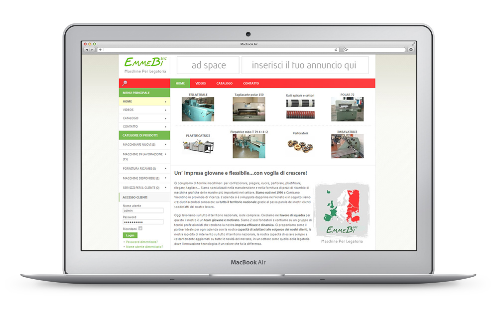

As part of my partnership with Website Profesional, I was hired to build a website for EmmeBi (Macchine Per Legatoria), an italian manufacturer of industrial products.

The website was built with Joomla and I customised a template to match the company's brand and their products.
