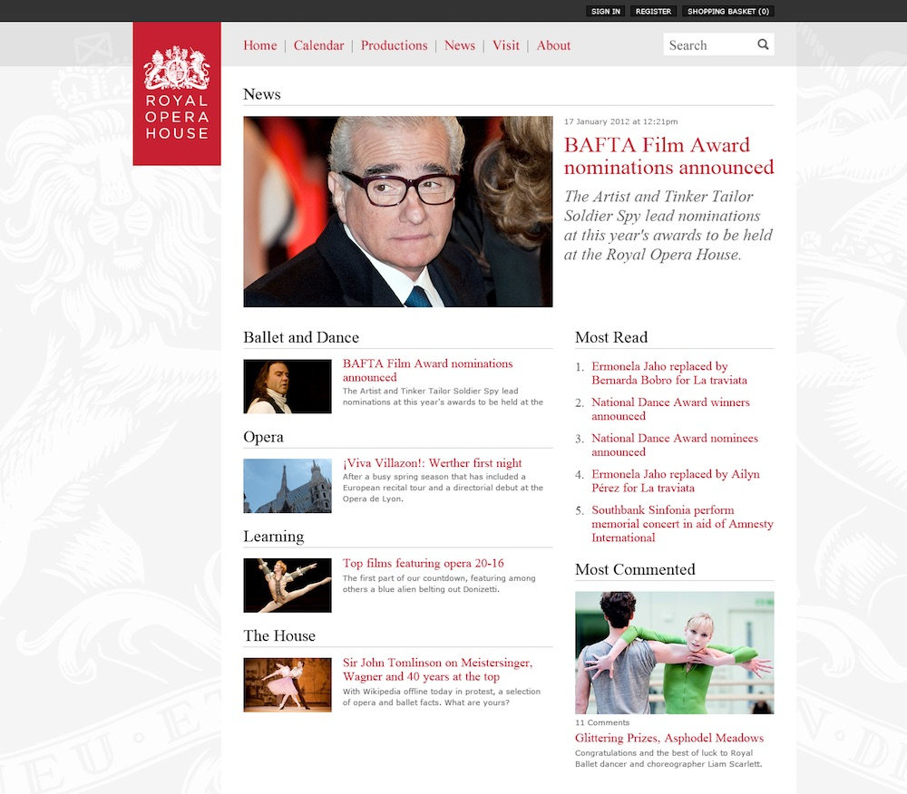
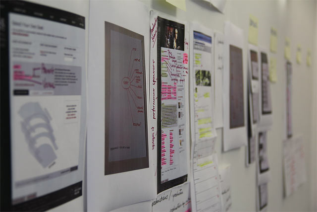
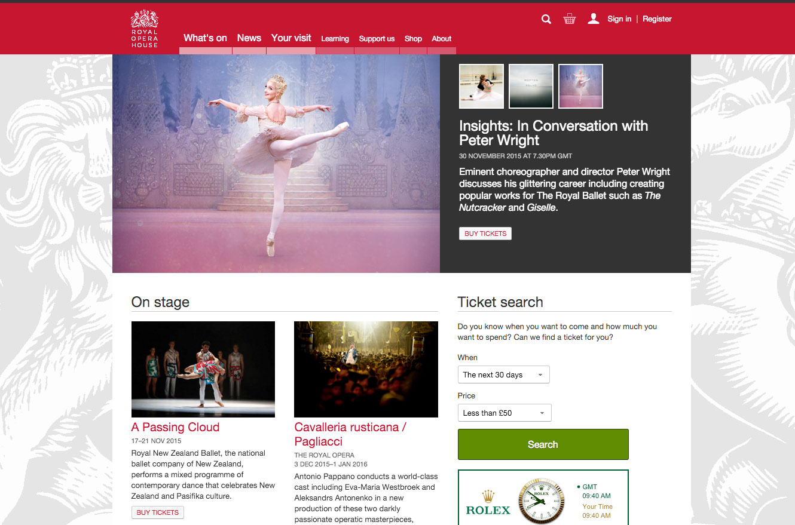

The Royal Opera House was my first professional experience in the UK. I was hired as a Digital Developer by the Design & Development manager (former lead designer of BBC programs) with a very important objective: to completely rebuild the ROH website from scratch. A business critical project that required a major overhaul in the online ticketing system, server infrastructure, information architecture, user experience, content management and online shop to match the high standards of the organisation.

At the beginning, the development team was very small (just the two of us). Once we understood the issues with the old website, we decided to start building [the news section](http://www.roh.org.uk/news), which is quite an isolated piece that could be driven by a Wordpress installation with custom theme and plugins.

*Screenshot of the ROH current news section*

### The requirements and the plan

While we were working on the news section, we continued exploring and learning about the organisation. We followed a [domain driven design](https://en.wikipedia.org/wiki/Domain-driven_design) approach, which it's a very effective way to understand the needs and requirements of the many different departments and units that work within the institution. Things like the navigation or page hierarchy are very political topics and building the correct information architecture can take some time...

On the other hand, one of the main issues in the old website was **the waiting room**. The ROH sell its tickets very quickly. As soon as they are available to purchase, thousands of customers will go online to buy them. This situation was creating a bottleneck in the infrastructure and users were having to wait online for long periods of time until they were able to purchase their tickets.

The new website would have to address that issue as the main priority. To do so, we partnered with [Pop](http://www.popagency.com/), a digital agency based in the US. They had a lot of experience with [Tessitura](http://www.tessituranetwork.com/), the software that many theatres around the world use to manage the box office and their network, so they were the perfect partner for our project.

The agreement with Pop was that they will take care of the Tessitura API and checkout journey (including the seat selection and payment gateway) and we would take care of the rest. The actual bottleneck was in the Tessitura database. It was huge and slow. We needed to decouple the website from that DB if we wanted to have a smooth experience.

At this point, another developer joined the team. We were now three!, still a small number for a project of this size, but we had 100% dedication and direct contact with stakeholders, customers and other members of the digital media department.

### Framework and infrastructure

*Evaluating the current website and developing the new © ROH 2011*

Once we understood the problem, we studied the different open source PHP frameworks out there to build the rest of the website. Although the static pages we decided to build them with Wordpress. Why open source and why PHP? Well, the ROH is partly funded with public money and we believed in Open Data, Web Standards and making things as open and accesible as possible. I remember that Zend, CodeIgniter or Symfony were the most popular at that time, so we decided to go with Zend due to its robustness and huge community. We also decided to use Doctrine (Symfony's ORM), Apache, Linux and MySQL. A classic LAMP stack.

For the infrastructure, we started with Rackspace but soon moved to Amazon AWS elastic cloud. This would allow us to scale the website during the ticket sale days to allow more traffic and make the purchase experience more enjoyable.

At this point we knew that we were going to have an API to access data from ticket prize, event dates, etc, but not all the data we needed! The API was going to give as access only to a subset of data related with tickets and events. We still needed to access data related with productions, artists, season calendar, etc. To get hold of this data, we came out with a plan: to implement MS SQL triggers in the Tessitura DB that will update the data in our MySQL DB. This means that we designed our own MySQL database, with tables like 'productions', 'events', 'people', etc, and the data of those tables will be updated automatically from the main Tessitura DB. Awesome! The theory was great, but the practice turned out to be a bit complex due to firewall restrictions, ODBC connectors and writing some complex SQL queries. Nevertheless, we were able to set it up and it felt great to see it working.

### The Internet as a CMS

Another interesting topic was the imagery and video management. The ROH is an Art organisation and the audiovisual documents are very important. We needed an inexpensive system, scalable, social media friendly and easy to work with. We decided to use Flickr for images, Youtube for videos, SoundCloud for audio and Delicious for related content.

Here is where I learned a very important lesson from my team leader... "**We have to use the Internet as a CMS**". This line resonated on me for years and I used it several times later on in other projects. It's so powerful and meaningful. At first I wasn't confident about it. I wanted to have control, to host the files on our own server. But then I realised the benefits of delegating this task to someone who is the best at it, like Flickr. They had a strong and well documented API, an automatic cropping system, a huge audience! This sites don't disappear in one day, why should we worry about it?

So we customised a Flickr Wordpress plugin (for the news section) and created a small admin area to allow the content team to update the homepage imagery. The rest of the pages with dynamic data (events, productions, seasons, etc) were using images and videos coming directly from the Tessitura database.

### Less is more

*The Royal Opera House home page*

Another lesson I learned in this project is about minimalism and simple design, or how is commonly known as "less is more". The best example is when we were discussing about adding the social media icons to share the news articles. Having a personal blog and knowing the benefits of having those buttons, I was totally convinced that the same principle would apply to the ROH website but I was wrong.

By looking at the iOS interface, I realised how easy and clear interfaces make a better UX. At first, I though that it could come across as some sort of 'institutional elitism'. In example, "I don't put social links because I don't need them and that's something small blogs do". But then I realised that this decision has more to do with the target audience habits and favouring an easy UX. This approach has also an SEO benefit due to users having to come back to the website to continue their conversation about a story.

### Open Data

I would also like to talk about the API system that we built to open the ROH data. It seemed like a great idea at that moment, but I'm not sure why it doesn't seem to be public yet. What we did was to implement lot's of different formats (XML, JSON, RDF, RSS, ATOM, ICS) and [hackable/semantic URLs](https://en.wikipedia.org/wiki/Semantic_URL) for the website content.

As a user, you could get the news stories in many different formats. Not only the article, but the categories, archive, most read, most commented, etc. You could also download the events calendar (a particular day, month, week,...) in ICS microformat. The events and productions data was also available to be consumed in JSON or XML. It was mainly a system to allow people to consume the ROH data in a machine readable manner. All you had to do was to add ".xml" or ".rss" or ".json" at the end of the URL.
This idea follows what was implemented in the [BBC programs](http://www.bbc.co.uk/blogs/radiolabs/2008/05/helping_machines_play_with_pro.shtml).

### Conclusion

There are many interesting topics that I could continue talking about, like the global search, consistent tagging, proscenium (global header and footer), or **how we photographed every single seat in the theatre** and the view from that seat to let the users know in the seat selection page.

It was a great professional experience and I learned a lot. It was also my first job in the UK, so I was unaware of many cultural differences, which made it even more interesting. As of today, **I still consider this project one of my career best achievements**, mainly because it was a very small team with a high responsibility and I was surrounded with very talented professionals that mentored me and made me a more thoughtful and capable developer.

### Related articles

21/02/2012: [www.roh.org.uk/news/our-new-website-an-update-on-progress](http://www.roh.org.uk/news/our-new-website-an-update-on-progress)

12/01/2012: [www.roh.org.uk/news/our-website-a-look-forward](http://www.roh.org.uk/news/our-website-a-look-forward)
