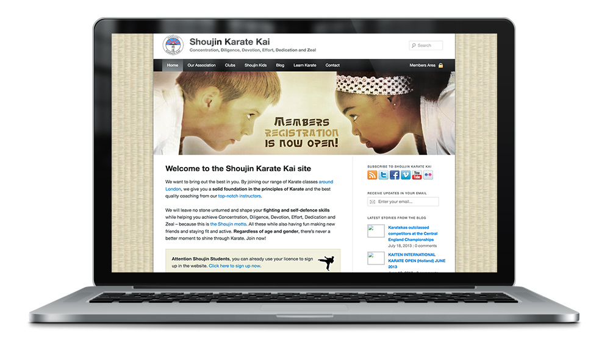

<a class="btn icon icon-external" href="http://shoujin.co.uk" target="_blank">Launch live website</a>

During my first year in London, I attended the Shoujin Karate club in Newham. I got so excited that I built for the club a full Wordpress website with a custom template and many details. I even had a photoshoot with lights, backdrop and all the paraphernalia for the students and also recorded a few videos of the competitions and the training.

The website has a module to register club members with their karate federation number, so they can access the private sections of the website.
