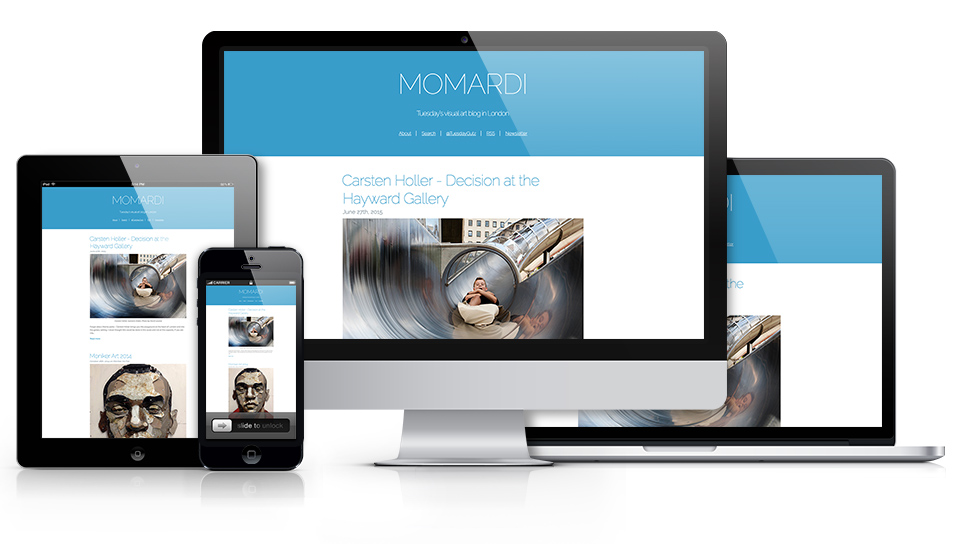
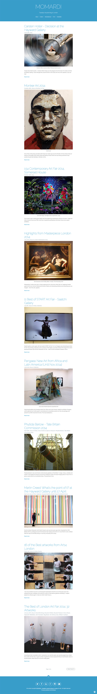
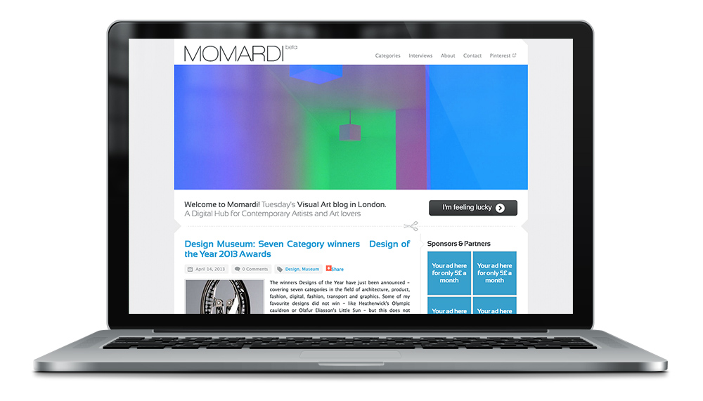
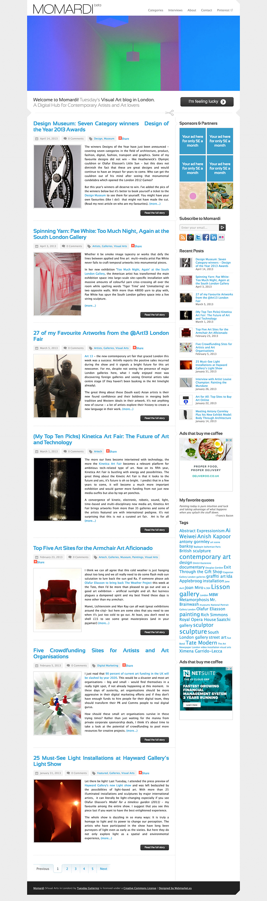

<a class="btn" href="http://momardi.com" target="_blank">Launch website</a>
<a class="btn" href="http://momardi-wp.herokuapp.com/" target="_blank">Launch archived v1 website</a>

I built Momardi.com initially with a custom template for Wordpress, but after a couple of years, we moved it into the Ghost platform and built another custom theme. And then, after a few more years, I moved to a GatsbyJS platform.

Momardi is the personal website of Tuesday Gutierrez. It showcases art exhibits in galleries / museums and also features articles about new artists.

